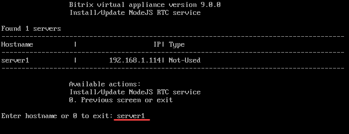
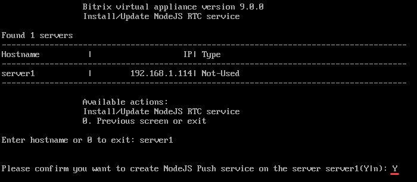
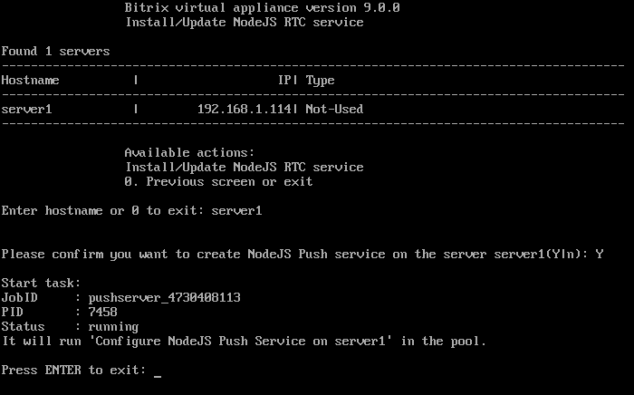

# 1. Настроить NodeJS RTC сервис (1. Install/Update NodeJS RTC Service)

**Навигация**
- [← Оглавление курса](index.md)
- [← Предыдущий: 30262 — 3. Удалить sphinx на сервере (3. Remove sphinx instance on server)](lesson_30262.md)
- [Следующий: 29378 — 2. Удалить NodeJS RTC инстанс (2. Uninstall NodeJS RTC instance) →](lesson_29378.md)

Официальная страница урока: https://dev.1c-bitrix.ru/learning/course/index.php?COURSE_ID=37&LESSON_ID=29376

Для работы Push&Pull подключите модуль NodeJS RTC:

1. В главном меню виртуальной машины выберите пункт 6. Configure Push/RTC service for the pool &gt; 1. Install/Update NodeJS RTC Service:
  
2. Введите имя хоста, на котором нужно запустить NodeJS RTC сервис (в примере мы выбираем **server1**):
  
3. Подтвердите создание сервиса `Y`:
  
4. Подождите, пока задачи по запуску NodeJS RTC Push&Pull сервиса будут выполнены:
  
5. Когда задача выполнится, перейдите в 6. Configure Push/RTC service for the pool. Теперь вы увидите, что в поле Type указан **NodeJS-PushServer**:
  

**Примечание.** В пуле может быть только один сервис Push&Pull. Если у вас запущен Push&Pull сервис на одном сервере, и вы выбираете в качестве сервера другую машину, то мастер остановит Push&Pull сервис на первой машине и запустит его на другой.

#### Обновить Push сервер

В новых версиях виртуальной машины могут быть более свежие версии NodeJS-PushServer. Чтобы обновить Push сервер:

- Остановите Push сервер через меню 6. Configure Push/RTC service for the pool &gt; [2. Uninstall NodeJS RTC Instance](https://dev.1c-bitrix.ru/learning/course/index-new.php?COURSE_ID=37&LESSON_ID=29138)
- Обновите сервер 2. Configure localhost settings &gt; 6. Update server
- Вновь запустите Push сервер 6. Configure Push/RTC service for the pool &gt; 1. Install/Update NodeJS RTC Service

**Примечание.** Задачи могут выполняться длительное время. Время зависит от сложности задачи, объема данных, используемых в этих задачах, мощности и загруженности сервера.
Проверить текущие выполняемые задачи можно с помощью меню 10. Background pool tasks &gt; 1. View running tasks. Лог-файлы выполнения задач находятся в директории `/opt/webdir/temp`.

#### Доп. материалы:

- [Настройка сервера очередей Push and Pull](https://dev.1c-bitrix.ru/learning/course/index.php?COURSE_ID=48&LESSON_ID=2033)
- [Использование отдельного сервера очередей](https://dev.1c-bitrix.ru/learning/course/index.php?COURSE_ID=48&LESSON_ID=21594)
- [Настройка и запуск push сервера на стороннем окружении](https://dev.1c-bitrix.ru/learning/course/index.php?COURSE_ID=48&LESSON_ID=8609)
