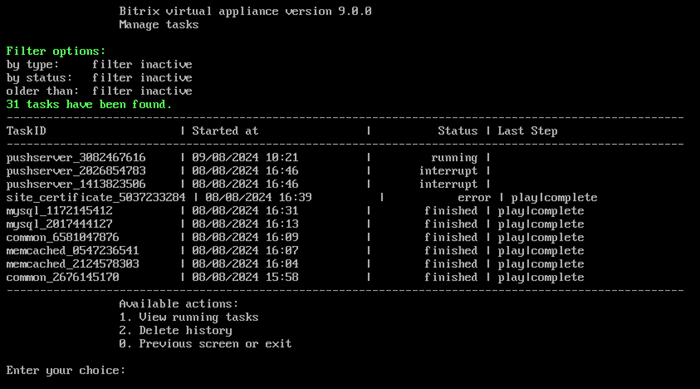
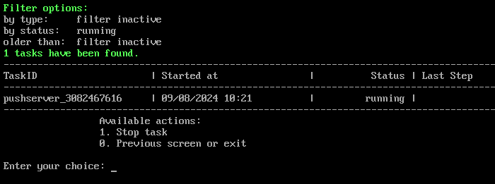
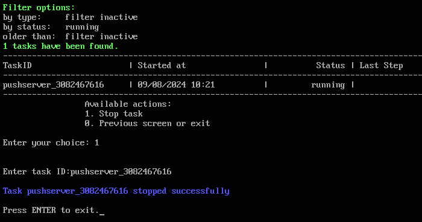
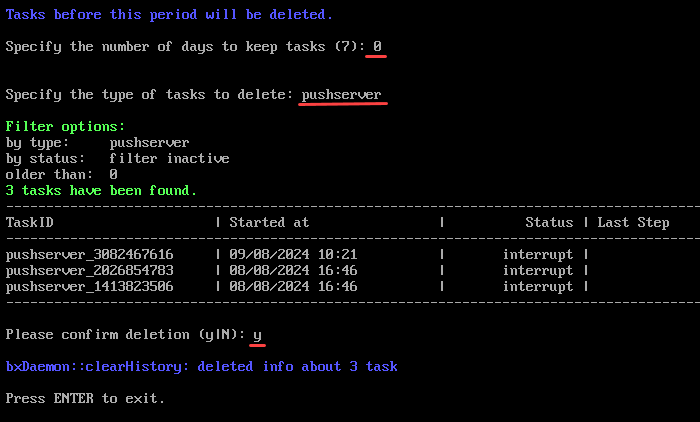

# 10. Фоновые задачи (10. Background pool tasks)

**Навигация**
- [← Оглавление курса](index.md)
- [← Предыдущий: 29370 — 3. Восстановление сертификата по умолчанию (3. Restore default certificate)](lesson_29370.md)
- [Следующий: 29390 — Изменение стандартных настроек BitrixVM без отключения автоподстройки →](lesson_29390.md)

Официальная страница урока: https://dev.1c-bitrix.ru/learning/course/index.php?COURSE_ID=37&LESSON_ID=29380

### Посмотреть историю

Все изменения в виртуальной машине – настройки, запуск каких-либо служб, синхронизация и др. осуществляются с помощью скриптов – задач.

Просмотреть историю, а также выполняемые в данный момент задачи, можно с помощью пункта меню 10. Background pool tasks:

Просмотреть запущенную в данный момент задачу можно с помощью пункта меню 10. Background pool tasks &gt; 1. View running tasks:

Для её остановки нужно перейти в пункт меню 10. Background pool tasks &gt; 1. View running tasks &gt; 1. Stop task и ввести идентификатор задачи:

### Очистить историю

Чтобы очистить историю нужно выбрать пункт меню 10. Background pool tasks &gt; 2. Delete history.

Далее указать:

- количество дней, за которое нужно оставить историю
- фильтр, по которому выбирать задачи (к примеру, выберем все задачи с TaskID **pushserver**)

После этого будут выведены все задачи, удовлетворяющие заданному интервалу и фильтру, и запрошено подтверждение на очистку истории:

**Примечание.** Задачи могут выполняться длительное время. Время зависит от сложности задачи, объема данных, используемых в этих задачах, мощности и загруженности сервера.
Проверить текущие выполняемые задачи можно с помощью меню 10. Background pool tasks &gt; 1. View running tasks. Лог-файлы выполнения задач находятся в директории `/opt/webdir/temp`.
