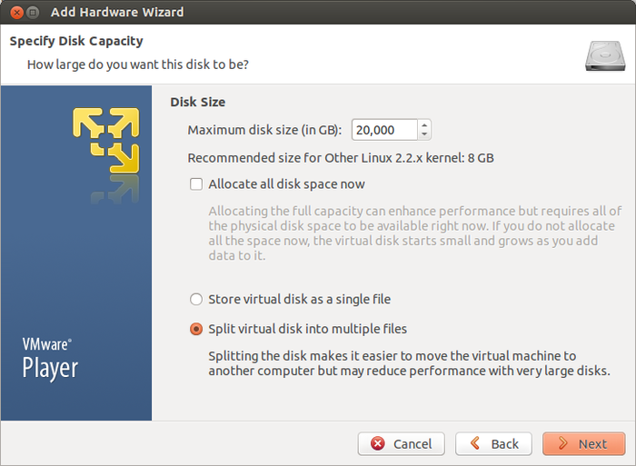
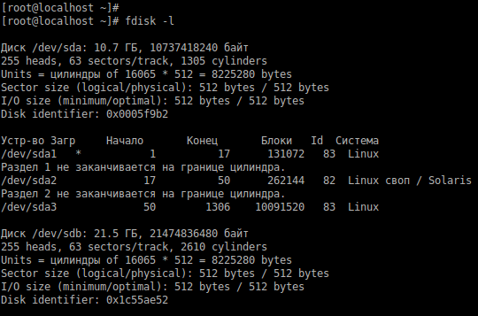
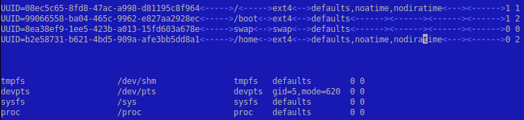

# Добавление дополнительного жесткого диска BitrixVM

**Навигация**
- [← Оглавление курса](index.md)
- [← Предыдущий: 29390 — Изменение стандартных настроек BitrixVM без отключения автоподстройки](lesson_29390.md)
- [Следующий: 30164 — Как увеличить размер жесткого диска BitrixVM v9.x →](lesson_30164.md)

Официальная страница урока: https://dev.1c-bitrix.ru/learning/course/index.php?COURSE_ID=37&LESSON_ID=29394

**Внимание!**

1. Для операций, описанных в данной главе, необходимы знания администрирования *nix-систем. Перед началом проведения данных операций рекомендуется сделать полный бекап *«Виртуальной машины»*.
2. Приведённые настройки выходят за рамки меню Виртуальной машины. Это означает, что информация - ознакомительная и применять её следует с чётким пониманием того что вы делаете и с собственной ответственностью за совершаемые действия. В нашей техподдержке рассматриваются только вопросы по работе пунктов меню ВМ.


Так как основной объем дискового пространства потребляется контентом сайтов и их резервными копиями, расположенными в `/home/bitrix`, а также БД, расположенной в `/var/lib/mysql`, то на отдельные диски следует выносить именно эти разделы.


Рассмотрим данную задачу на примере переноса на отдельный диск папки `/home` с контентом сайтов и их резервными копиями.


- Для этого в настройках виртуальной машины в список оборудования, добавляем новый диск необходимого размера. Все указанные ниже действия необходимо осуществлять под учетной записью администратора **root**:
  
  
- После добавления диска, для его инициализации, возможно, потребуется перезагрузить сервер. Увидеть новый диск и присвоенное ему буквенное обозначение можно, выполнив команду:
  ```
  fdisk -l
  ```
  
- Запускаем утилиту **fdisk** для работы с диском `/dev/sdb`:
  ```
  fdisk /dev/sdb
  ```
  И командой **n** создаем новый раздел:
  

  - основной (primary partition) - команда **p** и `Partition number (1-4): 1`;
  - первый и последний сектора при этом выбираем по умолчанию - таким образом, будет создан раздел, используя все свободное пространство на диске:
- После сохранения таблицы разделов, форматируем новый раздел и переносим на него информацию из `/home`:
  ```
  mkfs.ext4 /dev/sdb1
  mount /dev/sdb1 /mnt
  systemctl stop httpd.service
  systemctl stop nginx.service
  mv -f /home/* /mnt
  umount /mnt
  ```
  Следующим шагом определяем **UUID** нового диска:
  ```
  blkid
  /dev/sda1: UUID="99066558-ba04-465c-9962-e827aa2928ec" TYPE="ext4"
  /dev/sda2: UUID="8ea38ef9-1ee5-423b-a013-15fd603a678e" TYPE="swap"
  /dev/sda3: UUID="08ec5c65-8fd8-47ac-a998-d81195c8f964" TYPE="ext4"
  /dev/sdb1: UUID="b2e58731-b621-4bd5-909a-afe3bb5dd8a1" TYPE="ext4"
  ```
  и добавляем запись (в данном примере: `UUID=b2e58731-b621-4bd5-909a-afe3bb5dd8a1`) о нем в `/etc/fstab` (вместо **UUID** можно также использовать имя устройства `/dev/sdb`):
  
  Остается только примонтировать новый диск и запустить остановленные ранее службы:
  ```
  mount /home
  systemctl start httpd.service
  systemctl start nginx.service
  ```


Добавление дисков в других средах виртуализации или непосредственно на физическом сервере проходит аналогично.


**Внимание!** Если создаете на новом диске директорию `/home/bitrix/www` вручную, то убедитесь, чтобы она имела права `bitrix:bitrix` - 755 для директории и 644 - для файлов.
