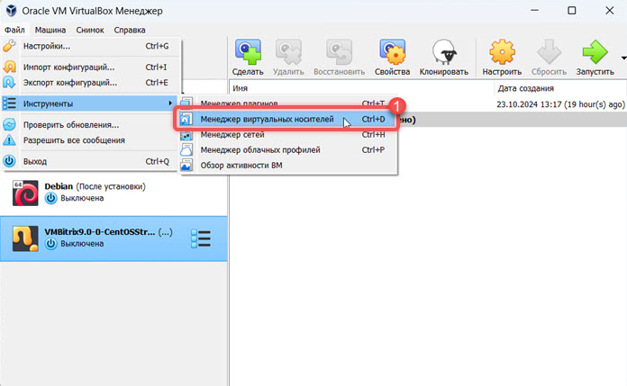
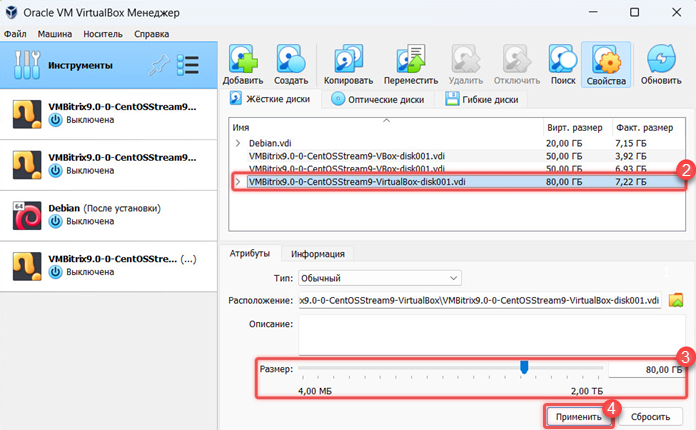
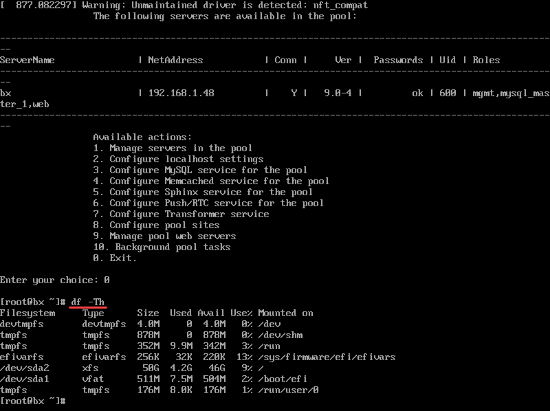
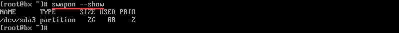
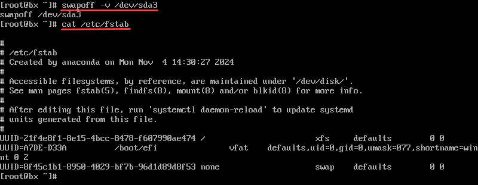
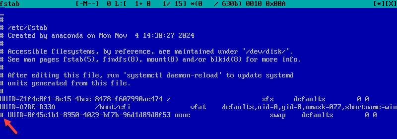
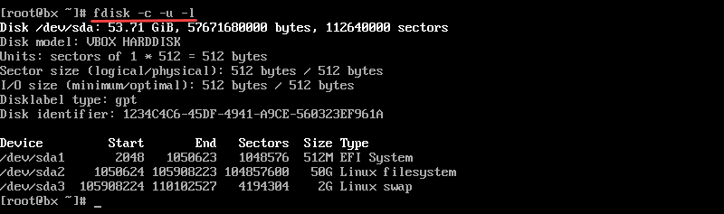
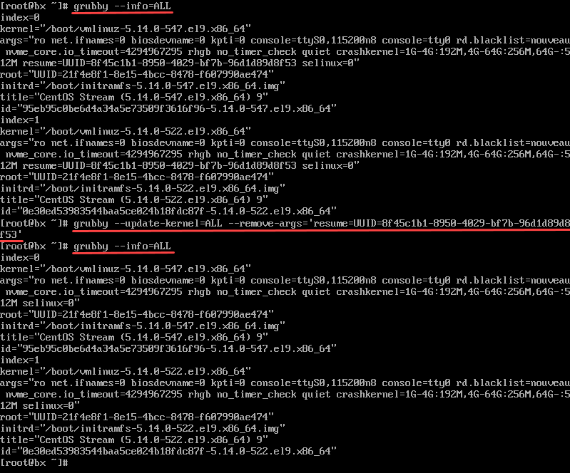

# Как увеличить размер жесткого диска BitrixVM v9.x

**Навигация**
- [← Оглавление курса](index.md)
- [← Предыдущий: 29394 — Добавление дополнительного жесткого диска BitrixVM](lesson_29394.md)
- [Следующий: 29398 — Увеличение размера LVM-раздела BitrixEnv →](lesson_29398.md)

Официальная страница урока: https://dev.1c-bitrix.ru/learning/course/index.php?COURSE_ID=37&LESSON_ID=30164

### Порядок действий


**Чтобы выполнить операции, потребуется знание работы с *nix-системами**

- Перед началом обязательно сделайте полный бэкап виртуальной машины.
- Рекомендуем предварительно выполнить все действия на тестовой виртуальной машине, прежде чем повторять их на продакшн средах.
- Настройки размера жесткого диска не входят в меню виртуальной машины. Рекомендуем внимательно следовать инструкциям. Техподдержка помогает только с вопросами по меню виртуальной машины.


Чтобы увеличить диск, выполните четыре шага:


1. увеличьте размер системного диска в гипервизоре
2. отключите и удалите swap — специальную область на жестком диске, которую система использует как резервное пространство при нехватке оперативной памяти
3. увеличьте размер основного раздела
4. создайте и подключите swap заново


### Увеличить размер системного диска в гипервизоре


Измените размер системного диска в программе виртуализации: VirtualBox, VMWare или HyperV.


Для VirtualBox:


1. В меню VirtualBox выберите *Файл &gt; Инструменты &gt; Менеджер виртуальных носителей*.
2. Выберите ваш виртуальный диск.
3. Укажите необходимый объем диска.
4. Нажмите кнопку Применить.








Для других программ смотрите примеры увеличения жесткого диска в их документации.


После того как вы увеличили размер системного диска в плеере, запустите виртуальную машину BitrixVM. Авторизуйтесь под пользователем root и перейдите в режим командной строки. Для этого выберите пункт меню *0. Exit.*


Проверить текущие параметры диска можно с помощью команды.


```
df -Th
```





Размер диска пока не изменился. Разделы /dev/sda1 и /dev/sda2 размером 50,5 Гб, остальное место из текущих 53,71 Гб занимают временные tmpfs.


<!-- &lt;p&gt;Получить информацию об использованной и неиспользованной памяти, а так же о разделе подкачки swap можно с помощью команды&lt;/p&gt;

&lt;p&gt;&lt;pre class="syntax"&gt;free -h&lt;/pre&gt;&lt;/p&gt;

&lt;p&gt;&lt;img class="border" src="/images/bitrixvm/vmbitrix9/other_options/free-h.png"&gt;&lt;/p&gt;

&lt;p&gt;Swap 2 Гб используется как отдельный раздел. Сначала идет раздел /dev/sda1, а потом — swap.&lt;/p&gt; -->


### Отключить и удалить swap


1. Просмотрите список всех существующих swap.
  ```
  swapon --show
  ```
  
  Swap может быть как в виде отдельного раздела, так и в виде файла. В нашем случае это partition — раздел.
2. Выключите swap.
  ```
  swapoff -v /dev/sda3
  ```
  Swap отключен, но он остался в таблице разделов /etc/fstab. Это можно проверить командой.
  ```
  cat /etc/fstab
  ```
  
3. Откройте таблицу /etc/fstab в редакторе, например в mcedit.
  ```
  mcedit /etc/fstab
  ```
  Закомментируйте строку swap символом `#`. Должно получиться так: `# UUID=8f45c1b1-8950-4029-bf7b-96d1d89d8f53 none swap defaults 0 0`.
  
  Закройте редактор mcedit клавишей F10. Редактор уточнит, сохранить ли изменения — выберите пункт Yes.
4. Просмотрите список дисков.
  ```
  fdisk -c -u -l
  ```
  
  Здесь sda — название диска, sda1 и sda2 — первые два раздела, sda3 — третий раздел swap. Перейдите в утилиту для управления разделами жесткого диска fdisk и откройте /dev/sda.
  ```
  fdisk -c -u /dev/sda
  ```
  Поочередно введите команды:
  

  - `d` — удалить
  - `3` — раздел 3
  - `w` — записать изменения
5. Откройте файл /etc/defualt/grub в редакторе mcedit.
  ```
  mcedit /etc/default/grub
  ```
  В строке GRUB_CMDLINE_LUNUX удалите `resume=UUID=8f45c1b1-8950-4029-bf7b-96d1d89d8f53`.
  Закройте редактор mcedit клавишей F10, сохранив изменения.
6. Обновите конфигурацию.
  ```
  grub2-mkconfig -o /etc/grub2.cfg
  ```
  Сгенерирован новый операционный файл.
7. Запустите регенерацию файлов.
  ```
  dracut --regenerate-all --force
  ```
  Дождитесь завершения процесса регенерации. Когда он закончится, снова появится строка ввода команд.
8. **Внимание!** Если не выполнить этот шаг, то виртуальная машина после перезагрузки не восстановится.
  Просмотрите информацию обо всех имеющихся версиях ядра.
  ```
  grubby --info=ALL
  ```
  Удалите идентификатор swap.
  ```
  grubby --update-kernel=ALL --remove-args='resume=UUID=8f45c1b1-8950-4029-bf7b-96d1d89d8f53'
  ```
  Проверьте, что идентификаторы swap удалены.
  ```
  grubby --info=ALL
  ```
  
9. Перезагрузите виртуальную машину.
  ```
  reboot
  ```


### Увеличить размер основного раздела


Для увеличения места на диске пересоздайте раздел.


1. Удалите раздел sda2. Для этого перейдите в утилиту для управления разделами жесткого диска fdisk и откройте /dev/sda.
  ```
  fdisk -c -u /dev/sda
  ```
  Поочередно введите команды:

  - `d` — удалить
  - `2` — раздел 2
  - `w` — записать изменения
2. Создайте новый раздел sda2. Для этого снова перейдите в fdisk и откройте /dev/sda.
  ```
  fdisk -c -u /dev/sda
  ```
  Поочередно введите команды:

  - `n` — создать
  - `2` — раздел 2
  - *First sector* не заполняйте
  - в *Last sector* укажите `+78G` — размер нового диска
  - `Y` — удалить сигнатуру
  - `w` — записать изменения
3. Чтобы новая конфигурация применилась, перезагрузите виртуальную машину.
  ```
  reboot
  ```
4. Вернитесь в консоль и увеличьте место для раздела sda2.
  ```
  xfs_growfs /dev/sda2
  ```
5. Проверьте, что место на диске увеличилось.
  ```
  df -Th
  ```


### Создать и подключить swap


1. Перейдите в утилиту для управления разделами жесткого диска fdisk и откройте /dev/sda.
  ```
  fdisk -c -u /dev/sda
  ```
  Создайте новый раздел. Поочередно введите команды:

  - `n` — создать
  - `3` — раздел 3
  - *First sector* не заполняйте
  - *Last sector* не заполняйте
  - `t` — изменить тип раздела
  - `3` — раздел с номером 3
  - `19` — присвоить hex-код 19, который соответствует swap
  - `w` — записать изменения
2. Создайте swap для созданного раздела.
  ```
  mkswap /dev/sda3
  ```
3. Включите swap.
  ```
  swapon -v /dev/sda3
  ```
4. Просмотрите идентификатор созданного swap.
  ```
  blkid
  ```
  В нашем случае у нового swap идентификатор `UUID=663f201f-c5aa-41f1-a07f-c17dbfa887bf`. Этот идентификатор нужно разместить там, где ранее удалили старый идентификатор.
5. Добавьте идентификатор swap в таблицу fstab.
  ```
  mcedit /etc/fstab
  ```
  Должно получиться так: `UUID=663f201f-c5aa-41f1-a07f-c17dbfa887bf none swap defaults  0 0`.
6. Также добавьте идентификатор swap в файл /etc/defualt/grub.
  ```
  mcedit /etc/default/grub
  ```
  В строке GRUB_CMDLINE_LUNUX перед `selinux=0` добавьте `resume=UUID=663f201f-c5aa-41f1-a07f-c17dbfa887bf`.
7. Снова обновите конфигурацию.
  ```
  grub2-mkconfig -o /etc/grub2.cfg
  ```
  ```
  dracut --regenerate-all --force
  ```
8. Добавьте идентификатор swap в grubby.
  ```
  grubby --update-kernel=ALL --args='resume=UUID=663f201f-c5aa-41f1-a07f-c17dbfa887bf'
  ```
  Проверьте, что идентификаторы успешно добавлены.
  ```
  grubby --info=ALL
  ```
9. Перезапустите виртуальную машину.
  ```
  reboot
  ```
