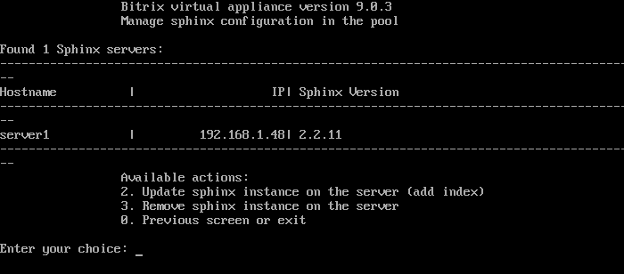
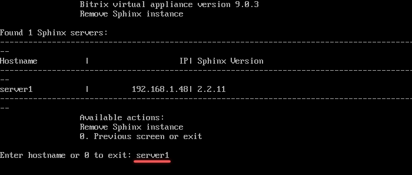
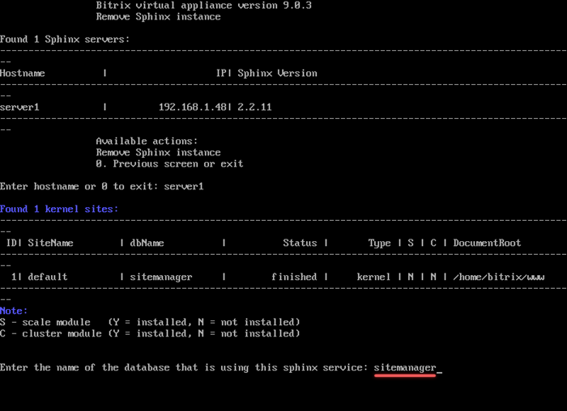
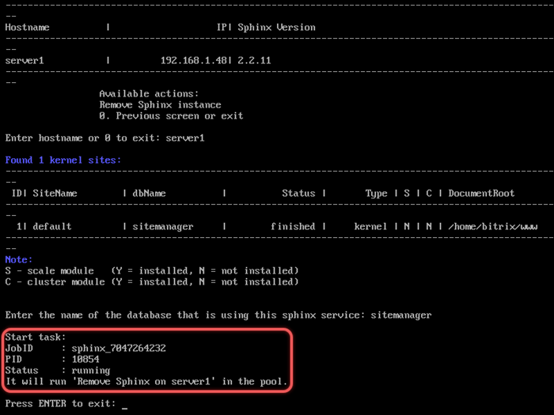

# 3. Удалить sphinx на сервере (3. Remove sphinx instance on server)

**Навигация**
- [← Оглавление курса](index.md)
- [← Предыдущий: 30258 — 2. Обновить настройки sphinx (2. Update sphinx instance on server)](lesson_30258.md)
- [Следующий: 29376 — 1. Настроить NodeJS RTC сервис (1. Install/Update NodeJS RTC Service) →](lesson_29376.md)

Официальная страница урока: https://dev.1c-bitrix.ru/learning/course/index.php?COURSE_ID=37&LESSON_ID=30262

Для удаления Sphinx-инстанса с сервера необходимо:

- Выбрать пункт меню *5. Configure Sphinx service for the pool &gt; 3. Remove sphinx instance on the server*.
  **Примечание**. Пункт меню появится только когда будет создан хотя бы один инстанс с помощью меню *5. Configure Sphinx service for the pool &gt; 1. Create sphinx instance on the server*.
  
- Ввести имя хоста удаляемого Sphinx-инстанса. Например `server1`.
  
- Выбрать базу данных ядра системы сайта из списка.
  
- Подождать, пока задача по удалению будет закончена.
  

В результате выполнения задачи виртуальная машина удалит:

- службу sphinx;
- все служебные файлы, например, из папки логов;
- пакет bx-sphinx.

**Примечание.** Задачи могут выполняться длительное время. Время зависит от сложности задачи, объема данных, используемых в этих задачах, мощности и загруженности сервера.
Проверить текущие выполняемые задачи можно с помощью меню *10. Background pool tasks &gt; 1. View running tasks*. Лог-файлы выполнения задач находятся в директории `/opt/webdir/temp`.
