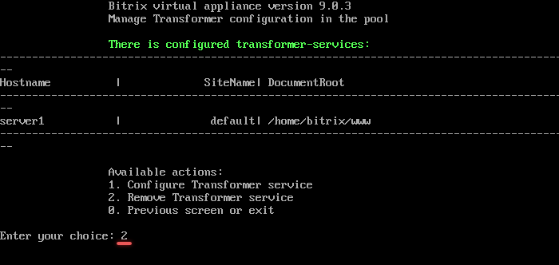
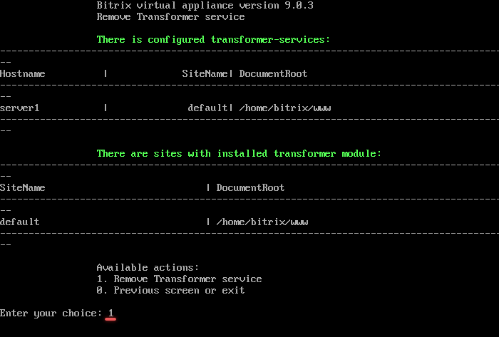
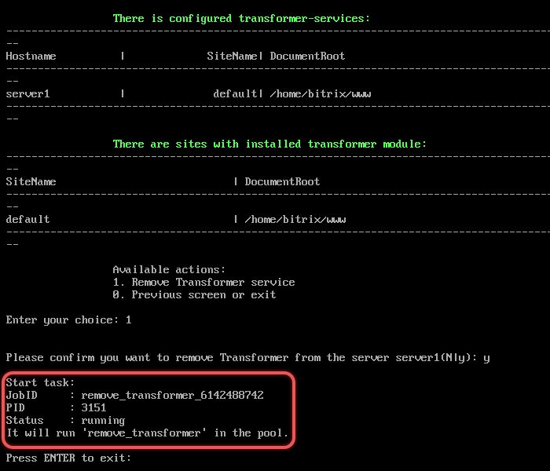

# 2. Удалить сервис «Конвертер файлов» (2. Remove Transformer service)

**Навигация**
- [← Оглавление курса](index.md)
- [← Предыдущий: 30268 — 1. Настроить сервис Конвертер файлов (1. Configure Transformer service)](lesson_30268.md)
- [Следующий: 29320 — 1. Создание сайта (1. Create a site) →](lesson_29320.md)

Официальная страница урока: https://dev.1c-bitrix.ru/learning/course/index.php?COURSE_ID=37&LESSON_ID=30270

Чтобы удалить роль **Конвертер файлов**, нужно:

- В главном меню виртуальной машины выбрать пункт *7. Configure Transformer service &gt; 2. Remove Transformer service*.
  
- Выбрать пункт *1. Remove Transformer service* и согласиться на удаление роли:
  
- BitrixVM запустит задачу `remove_transformer_***`, которая:
  

  - деактивирует запущенные раннее сервисы
  - удалит данные сервисов
  - сбросит настройки модулей Конвертер файлов transformer и Сервер конвертации файлов transformercontroller

**Примечание.** Задачи могут выполняться длительное время. Время зависит от сложности задачи, объема данных, используемых в этих задачах, мощности и загруженности сервера.
Проверить текущие выполняемые задачи можно с помощью меню 10. Background pool tasks &gt; 1. View running tasks. Лог-файлы выполнения задач находятся в директории `/opt/webdir/temp`.
