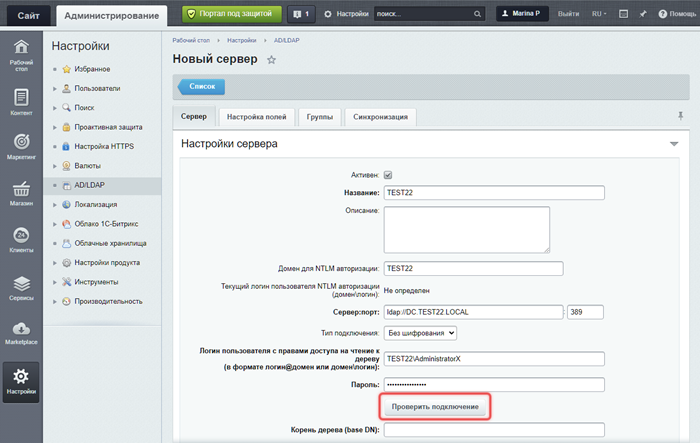
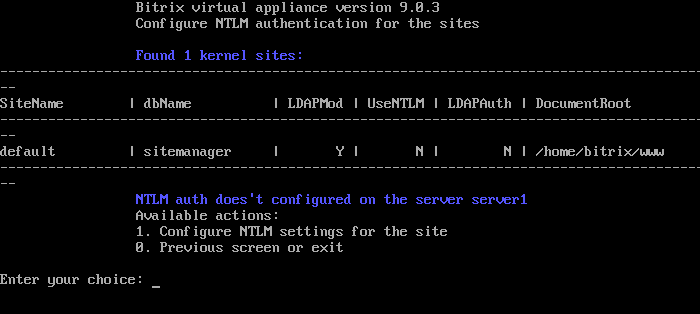
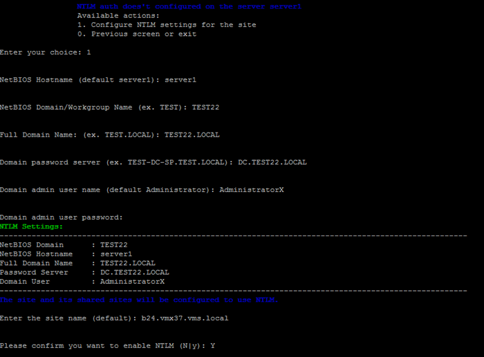

# 1. Настроить NTLM-авторизацию для сайта (1. Configure NTLM settings for the site)

**Навигация**
- [← Оглавление курса](index.md)
- [← Предыдущий: 29342 — Конфигурационный файл сайта](lesson_29342.md)
- [Следующий: 30276 — 2. Использовать существующие настройки NTLM для сайта (2. Use existing NTLM settings for the site) →](lesson_30276.md)

Официальная страница урока: https://dev.1c-bitrix.ru/learning/course/index.php?COURSE_ID=37&LESSON_ID=30274

### Подключение сервера AD

Откройте административный раздел сайта. Обновите модуль AD/LDAP интеграция до версии 24.100.0.

Перейдите в раздел *Настройки &gt; AD/LDAP* и добавьте новое подключение к AD серверу. В настройках отметьте Активен и укажите:

- Название подключения
- Домен для NTLM авторизации
  Обязательно заполните поле Домен для NTLM авторизации. Виртуальная машина использует его в дальнейшей настройке.
- Сервер и порт
- Логин и пароль пользователя с правами на чтение дерева

Нажмите кнопку Проверить подключение. Если подключение к AD серверу успешно установлено, продолжите настройки. Заполните:

- корень дерева (base DN)
- параметры схемы сервера (AD/LDAP)
- соответствие полей пользователя и атрибутов LDAP
- импорт отделов и структуры компании
- соответствие групп пользователей
- периодическую синхронизацию

### Настройки в BitrixVM

Откройте меню виртуальной машины и перейдите в *8. Configure pool sites &gt; 7. Configure NTLM auth for sites*.

Запустите мастер *1. Configure NTLM settings for the site* и укажите:

- NetBIOS Hostname (default server1) — имя сервера в пуле. В примере `server1`
- NetBIOS Domain/Workgroup Name (ex. TEST) — домен. В примере `TEST22`
- Full Domain Name: (ex. TEST.LOCAL) — fqd домена. В примере `TEST22.LOCAL`
- Domain password server (ex. TEST-DC-SP.TEST.LOCAL) — контроллер домена. В примере `DC.TEST22.LOCAL`
- Domain admin user name (default Administrator) — имя пользователя и его пароль. В примере `AdministratorX / ************`
- Enter the site name (default) — имя сайта. В примере `b24.vmx37.vms.local`

BitrixVM запустит задачу `ntlm_create_***`, которая:

- установит необходимые пакеты
- сконфигурирует службы и перезапустит их
- введет виртуальную машину в домен
- добавит настройки NTLM авторизации в модуле ldap для указанного сайта

Дополнительно настраивать модуль AD/LDAP в административной части сайта не нужно. Мастер:

- отметит опцию Использовать NTLM авторизацию
- установит в параметре Сервер домена по умолчанию значение из Домена для NTLM авторизации, которое указывали в настройках подключения к серверу AD
- включит переадресацию NTLM авторизации на порты 8890 и 8891
- зарегистрирует зависимости модулей main и ldap

**Примечание.** Задачи могут выполняться длительное время. Время зависит от сложности задачи, объема данных, используемых в этих задачах, мощности и загруженности сервера.
Проверить текущие выполняемые задачи можно с помощью меню 10. Background pool tasks &gt; 1. View running tasks. Лог-файлы выполнения задач находятся в директории `/opt/webdir/temp`.

### Как работает NTLM

Механизм NTLM авторизации работает следующим образом:

- Неавторизованный посетитель заходит на сайт. Обработчик события перенаправляет его на открытый порт Apache:

  - `8890` для протокола http
  - `8891` для протокола https
- Apache выполняет NTLM-авторизацию пользователя и перенаправляет его обратно на сайт на порт:

  - `80` для протокола http
  - `443` для протокола https
- Следующие переходы по сайту пользователь выполняет в обычном режиме.

Работа по https для SSL Let's Encrypt сертификатов или для самоподписанных SSL сертификатов поддерживается в случаях:

- если на сайт установили SSL сертификат до настройки NTLM роли
- если сначала включили NTLM роль и SSL сертификат настроили после
