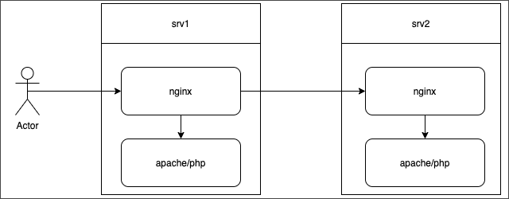

# Веб-кластер: конфигурация, бэкапы, восстановление

**Навигация**
- [← Оглавление курса](index.md)
- [← Предыдущий: 8907 — Скрипт работы с провайдерами](lesson_8907.md)
- [Следующий: 20428 — Как сделать образ BitrixVM для клонирования →](lesson_20428.md)

Официальная страница урока: https://dev.1c-bitrix.ru/learning/course/index.php?COURSE_ID=37&LESSON_ID=30542

### Описание


Рассмотрим несложную конфигурацию, где:


- **srv1** - главный web-сервер в пуле серверов. На нем настроен NGINX сервер в качестве балансера и есть Apache  сервер который обрабатывает php-запросы.
- **srv2** - дополнительный сервер. На нем есть настроенный NGINX сервер с копией конфигов srv1. И есть Apache сервер, который обрабатывает php-запросы.





**Примечание**:  На текущий момент конфигурации, которая позволяет вынести NGINX-балансер на отдельную ноду нет. Если таковая требуется можно взять за основу конфигурационные файлы NGINX сервера srv1. Но надо помнить, что официальной поддержки такой конфигурации в модуле Веб-кластер нет.


Между нодами настроена синхронизация файлов в обе стороны, используется lsyncd.


Для этого на каждой ноде поднят дополнительный сервис **lsyncd-&lt;имя_сервера&gt;**, где имя сервера - это идентификатор хоста в пуле Виртуальной машины с которым выполняется синхронизация. В нашем примере на сервере srv1, можно найти сервис lsyncd-srv2, который будет синхронизировать файлы с сервера srv1 на  srv2. Синхронизация файлов выполняется по протоколу SSH+Rsync с авторизацией по ключу пользователем **bitrix** Виртуальной машины BitrixVM.


Логи сервиса можно найти в каталоге `/var/log/lsyncd`. Например, **daemon-srv2.log** - будет содержать лог синхронизации с серверов srv2, а **daemon-srv2.status** - текущий статус синхронизации. При этом основной сервер синхронизирует следующие каталоги:


```
/etc/httpd/bx/conf/
/etc/nginx/bx/
<каталог(и) сайта(ов)>
```


На дополнительных серверах, синхронизируются только каталоги для сайтов.


Из синхронизации на основном и дополнительных серверах исключены - подкаталоги содержащие кеш для сайтов, на дополнительных еще исключаются конфигурационные файлы:


```
"bitrix/cache/",
"bitrix/managed_cache/",
"bitrix/stack_cache/",
"upload/resize_cache/",
"*.log",
"bitrix/.settings.php",
"php_interface/*.php",
```


Какие есть возможности у такой конфигурации:


- Масштабирование запросов, оба сервера могут обрабатывать запросы клиентов
- "Бэкап" основного сервера. Тут важно понимать, что данная конфигурация не защищает от удаления данных, синхронизация через lsyncd выполняется достаточно быстро и удаление их на одной ноде, приведет к удалению на другой. Если нужен бэкап данных, настраиваем его [стандартными способами](https://dev.1c-bitrix.ru/learning/course/index.php?COURSE_ID=35&CHAPTER_ID=04833). Архив лучше хранить не на тех же серверах, где происходит работа с файлами.


Теперь рассмотрим, что будет если одна из нод выйдет из строя.


### Сломался дополнительный веб-сервер


Простой вариант - выходит из строя дополнительный web-сервер.


Есть большая вероятность, что вы этого можете просто не заметить этой поломки потому, что NGINX сервер помечает свои бэкенд-сервера как нерабочие только после нескольких ошибок. NGINX  продолжает использовать те сервера, которые отвечают в обычном режиме. Чтобы не пропустить такой выход из строя - настройте  [внутренний мониторинг](https://dev.1c-bitrix.ru/learning/course/index.php?COURSE_ID=37&CHAPTER_ID=08875) Виртуальной машины или любой [другой мониторинг](https://dev.1c-bitrix.ru/learning/course/index.php?COURSE_ID=38&CHAPTER_ID=03249).


Если дополнительный сервер рабочий, но необходимо вывести его из эксплуатации, то используйте предусмотренный [пункт в меню](lesson_12127.md) Виртуальной машины. Если такой возможности нет, то можно отключить вручную, убрав его из upstream серверов NGINX и выключив синхронизацию lsyncd конфигов.


**Внимание!** Если доступ к дополнительной ноде (srv2) есть у вас, но нет на мастер сервере, то выключите lsyncd сервис и на дополнительной ноде. Это нужно сделать до того как начнете чистить данные или работать с нодой вне пула.


По шагам на нашем примере:


1. Отключить использование ноды на главном сервере `/etc/nginx/bx/site_enabled/upstream.conf`:
  ```
  upstream bx_cluster {
  ..
  server srv2:8080;
  }
  ```
2. Удалить строку с неиспользуемым сервером.
  ```
  systemctl restart nginx
  ```
3. Отключить синхронизацию файлов на дополнительной ноде:
  ```
  systemctl stop lsyncd-srv2
  systemctl disable lsyncd-srv2
  ```
4. Отключить синхронизацию файлов:
  ```
  systemctl stop lsyncd-srv1
  systemctl disable lsyncd-srv1
  ```


### Сломался основной сервер


Сложный вариант - выход из строя основного web-сервера. Его вы не пропустите скорее всего, но мониторинг тоже лучше настроить.


Ситуация тяжёлая, но не паникуйте: у вас есть все необходимые конфигурационные файлы на дополнительной ноде (не все включены в использование, но это легко поправить).


1. Включите конфигурационные файлы балансера:
  ```
  ln -sf /etc/nginx/bx/site_avaliable/http* /etc/nginx/bx/site_enabled/
  ln -sf /etc/nginx/bx/site_avaliable/upstream.conf /etc/nginx/bx/site_enabled/
  ```
2. Уберите основной сервер в upstream (`/etc/nginx/bx/site_enabled/upstream.conf`):
  ```
  upstream bx_cluster {
    ip_hash;
    server srv1:8080;
  ...
    keepalive 10;
  }
  ```
3. Проверьте, что конфигурация рабочая и пеерезапустите NGINX:
  ```
  nginx -t
  systemctl restart nginx
  ```
4. По умолчанию ваш сайт работает на ip-адресе сервера srv1. Самый простой вариант переключить DNS запись на адрес сервера srv2.
  Заранее нужно продумать это вариант, если время кеширования записи большое, то такое переключение может затянутся на часы или дни.
