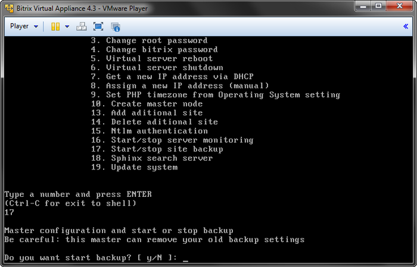
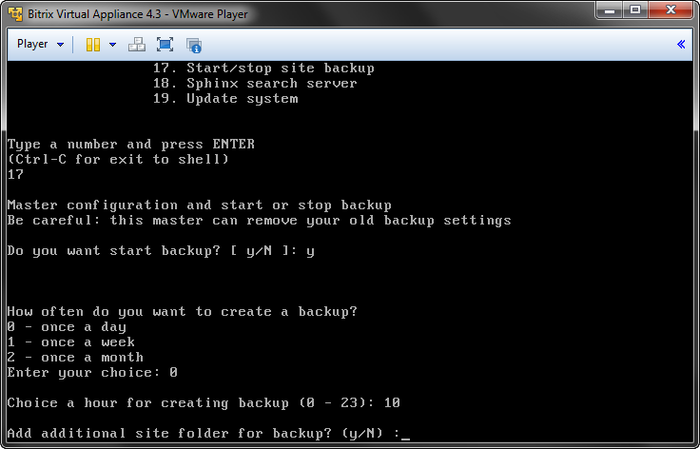
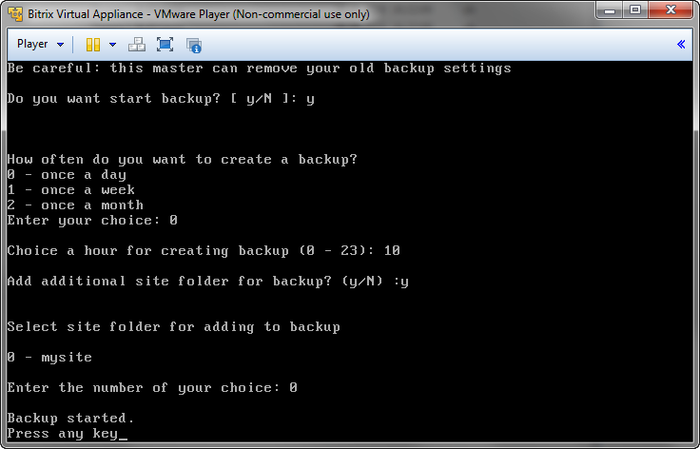

# Автоматическое создание резервной копии

**Навигация**
- [← Оглавление курса](index.md)
- [← Предыдущий: 6304 — Мониторинг сервера](lesson_6304.md)
- [Следующий: 5838 — Настройка сервера поиска Sphinx →](lesson_5838.md)

Официальная страница урока: https://dev.1c-bitrix.ru/learning/course/index.php?COURSE_ID=37&LESSON_ID=3459

При разворачивании проектов на базе *BitrixVM*, часто встает задача создания резервной копии проекта по расписанию.


В *«1C-Битрикс: Виртуальная машина»* версии 4.х появился функционал автоматического резервного копирования сайта, находящегося в директории `/bitrix/home/www/`, и базы данных. Бекап будет создан по расписанию в виде архива **.tar.gz** и записан в директории `/home/bitrix/backup/archive/`.


У данного способа есть как преимущества, так и недостатки в сравнении с встроенным в продукты «1С-Битрикс» механизмом создания резервной копии:


- **К преимуществам** относятся более высокая скорость создания резервной копии и независимость от работоспособности проекта.
- **Из недостатков** стоит отметить то, что при использование данного способа нельзя сделать резервную копию файлов, расположенных в облачных хранилищах.


Для создания расписания автоматического резервного копирования необходимо:


- В меню виртуальной машины выбрать пункт **17. Start/Stop site backup**:
  
- Выбрать периодичность и время запуска автоматического резервного копирования:
  
  **Примечание**: Время в *«1C-Битрикс: Виртуальная машина»* по умолчанию московское MSK (часовой пояс - UTC+4).


**Примечание**: Если необходимо делать бекап дополнительных сайтов, созданных с помощью административного меню **13. Add additional site**, то нужно указать имя директории дополнительного сайта в `/home/bitrix/ext_www/`:




На этом работа мастера настройки завершена, и в крон (`/etc/crontab`) добавляется задача резервного копирования вашего проекта.
В случае необходимости более гибкой настройки времени запуска создания резервной копии, можно его скорректировать непосредственно в `/etc/crontab`:


```

10 22 * * * bitrix test -f /home/bitrix/backup/scripts/bxbackup.sh && { /home/bitrix/backup/scripts/bxbackup.sh ; } >/dev/null 2>&1
```


#### Версии виртуальной машины до 4.х


При разворачивании проектов на базе *BitrixEnv* (в версии для **Linux**) или *BitrixVM* старых версий задачу создания резервной копии проекта по расписанию поможет решить скрипт, который создает резервную копию базы данных и файлов сайта (`/bitrix/home/www/`) в `/home/bitrix/backup/archive/`.


Создание резервной копии будет запускаться автоматически раз в сутки, в 2:30. Периодичность исполнения можно настроить в `/etc/crontab`.


Для запуска резервного копирования на сайте необходимо выполнить следующие команды:


```

wget http://repo.bitrix24.tech/ext/start_site_backup.sh
chmod +x start_site_backup.sh
./start_site_backup.sh
```


**Примечание**: Не забывайте следить за свободным местом на диске и периодически удалять старые резервные копии.
