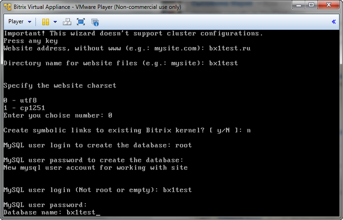

# Добавление дополнительного сайта

**Навигация**
- [← Оглавление курса](index.md)
- [← Предыдущий: 5233 — Создание кластера master-slave](lesson_5233.md)
- [Следующий: 6304 — Мониторинг сервера →](lesson_6304.md)

Официальная страница урока: https://dev.1c-bitrix.ru/learning/course/index.php?COURSE_ID=37&LESSON_ID=5232

Мастер создания дополнительных сайтов, позволяет развернуть на одной виртуальной машине несколько сайтов, как на независимых установках «1С-Битрикс», так и в рамках многосайтовости.

#### Добавление

Для добавления дополнительного сайта необходимо:

- Предварительно настроить DNS-сервер или указать доменное имя в **/etc/hosts** на виртуальной машине, а также на всех машинах, с которых будет осуществляться доступ к данному сайту.
- Далее из административного меню запустить мастер **13. Add aditional site**:
  
  и указать:

  1. **Website address, without www** – доменное имя без www;
  2. **Directory name for website files** – имя директории, в которой будут хранится файлы (директория будет создана в `/home/bitrix/ext_www/`);
  3. **Specify the website charset** – кодировку создаваемого сайта;
  4. **Create symbolic links to existing Bitrix kernel** – создание символических ссылок на установленное ядро «1С-Битрикс»:

    - **N** – при создании в рамках отдельной установки. В данном случае необходимо создать базу данных. Для этого потребуется указать имя новой базы данных, логин и пароль пользователя MySQL, обладающего необходимыми правами.
    - **Y** – при создании в рамках многосайтовости. В данном случае необходимо указать полный путь к ранее установленному продукту «1С-Битрикс».

Новый дополнительный сайт доступен для использования.

**Примечание**: Количество таких сайтов не ограничивается. Единственным ограничением является то, что данный мастер не рассчитан на работу с машинами, входящими в кластер.

#### Удаление

Для удаления записи о дополнительном сайте необходимо в административном меню *«1C-Битрикс: Виртуальная машина»* выбрать пункт **14. Delete aditional site**.

**Примечание**: Мастер удаления не удаляет директорию с файлами и базу данных дополнительного сайта. Он удаляет только конфигурационный файл в *«1C-Битрикс: Виртуальная машина»*. Удаление директории с файлами и базу данных сайта необходимо сделать вручную.
