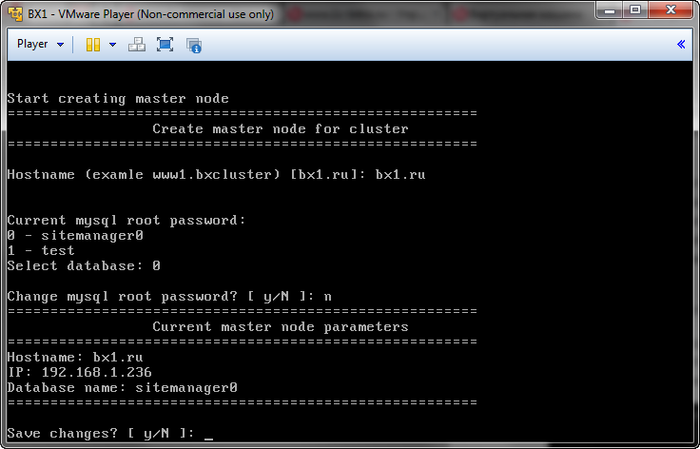
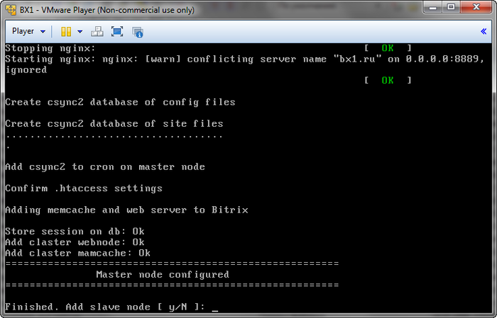
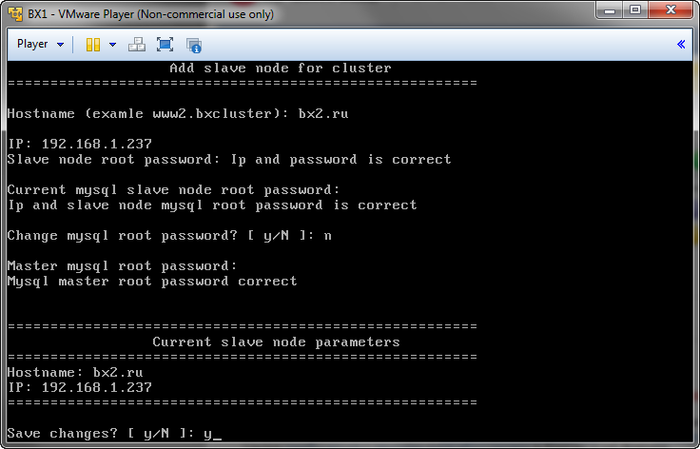
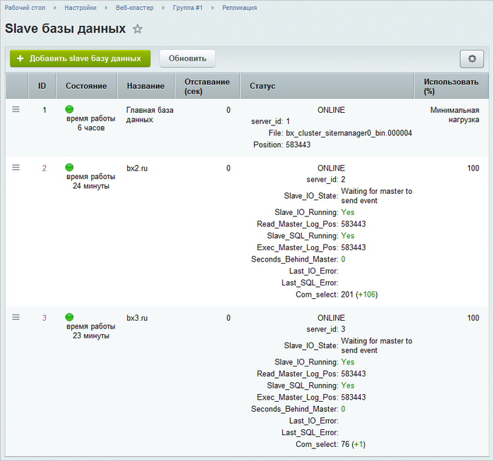
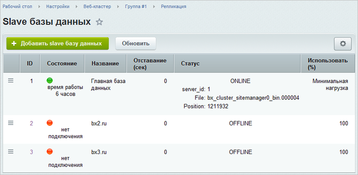
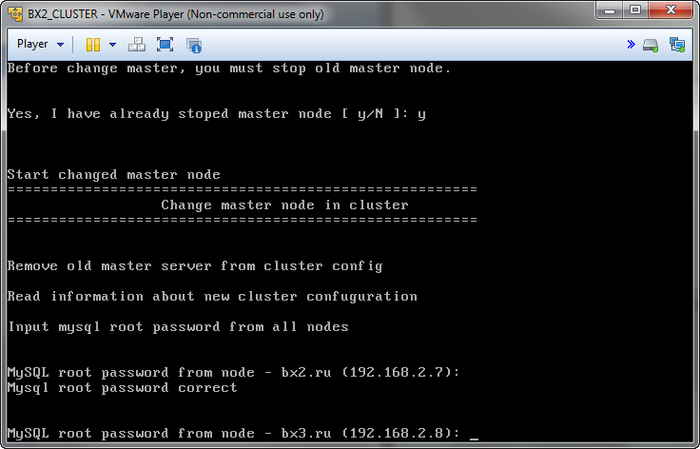
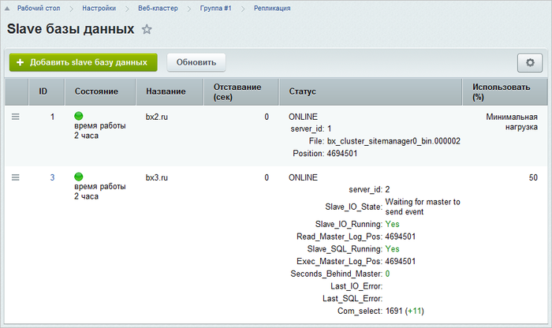

# Создание кластера master-slave

**Навигация**
- [← Оглавление курса](index.md)
- [← Предыдущий: 2716 — Настройка почтового сервера](lesson_2716.md)
- [Следующий: 5232 — Добавление дополнительного сайта →](lesson_5232.md)

Официальная страница урока: https://dev.1c-bitrix.ru/learning/course/index.php?COURSE_ID=37&LESSON_ID=5233

В *«1C-Битрикс: Виртуальная машина»* также есть поддержка быстрого развертывания кластерной конфигурации master-slave [«1С-Битрикс: Управление сайтом»](http://www.1c-bitrix.ru/products/cms/) и [«1С-Битрикс: Корпоративный портал»](http://www.1c-bitrix.ru/products/intranet/) с установленным модулем [«Веб-кластер»](https://dev.1c-bitrix.ru/learning/course/index.php?COURSE_ID=35&CHAPTER_ID=04750).

Это позволит распределить один сайт на несколько серверов, решая тем самым несколько задач:

- обеспечение высокой доступности сайта;
- его масштабирование в условиях возрастающей нагрузки;
- балансирование нагрузки, трафика, данных между несколькими серверами.

#### Подготовка виртуальной машины для включения в кластер

Для подготовки виртуальной машины для включения в кластер необходимо:

- сменить стандартный пароль пользователя **root**;
- сменить стандартный пароль пользователя **bitrix**;
- если виртуальная машина будет добавляться в кластер в качестве **slave-ноды**, необходимо удалить базу данных с тем же именем, что рабочая база данных на **master-ноде** (по умолчанию это **sitemanager0**).

#### Создание master-ноды

После подготовки первым шагом в создание кластера, является создание master-ноды. На ней будет находится master-база MySQL, а также она будет осуществлять настройку кластера и всех входящих в него узлов.

Для этого:

- выполнить подготовку виртуальной машины;
- установить на виртуальную машину [«1С-Битрикс: Управление сайтом»](http://www.1c-bitrix.ru/products/cms/) или [«1С-Битрикс: Корпоративный портал»](http://www.1c-bitrix.ru/products/intranet/) с модулем [«Веб-кластер»](https://dev.1c-bitrix.ru/learning/course/index.php?COURSE_ID=35&CHAPTER_ID=04750);
- перевести все таблицы базы данных в **InnoDB** (если они используют другой механизм);
- из административного меню *«1C-Битрикс: Виртуальная машина»* запустить мастер создания – **10. Create master node**
  
  В мастере потребуется указать:
  1. **Hostname** – доменное имя ноды кластера;
  2. **Current mysql root password** – пароль пользователя root базы данных;
  3. **Select database** – выбрать базу данных, которая будет участвовать в репликации;

После подтверждения запускается процесс создания, который произведет настройку всех необходимых сервисов, а также добавит все необходимые записи в модуль **Веб-кластера**.

После настройки master-ноды будет предложено создать **slave-ноду** – можно согласиться, а можно отказаться и создать её [позже](#slave).

#### Создание slave-ноды

Для полноценной работы кластера после создания master-ноды в кластер необходимо добавить хотя бы одну slave-ноду. Это можно сделать как после создания master-ноды, так и с помощью административного меню:

- заранее выполнить подготовку виртуальной машины для slave-ноды;
- подключиться к консоли master-ноды и выбрать в меню пункт **11. Add slave node**:
  
  Здесь для slave-ноды потребуется указать:

  1. **Hostname** - доменное имя;
  2. **IP** - ip-адрес;
  3. **Slave node root password** - пароль root;
  4. **Current mysql slave node root password** - пароль root от mysql;
  5. **Master mysql root password** - пароль root от mysql на master ноде.

После подтверждения запустится процесс, который произведет настройку кластера, перенесет на новую ноду файлы сайта, базу данных и добавит её сервисы в модуль **Веб-кластер**.

После добавления slave-ноды мы получаем полноценный кластер. При росте нагрузки на проект можно добавить дополнительную slave-ноду в кластер аналогичным образом. Тем самым обеспечить стабильность работы проекта при любом росте нагрузки:

#### Падение нод в кластере

В случае падения одной или нескольких **slave-нод** проект будет по-прежнему стабильно работать.

Если же упадет **master-нода**, то для восстановления работоспособности кластера необходимо:

- сменить роль одной из slave на master. Для этого достаточно запустить мастер **12. Make slave node a master node** и указать пароли к MySQL root для всех оставшихся в кластере нод:
  
- и после его работы скорректировать список нод в модуле **Веб-кластер**.
  
