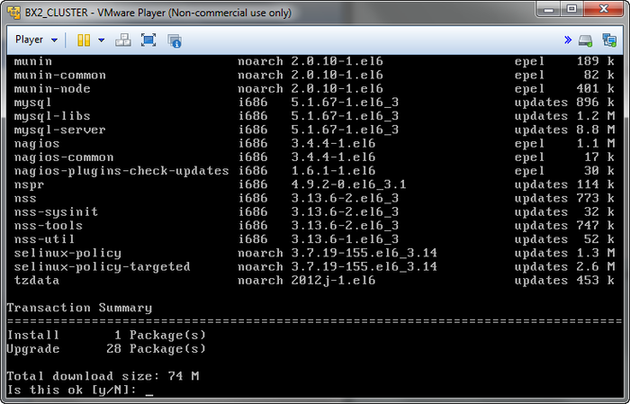

# Обновление виртуальной машины VMBitrix

**Навигация**
- [← Оглавление курса](index.md)
- [← Предыдущий: 5838 — Настройка сервера поиска Sphinx](lesson_5838.md)
- [Следующий: 5794 — Перенос продукта «1C-Битрикс» на виртуальную машину BitrixVM →](lesson_5794.md)

Официальная страница урока: https://dev.1c-bitrix.ru/learning/course/index.php?COURSE_ID=37&LESSON_ID=5262

**Внимание!** Обновление продукта *«1C-Битрикс: Виртуальная машина»* – сложная операция, в процессе которой происходит обновление системных файлов операционной системы виртуальной машины, и для этого необходимы соответствующие знания администрирования *nix-систем. Перед запуском процедуры рекомендуется сделать полный бекап виртуальной машины.


Для обновления продукта *«1C-Битрикс: Виртуальная машина»* необходимо выбрать в административном меню пункт **19. Update System**.





Скрипт автоматически проверит обновления виртуальной машины, выдаст общий объем для загрузки и запрос на установку.


**Примечания:**

- Если в результате что-то перестанет работать, то можно вернуть полностью или частично старые файлы настроек соответствующей службы, т.к. конфигурационные файлы во время выполнения процесса не перезаписываются, а сохраняются в файлах ***.ori.(метка времени)**.
- Также в процессе обновления могут отключиться некоторые модули php. Для их включения необходимо выполнить следующие команды:
  ```
  mv -f /etc/php.d/(имя модуля).ini.disabled /etc/php.d/(имя модуля).ini
  service httpd restart
  ```
