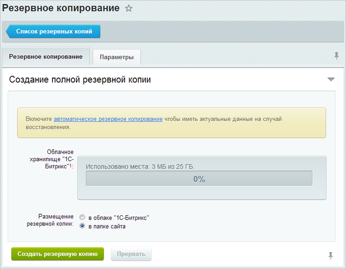
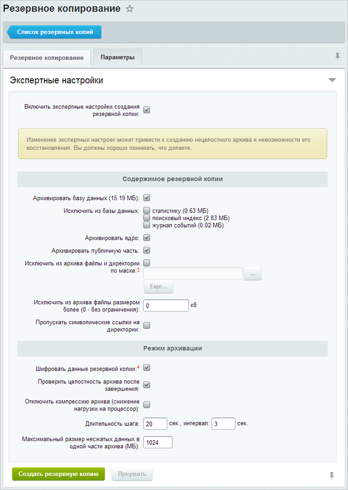
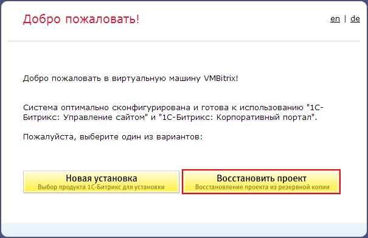
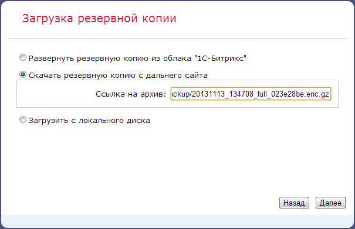
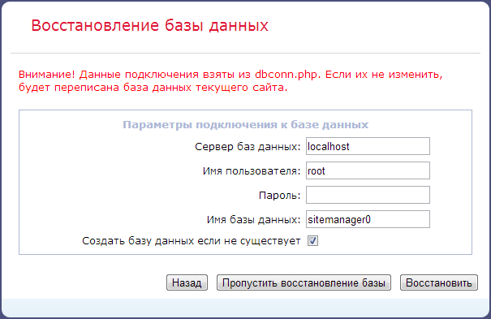
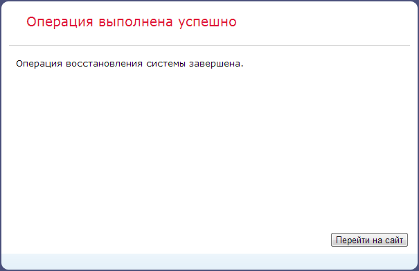

# Перенос продукта «1C-Битрикс» на виртуальную машину BitrixVM

**Навигация**
- [← Оглавление курса](index.md)
- [← Предыдущий: 5262 — Обновление виртуальной машины VMBitrix](lesson_5262.md)
- [Следующий: 6552 — Изменение стандартных настроек BitrixVM без отключения автоподстройки →](lesson_6552.md)

Официальная страница урока: https://dev.1c-bitrix.ru/learning/course/index.php?COURSE_ID=37&LESSON_ID=5794

Для переноса сайта с хостинга или локального сервера на виртуальную машину *BitrixVM* необходимо:

- архив сайта;
- настроенная виртуальная машина *BitrixVM* (подробнее - см. [Запуск виртуальной машины BitrixVM](lesson_2715.md))

#### Создание архива сайта

1. Создание архива сайта происходит на странице **Резервное копирование** (Настройки &gt; Инструменты &gt; Резервное копирование) :
  

  - архив сайта может быть сохранен **в облаке «1С-Битрикс»**;
    **Примечание**: Опция копирования **в облако «1С-Битрикс»** доступна пользователям с активной лицензией. Также, в целях безопасности, все резервные копии сайта отправляются в облако «1С-Битрикс» всегда зашифрованными. Компания «1С-Битрикс» не может восстановить или поменять пароль! Будьте внимательны, без знания этого пароля восстановить архив не удастся!
  - либо **в папке сайта** (архив сайта будет сохранен в папке `/bitrix/backup/` хостинга с уникальным именем файла).
2. На вкладке **Параметры** можно выбрать **экспертные настройки создания резервной копии**:
  
  **Примечание**: Для безопасности данных рекомендуется включить опцию **Шифровать данные резервной копии** и ввести пароль для архива сайта.
3. После успешного создания архива сайта он будет доступен на странице **Список резервных копий** (Настройки &gt; Инструменты &gt; Список резервных копий) . Здесь будут показаны все резервные копии:
  
4. Далее понадобится **Получить ссылку для переноса** с помощью одноименного меню действий:
  
  и в появившемся окне скопировать ее в буфер обмена:
  
5. Также можно скачать архив сайта на локальный компьютер с помощью пункта меню  **Скачать**.

#### Копирование сайта в виртуальную машину BitrixVM

1. Запустить предварительно настроенную виртуальную машину *BitrixVM* (см. урок [Запуск виртуальной машины BitrixVM](lesson_2715.md)).
2. В адресной строке браузера ввести http://адрес_виртуальной_машины/ (можно указать домен или ip-адрес).
3. Откроется мастер установки продукта «1С-Битрикс», где нужно выбрать **Восстановить проект**:
  
4. На этапе загрузки резервной копии выбрать нужный способ хранения архива сайта (в данном случае - ввести ссылку из буфера обмена, полученную на странице со списком резервных копий сайта):
  
  **Примечание**: Также есть возможность загрузить архив из облака «1С-Битрикс» (понадобится лицензионный ключ с действующей лицензией) или с локального компьютера, если эти способы были выбраны на этапе создания архива сайта.
5. После скачивания архива, если архив был зашифрован, то будет предложено ввести пароль:
6. Далее необходимо настроить подключение к базе данных:
  
  Настройки подключения к MySQL по умолчанию в виртуальной машине *BitrixVM*:
  Также, если есть необходимость, можно указать собственное **имя базы данных** в этом случае необходимо еще выбрать опцию **Создать базу данных, если не существует**.

  - **Сервер**: localhost
  - **Пользователь БД**: root
  - **Пароль**: &lt;пусто&gt;
  - **Имя БД**: sitemager0
7. После успешного восстановления базы данных в целях безопасности необходимо **Удалить локальную резервную копию и служебные скрипты**, нажав на одноименную кнопку:
  
8. Перенос продукта «1C-Битрикс» на виртуальную машину *BitrixVM* закончен:
  
