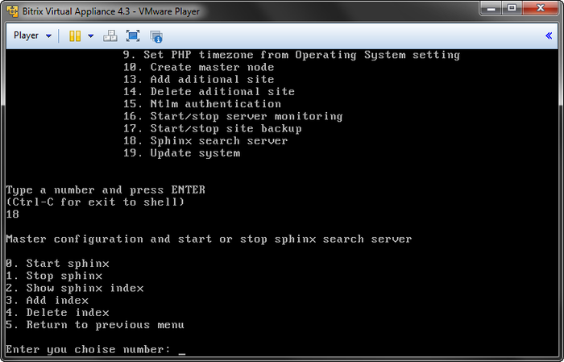
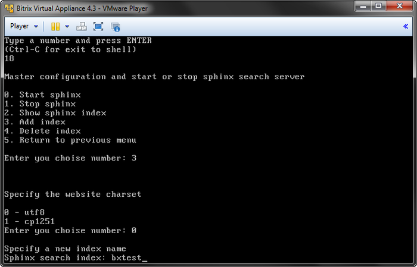
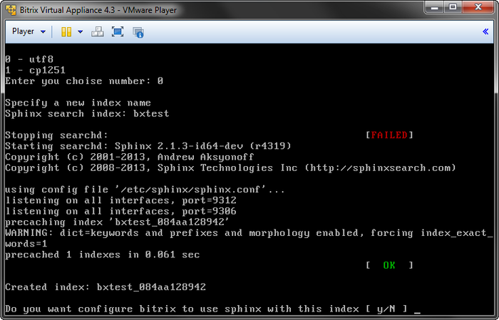
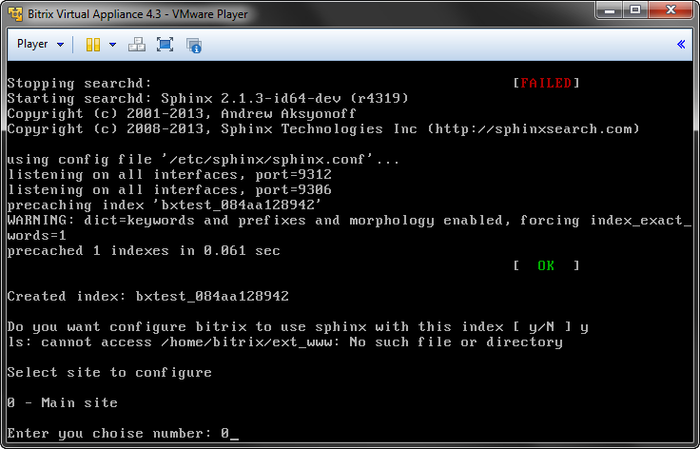
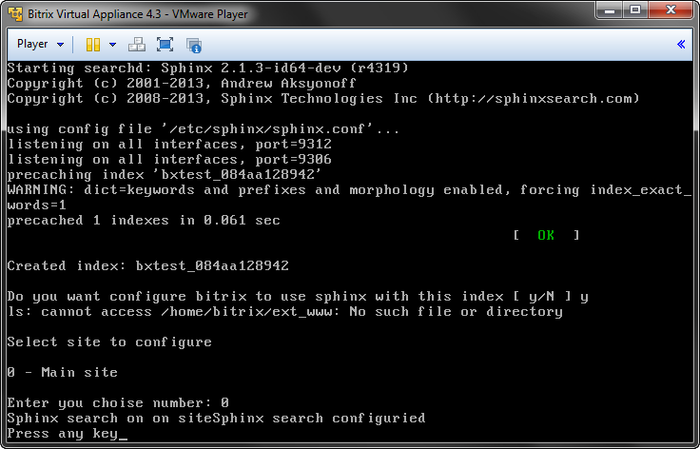

# Настройка сервера поиска Sphinx

**Навигация**
- [← Оглавление курса](index.md)
- [← Предыдущий: 3459 — Автоматическое создание резервной копии](lesson_3459.md)
- [Следующий: 5262 — Обновление виртуальной машины VMBitrix →](lesson_5262.md)

Официальная страница урока: https://dev.1c-bitrix.ru/learning/course/index.php?COURSE_ID=37&LESSON_ID=5838

Использование **Sphinx** в качестве поискового механизма позволит значительно увеличить скорость поиска и снизит нагрузку на сервер.

Для его настройки необходимо:

- Установить и обновить проект до последней актуальной версии;
- В меню виртуальной машины выбрать пункт **18. Sphinx search server**:
  
- В данном меню при первом включении вначале выбрать пункт **0. Start sphinx** , а затем **3. Add index**, чтобы создать индекс для конкретного сайта. При этом необходимо выбрать кодировку, в которой работает сайт и придумать название индекса:
  
- Мастер создаст нужный индекс, перезапустит **Sphinx**. После чего, покажет полное название индекса и предложит настроить на использование этого индекса установленный на машине проект:
  
- Для настройки уже установленного проекта достаточно выбрать его из списка доступных, и после отработки мастера выполнить полную переиндексацию.
  
- Все готово к работе:
  

**Примечание:** Ручная настройка поискового механизма **Sphinx** описана в данном [уроке](/learning/course/index.php?COURSE_ID=35&LESSON_ID=5935).
