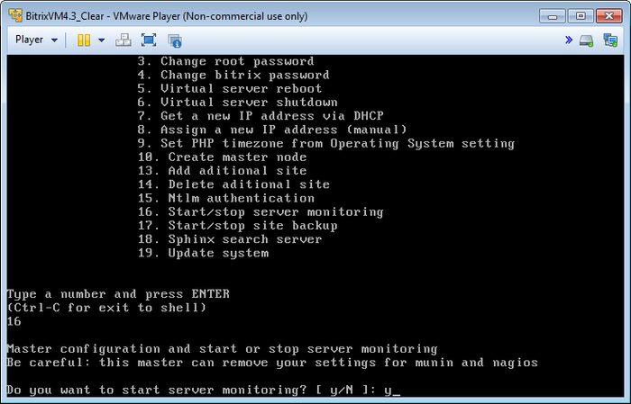
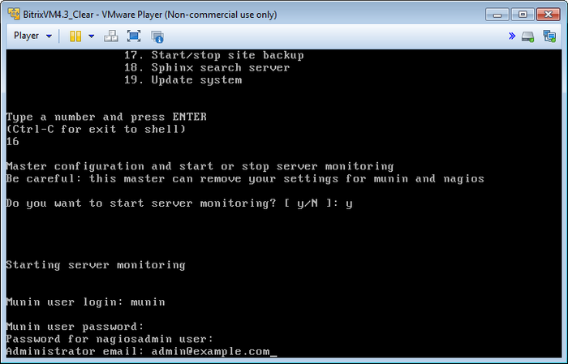
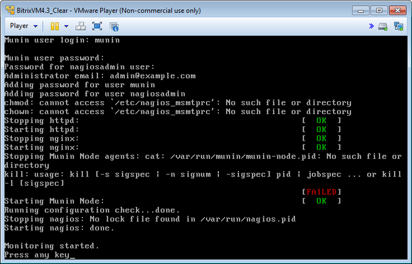
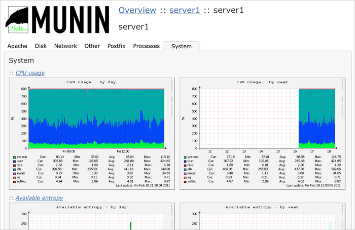
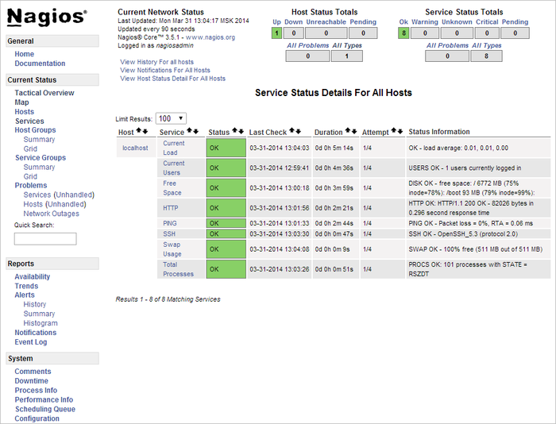

# Мониторинг сервера

**Навигация**
- [← Оглавление курса](index.md)
- [← Предыдущий: 5232 — Добавление дополнительного сайта](lesson_5232.md)
- [Следующий: 3459 — Автоматическое создание резервной копии →](lesson_3459.md)

Официальная страница урока: https://dev.1c-bitrix.ru/learning/course/index.php?COURSE_ID=37&LESSON_ID=6304

При разворачивании проектов на базе *BitrixVM* необходимо следить за состоянием сервера и отдельных его компонентов.

*«1C-Битрикс: Виртуальная машина»* версии 4.х поставляется с системами мониторинга такие как **Munin** и **Nagios**, которые имеют большое количество различных компонентов по отслеживанию функционирования всех систем сервера.

Для начала работы систем мониторинга необходимо:

- В меню виртуальной машины выбрать пункт **16. Start/stop server monitoring** и согласиться на запуск мониторинга:
  
- Далее задать:
  

  - **логин** и **пароль** для Munin;
  - **пароль** для Nagios (логин по умолчанию: **nagiosadmin**);
  - **e-mail** Администратора, куда будут высылаться уведомления.
- Затем мастер сделает необходимые настройки и запустит сервисы мониторинга сервера:
  

Для мониторинга сервера из браузера нужно зайти по адресам и авторизоваться под созданными ранее учетными записями мониторинга:

- Munin - http://адрес_сервера/munin/:
  
- Nagios - http://адрес_сервера/nagios/:
  
