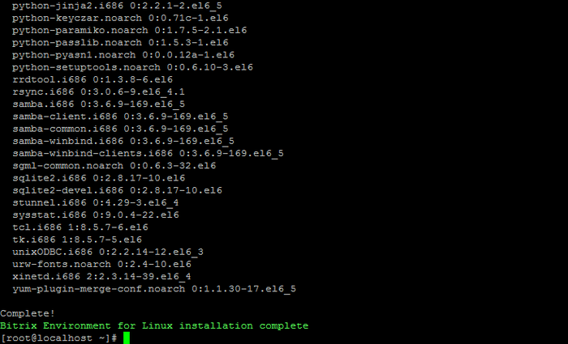
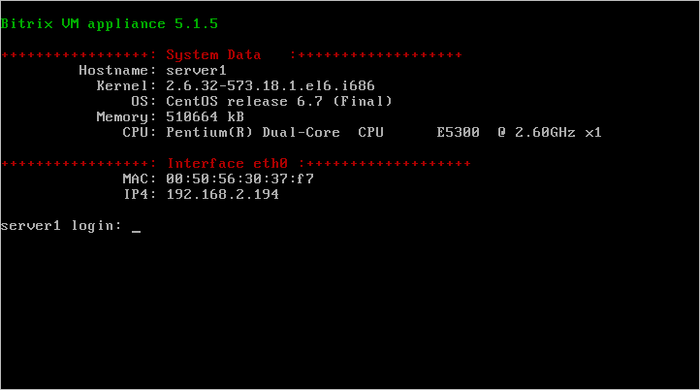
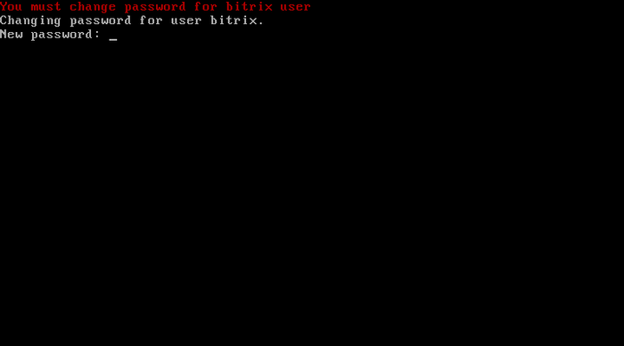

# Установка «1С-Битрикс: Веб-окружение» - Linux 5.x

**Навигация**
- [← Оглавление курса](index.md)
- [← Предыдущий: 20428 — Как сделать образ BitrixVM для клонирования](lesson_20428.md)
- [Следующий: 6490 — Запуск виртуальной машины BitrixVM →](lesson_6490.md)

Официальная страница урока: https://dev.1c-bitrix.ru/learning/course/index.php?COURSE_ID=37&LESSON_ID=6489

*«1С-Битрикс: Веб-окружение» - Linux* будет полезно:


- Для пользователей и разработчиков, которые использовали продукт *«1С-Битрикс: Виртуальная машина»* в процессе подготовки сайта и столкнулись с проблемой переноса конфигурации на хостинг или на невиртуальное оборудование и потерей производительности.
- Для специалистов хостинг-партнеров, планирующих создать шаблоны различных VPS для продуктов «1С-Битрикс».
- Для системных администраторов, которым требуется быстро подготовить производительную платформу для установки или миграции сайтов на основе «1С-Битрикс».
- Для программистов и системных администраторов, которым требуется быстро развернуть кластер для проектов на основе «1С-Битрикс».


*«1С-Битрикс: Веб-окружение» - Linux* позволяет быстро и с минимальными затратами развернуть оптимальное окружение для работы продуктов и решений «1С-Битрикс» на Linux-платформе **CentOS 5/6** (i386, x86_64):


- mysql-server 5.*
- web-server (Apache 2.2.*)
- php 5.6.*
- nginx 1.6.2
- memcached
- stunnel
- catdoc
- xpdf
- munin
- nagios
- sphinx


Рассмотрим установку *«1С-Битрикс: Веб-окружение» - Linux* на оборудовании с уже установленной **CentOS 6** (i386, x86_64).


- Авторизуемся на сервер под административным аккаунтом.
- Загружаем скрипт *«1С-Битрикс: Веб-окружение» - Linux* и запускаем его командами:
  ```
  wget http://repo.bitrix24.tech/yum/bitrix-env.sh
  chmod +x bitrix-env.sh
  ./bitrix-env.sh
  ```
  **Примечание**: Если на сервере нет утилиты для загрузки файлов **wget**, то ее можно установить командой `yum install wget`
  В процессе установки будет задан вопрос, какую версию *«Веб-окружения»* нужно установить (выбираем версию 5) и ждем окончания установки:
  
  Далее после завершения установки нужно открыть порты, которые необходимы для нормальной работы продуктов «1С-Битрикс» в *Веб-окружении*:
  ```
  iptables -I INPUT -p tcp --dport 25 -j ACCEPT
  iptables -I INPUT -p tcp --dport 80 -j ACCEPT
  iptables -I INPUT -p tcp --dport 443 -j ACCEPT
  iptables -I INPUT -p tcp --dport 5222 -j ACCEPT
  iptables -I INPUT -p tcp --dport 5223 -j ACCEPT
  iptables -I INPUT -p tcp --dport 8890 -j ACCEPT
  iptables -I INPUT -p tcp --dport 8891 -j ACCEPT
  iptables -I INPUT -p tcp --dport 8893 -j ACCEPT
  iptables -I INPUT -p tcp --dport 8894 -j ACCEPT
  ```
  где порты обозначают и используются для следующих сервисов:
  - **25** - smtp сервер;
  - **80** - http ;
  - **443** - https;
  - **5222** - bitrix xmpp сервер;
  - **5223** - bitrix xmpp сервер по ssl;
  - **8890** - ntlm авторизация;
  - **8891** - ntlm авторизация по ssl;
  - **8893** - http сервер мгновенных сообщений;
  - **8894** - https сервер мгновенных сообщений.
  Порты прописаны, необходимо сохранить таблицу командой:
  ```
  service iptables save
  ```
  **Внимание!** При установке *«1С-Битрикс: Веб-окружение» - Linux* **версии 7.x+** нужно только сменить пароли при первой авторизации (см. ниже) и создать пул ([1. Create Management pool of server](/learning/course/index.php?COURSE_ID=37&CHAPTER_ID=06511)). Мастер создания пула откроет все необходимые порты.
  Установка закончена.
  Перезагружаем сервер командой `reboot`, чтобы посмотреть, что все установилось корректно, на экране будет отображено, что запущена машина и ее текущая версия.
  
  При первом входе на сервер с логином **root** будет предложено сменить пароль у пользователя **bitrix**:
  


Можно приступать к работе.
