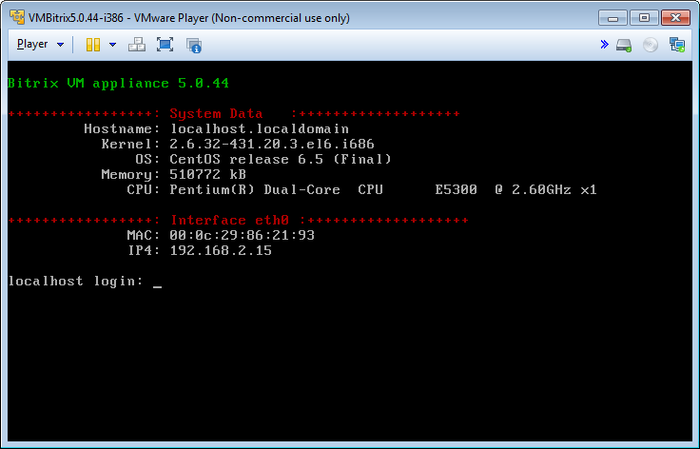
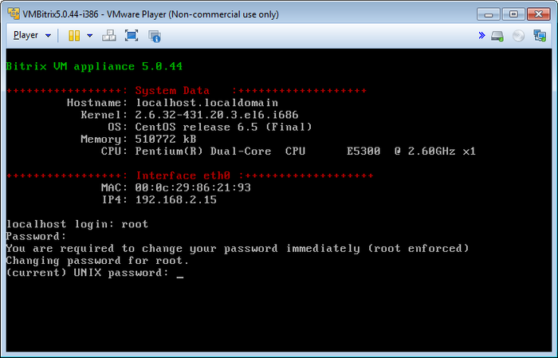
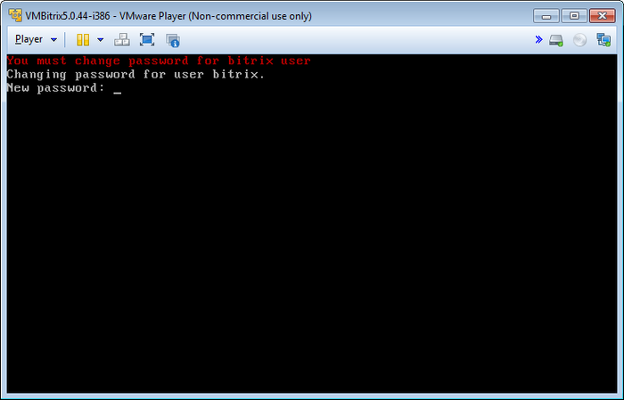
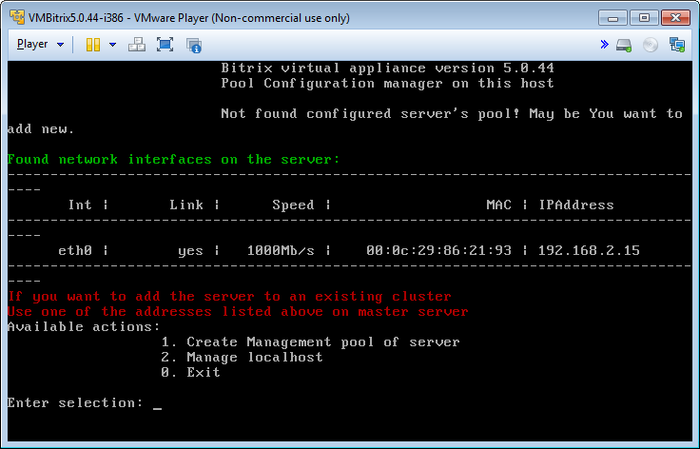

# Запуск виртуальной машины BitrixVM

**Навигация**
- [← Оглавление курса](index.md)
- [← Предыдущий: 6489 — Установка «1С-Битрикс: Веб-окружение» - Linux 5.x](lesson_6489.md)
- [Следующий: 6550 — Перенос продукта «1C-Битрикс» на виртуальную среду BitrixVM/BitrixEnv →](lesson_6550.md)

Официальная страница урока: https://dev.1c-bitrix.ru/learning/course/index.php?COURSE_ID=37&LESSON_ID=6490

- Загрузите дистрибутив [настроенной виртуальной машины BitrixVM](http://www.1c-bitrix.ru/products/vmbitrix/).
- Загруженный архив распакуйте в любую папку, например, `С:\BitrixVM\` и запустите виртуальную машину с помощью подходящего ПО:
- Начнется процесс загрузки операционной системы, установленной на виртуальной машине. В конце загрузки откроется окно:
  
- **Примечание:**Для суперпользователя **root** по умолчанию задан пароль **bitrix**.
  При первом запуске виртуальной машины будет предложено сменить пароли суперпользователя **root** и пользователя **bitrix**:
  
  Аналогично происходит смена пароля пользователя **bitrix**:
  
  **Примечание:** Сменить пароль пользователя **bitrix** можно позднее в панели управления виртуальным сервером с помощью пункта меню 1. Create Management pool of server - Change bitrix password.

  - В строках **localhost login** укажите текущий логин (**root**), а в поле **Password** пароль (по умолчанию **bitrix**).
  - В строке **(current) UNIX password** укажите текущий пароль (**bitrix**) и нажмите **Enter**.
  - Введите новый пароль в строке **Enter new UNIX password** и нажмите **Enter**.
  - Повторите ввод нового пароля в строке **Retype new UNIX password** и нажмите **Enter**.


В результате виртуальный сервер готов для использования. Первоначальное меню BitrixVM **Available actions** выглядит так:





- [**1. Create Management pool of server**](https://dev.1c-bitrix.ru/learning/course/index.php?COURSE_ID=37&CHAPTER_ID=06511) - создает пул управления сервером;
- [**2. Manage localhost**](https://dev.1c-bitrix.ru/learning/course/index.php?COURSE_ID=37&CHAPTER_ID=06500) - управление локальным виртуальным сервером;
- **0. Exit** - выход в консоль операционной системы.


Для перехода к выполнению любого действия введите число (от 0 до 2) и нажмите **Enter**. Например, для настройки локального виртуального сервера в строке наберите **2** (**Manage localhost**) и нажмите **Enter**.


Чтобы вернуться в вашу ОС, нажмите **Ctrl**+**Alt**.


Чтобы вернуться из shell в меню виртуальной машины, введите команду:


```

/root/menu.sh
```


**Примечание:**При возникновении проблем с сетевым адаптером **VMWare Player** необходимо перейти в настройки сетевого адаптера (Virtual Machine &gt; Removable Devices &gt; Network Adapter &gt; Settings...), выбрать один из режимов (**Bridged**, **NAT**, **Host-only**):


и перезапустить виртуальный сервер, выбрав пункт меню 2. Manage localhost &gt; 4. Reboot server.


**Примечание:** При клонировании виртуальной машины BitrixVM или в другом случае при смене MAC-адреса сетевого интерфейса eth0 может возникнуть ошибка **IP4: undefined**. В таком случае необходимо открыть файл `/etc/udev/rules.d/70-persistent-net.rules` и в нем удалить (или закомментировать) все строчки для интерфейса eth0 и eth1, сохранить файл и перезагрузить машину командой `reboot`.


Далее необходимо набрать IP-адрес (полученный в виртуальной машине - **IP4**) в браузере (в нашем примере это http://192.168.2.15 или https://192.168.2.15). Откроется страница с выбором варианта работы:


Для продолжения необходимо выбрать один из вариантов:


1. **Новая установка** - в этом случае будет запущен мастер, который позволяет скачать, установить и создать новый сайт средствами продуктов компании «1C-Битрикс». Шаги этого варианта аналогичны шагам, рассмотренным в главе **Установка продукта с помощью BitrixSetup**.
2. **Восстановить проект** - в этом случае будет запущен мастер, с помощью которого можно будет перенести существующий проект (восстановить проект из резервной копии). Шаги этого варианта аналогичны шагам, рассмотренным в главе **Перенос продукта**.
