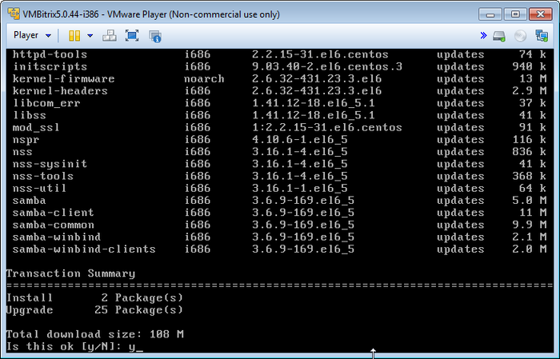

# Обновление локального сервера

**Навигация**
- [← Оглавление курса](index.md)
- [← Предыдущий: 6503 — Настройка IP-адреса сервера](lesson_6503.md)
- [Следующий: 6513 — Настройка MySQL (Configure MySQL servers) →](lesson_6513.md)

Официальная страница урока: https://dev.1c-bitrix.ru/learning/course/index.php?COURSE_ID=37&LESSON_ID=6501

**Внимание!** Обновление продукта *«1C-Битрикс: Виртуальная машина»* – сложная операция, в процессе которой происходит обновление системных файлов операционной системы виртуальной машины, и для этого необходимы соответствующие знания администрирования *nix-систем. Перед запуском процесса рекомендуется сделать полный бекап «Виртуальной машины».


Для обновления локальной виртуальной машины необходимо выбрать в административном меню пункт 2. Manage localhost - 6. Update server.





Скрипт автоматически проверит обновления компонентов, выдаст общий объем для загрузки и запрос на установку.


**Внимание!** Этот пункт меню запускает обновление компонентов лишь текущей виртуальной машины. Если у вас несколько серверов в пуле (кластер), то целесообразно производить его для всех виртуальных машин, входящих в этот пул.


**Примечания:**

- Если по окончании процесса что-то перестанет работать, то можно вернуть полностью или частично старые файлы настроек соответствующей службы, т.к. конфигурационные файлы во время выполнения процедуры не перезаписываются, а сохраняются в файлах ***.ori.(метка времени)**.
- Также в процессе обновления могут отключиться некоторые модули php. Для их включения необходимо выполнить следующие команды:
  ```
  mv -f /etc/php.d/(имя модуля).ini.disabled /etc/php.d/(имя модуля).ini
  service httpd restart
  ```
