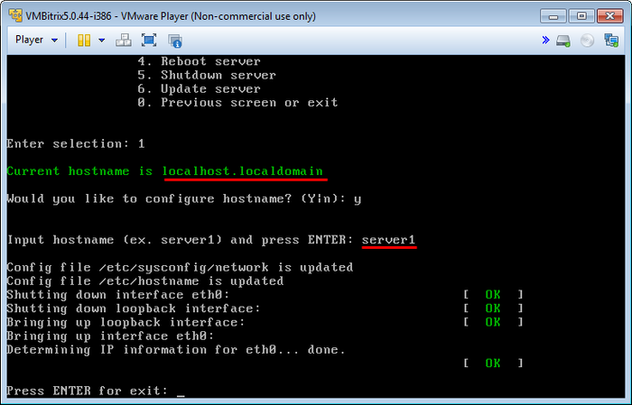
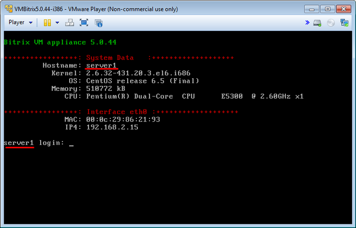

# Изменение названия хоста

**Навигация**
- [← Оглавление курса](index.md)
- [← Предыдущий: 7127 — Обновление PHP и MySQL (Upgrade php and mysql versions)](lesson_7127.md)
- [Следующий: 6503 — Настройка IP-адреса сервера →](lesson_6503.md)

Официальная страница урока: https://dev.1c-bitrix.ru/learning/course/index.php?COURSE_ID=37&LESSON_ID=6502

Чтобы задать имя хоста локального сервера, нужно перейти в главном меню 2. Manage localhost - Configure hostname:

Далее согласиться на его изменение и ввести новое название **Input hostname** – например **server1** (по умолчанию это **localhost.localdomain**):

После чего системе будет присвоено новое имя:

