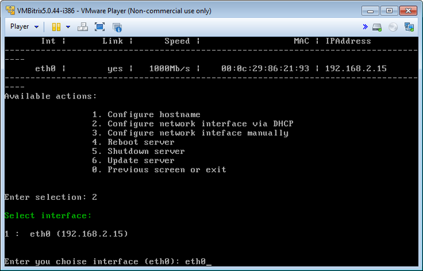
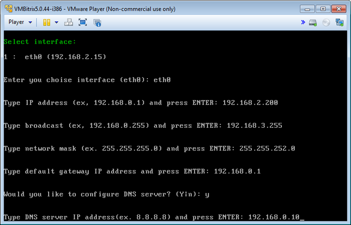
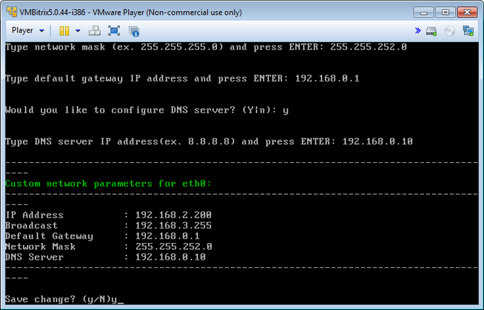

# Настройка IP-адреса сервера

**Навигация**
- [← Оглавление курса](index.md)
- [← Предыдущий: 6502 — Изменение названия хоста](lesson_6502.md)
- [Следующий: 6501 — Обновление локального сервера →](lesson_6501.md)

Официальная страница урока: https://dev.1c-bitrix.ru/learning/course/index.php?COURSE_ID=37&LESSON_ID=6503

При первом старте BitrixVM получение IP-адреса сервером происходит автоматически, если в сети есть настроенный DHCP-сервер.

Если по каким-либо причинам необходимо сменить полученный IP, то можно сделать это в двух режимах: автоматическом и ручном.

#### Автоматическое получение

- Чтобы сменить IP-адрес локального сервера с помощью DHCP-сервера, нужно перейти в главном меню 2. Manage localhost - 2. Configure network interface via DHCP.
- Выбрать сетевой интерфейс (в данном примере - **eth0**) и автоматически будет выдан новый IP:
  

#### Ручное изменение

- Для задания IP-адреса в ручном режиме необходимо перейти в главном меню 2. Manage localhost - 3. Configure network interface manually.
- Выбрать сетевой интерфейс (в данном примере - **eth0**).
- Ввести данные:
  

  - **Type IP address** -  новый IP сервера;
  - **Type broadcast** -  широковещательный адрес сети;
  - **Type network mask** -  маска подсети;
  - **Type default gateway** -  шлюз по умолчанию;
  - **Type DNS server** -  адрес DNS-сервера.
- Проверить введенные данные и  дать согласие на изменение параметров сети сервера:
  
