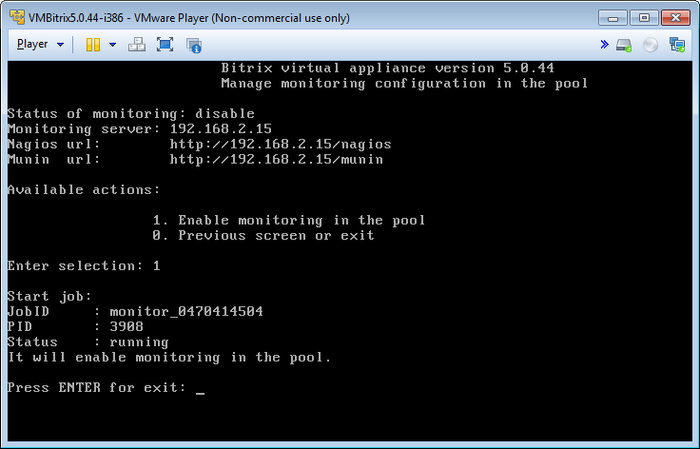
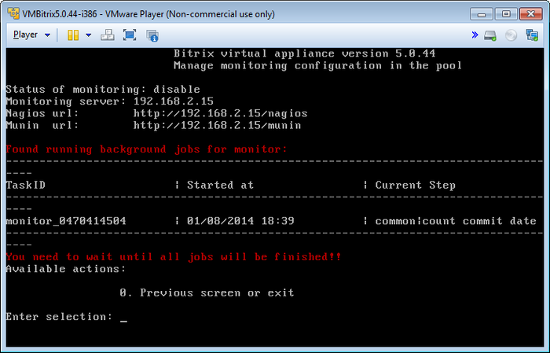
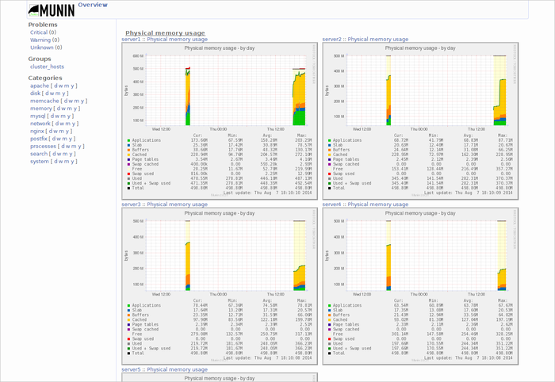
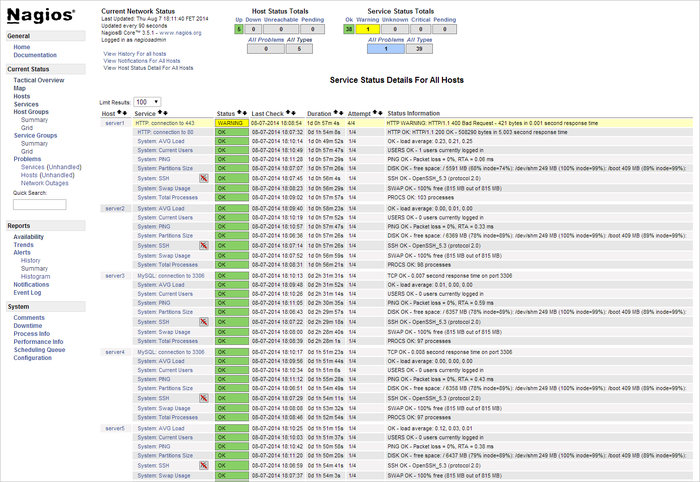

# Мониторинг (Monitoring in pool)

**Навигация**
- [← Оглавление курса](index.md)
- [← Предыдущий: 6518 — Управление веб-серверами (Manage web nodes in the pool)](lesson_6518.md)
- [Следующий: 5502 — Изменение стандартных настроек BitrixVM без отключения автоподстройки →](lesson_5502.md)

Официальная страница урока: https://dev.1c-bitrix.ru/learning/course/index.php?COURSE_ID=37&LESSON_ID=6508

При разворачивании проектов на базе *BitrixVM* необходимо следить за состоянием сервера и отдельных его компонентов.

В составе *«1C-Битрикс: Виртуальная машина»* версии 5.х уже имеются системы мониторинга такие как **Munin** и **Nagios**, которые имеют большое количество различных компонентов по отслеживанию функционирования всех систем сервера.

Для начала работы систем мониторинга необходимо:

- В главном меню виртуальной машины выбрать пункт 9. Monitoring in pool &gt; 1. Enable monitoring in the pool:
  
- Затем мастер сделает необходимые настройки и запустит сервисы мониторинга сервера:
  

Для мониторинга сервера из браузера нужно зайти по адресам и авторизоваться под учетными записями мониторинга:

- Munin - http://адрес_сервера/munin/:
  **логин**: admin
  **пароль**: muninBitrixMon
  
- Nagios - http://адрес_сервера/nagios/:
  **логин**: nagiosadmin
  **пароль**: nagiosBitrixMon
  

**Примечание:** Сменить пароли для систем мониторинга можно с помощью консольных команд:

- для Munin: `htpasswd /etc/munin/passwd admin`
- для Nagios: `htpasswd /etc/nagios/passwd nagiosadmin`
