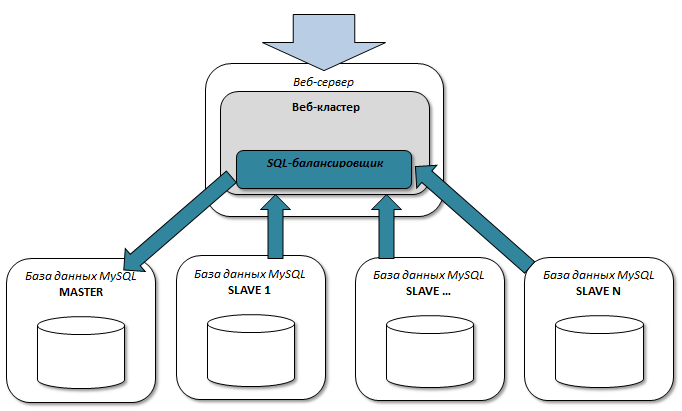
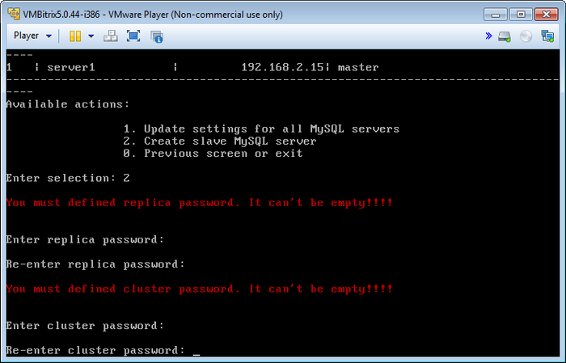
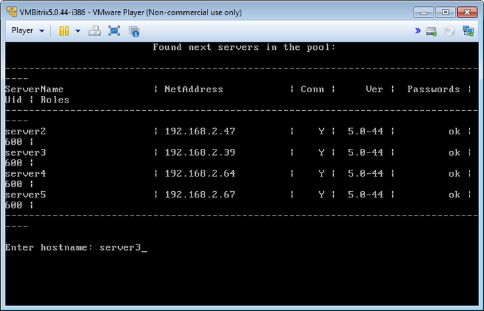
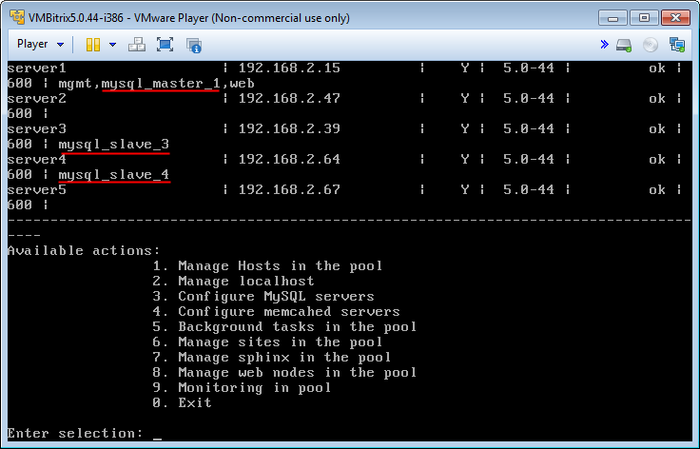
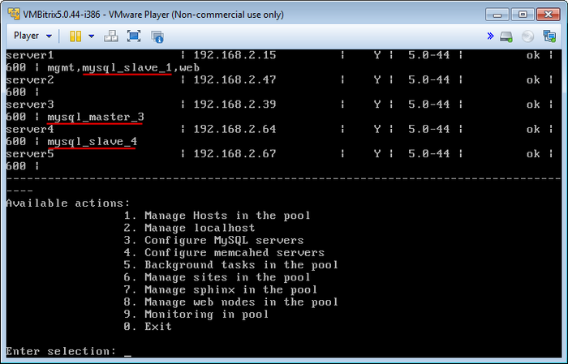
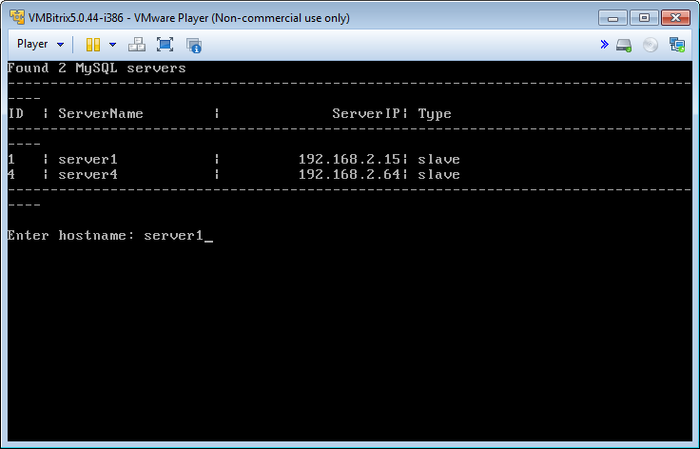
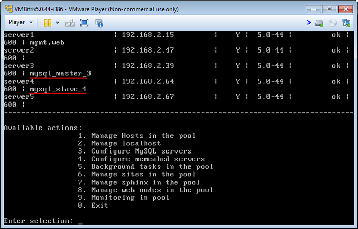

# Настройка MySQL (Configure MySQL servers)

**Навигация**
- [← Оглавление курса](index.md)
- [← Предыдущий: 6501 — Обновление локального сервера](lesson_6501.md)
- [Следующий: 6514 — Настройка memcached (Configure memcached servers) →](lesson_6514.md)

Официальная страница урока: https://dev.1c-bitrix.ru/learning/course/index.php?COURSE_ID=37&LESSON_ID=6513

В «1C-Битрикс: Виртуальная машина» можно быстро развернуть кластерную конфигурацию master-slave [«1С-Битрикс: Управление сайтом»](http://www.1c-bitrix.ru/products/cms/) и [«Битрикс24 в коробке»](http://www.1c-bitrix.ru/products/intranet/).

Ключевые особенности:

- гибкая балансировка нагрузки SQL;
- простота администрирования;
- дешевое и быстрое неограниченное масштабирование;
- онлайн бекап;
- не требуется доработка логики веб-приложения.

Схема «master - slave» реализуется средствами MySQL. Платформа «1С-Битрикс» позволяет гибко балансировать нагрузку между серверами, участвующими в репликации.

**Внимание!** Для создания такой конфигурации необходим модуль [Веб-кластер](http://www.1c-bitrix.ru/products/intranet/features/webcluster.php), который входит не во все редакции продуктов «1С-Битрикс».

  [Создание (Create slave MySQL server)](#add)
  [Смена master сервера MySQL (Change master MySQL server)](#change_master)
  [Удаление (Remove slave MySQL server)](#remove)

### Создание (Create slave MySQL server)

Для создания slave сервера нужно:

- Выбрать пункт меню 3. Configure MySQL servers &gt; 2. Create slave MySQL server, придумать и ввести пароли репликации и кластера:
  
  **Примечание**: Пароли репликации и кластера нужно ввести один раз, в дальнейшем при добавлении новых серверов эти пароли спрашиваться не будут.
- Ввести имя хоста в пуле, на котором будет создан сервер (в данном примере - **server3**):
  
- Подождать, пока задача по добавлению будет закончена.
- Создадим аналогичным образом еще один slave сервер (**server4**). В итоге получим три сервера MySQL: master (**server1**) и два slave (**server3** и **server4**):
  

### Смена master сервера MySQL (Change master MySQL server)

Для переноса на другую машину необходимо:

- Выбрать пункт меню 3. Configure MySQL servers &gt; 3. Change master MySQL server.
- Ввести имя хоста для будущего master сервера MySQL из списка доступных slave (например **server3**):
  
- Подождать, пока задача по смене будет закончена.
- В итоге серверы MySQL станут: master (**server3**) и два slave (**server1** и **server4**):
  

### Удаление (Remove slave MySQL server)

Для удаления необходимо:

- Выбрать пункт меню 3. Configure MySQL servers &gt; 4. Remove slave MySQL server.
- Ввести имя хоста удаляемого slave сервера (например **server1**):
  
- Подождать, пока задача по удалению будет закончена.
- В итоге серверы MySQL станут: master (**server3**) и один slave (**server4**):
  

Таким образом, мы перенесли master сервер MySQL с машины **server1** на **server3**, создали дополнительный slave сервер MySQL на машине **server4** и освободили ресурсы машины **server1** под другие роли.

**Внимание!** Задачи могут выполняться довольно длительное время (до 2-3 часов и более) в зависимости от сложности задачи, объема данных, используемых в этих задачах, мощности и загруженности сервера. Проверить текущие выполняемые задачи можно с помощью меню 5. Background tasks in the pool &gt; 1. View running tasks.
