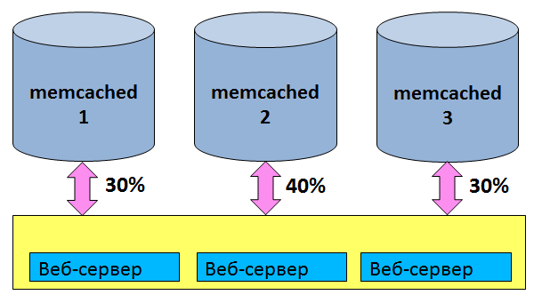
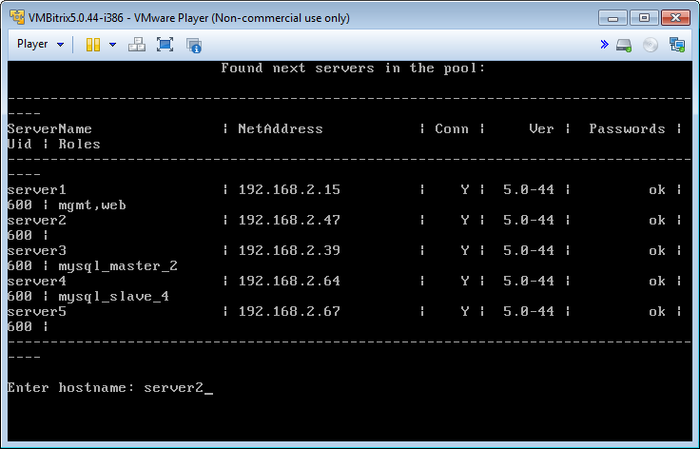
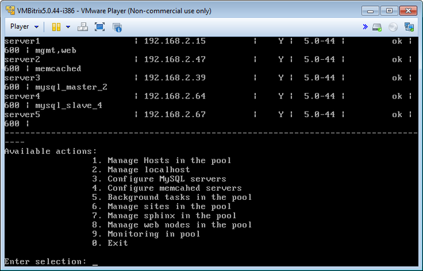
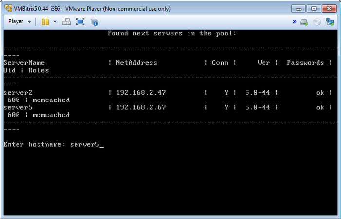

# Настройка memcached (Configure memcached servers)

**Навигация**
- [← Оглавление курса](index.md)
- [← Предыдущий: 6513 — Настройка MySQL (Configure MySQL servers)](lesson_6513.md)
- [Следующий: 6515 — Фоновые задачи (Background tasks in the pool) →](lesson_6515.md)

Официальная страница урока: https://dev.1c-bitrix.ru/learning/course/index.php?COURSE_ID=37&LESSON_ID=6514

Продукты «1С-Битрикс» позволяет использовать пул серверов **memcached** для работы с кешем данных.

Это обеспечивает:

- **высокую эффективность** – за счет централизованного использования кеша веб-приложением;
- **надежность** – за счет устойчивости подсистемы кеширования к выходу из строя отдельных компонентов;
- **неограниченную масштабируемость** – за счет добавления новых memcached-серверов.

**Внимание!** Для использования описанного функционала необходим модуль [Веб-кластер](http://www.1c-bitrix.ru/products/intranet/features/webcluster.php), который входит не во все редакции продуктов «1С-Битрикс».

  [Создание (Create memcached server)](#add)
  [Удаление (Remove memcached server)](#delete)

### Создание (Create memcached server)

Для создания memcached сервера нужно:

- Выбрать пункт меню 4. Configure memcached servers &gt; 1. Create memcached server.
  Ввести имя хоста в пуле, на котором будет запущен сервер (в данном примере - **server2**):
  
  Подождать, пока задача по запуску будет закончена:
  

### Удаление (Remove memcached server)

Для удаления memcached сервера необходимо:

- Выбрать пункт меню 4. Configure memcached servers &gt; 3. Remove memcached server:
- Ввести имя нужного хоста (например **server5**):
  
- Подождать, пока задача по удалению будет закончена.

**Внимание!** Задачи могут выполняться довольно длительное время (до 2-3 часов и более) в зависимости от сложности задачи, объема данных, используемых в этих задачах, мощности и загруженности сервера. Проверить текущие выполняемые задачи можно с помощью меню 5. Background tasks in the pool &gt; 1. View running tasks.
