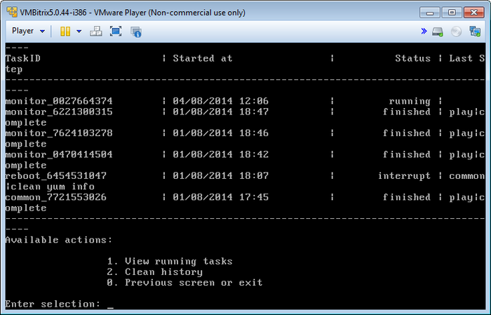
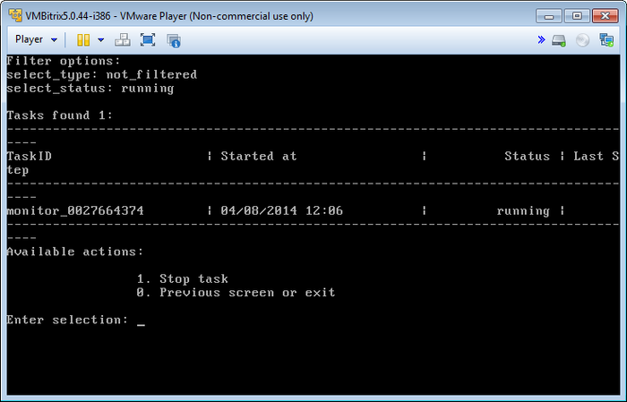
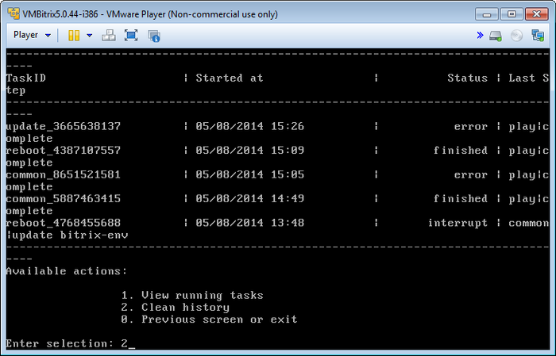
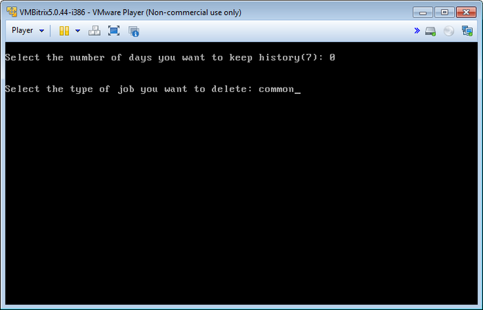
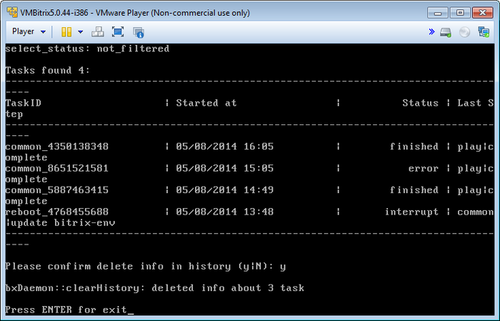

# Фоновые задачи (Background tasks in the pool)

**Навигация**
- [← Оглавление курса](index.md)
- [← Предыдущий: 6514 — Настройка memcached (Configure memcached servers)](lesson_6514.md)
- [Следующий: 6535 — Создание и удаление сайта (Create\Delete site) →](lesson_6535.md)

Официальная страница урока: https://dev.1c-bitrix.ru/learning/course/index.php?COURSE_ID=37&LESSON_ID=6515

Все изменения в виртуальной машине – настройки, запуск каких-либо служб, синхронизация и др. осуществляются с помощью скриптов – задач.

Просмотреть историю выполнения, а также активные в данный момент задачи, можно с помощью пункта меню 5. Background tasks in the pool:

Просмотреть запущенную на текущий момент задачу можно с помощью пункта меню 5. Background tasks in the pool &gt; 1. View running tasks:

Для её остановки нужно перейти в пункт меню 5. Background tasks in the pool &gt; 1. View running tasks &gt; 1. Stop task и ввести идентификатор задачи:

**Внимание!** Задачи могут выполняться довольно длительное время (до 2-3 часов и более) в зависимости от их сложности, используемых в них объема данных, мощности и загруженности сервера.

Чтобы очистить историю нужно выбрать пункт меню 5. Background tasks in the pool &gt; 2. Clean history:

Далее выбрать количество дней, за которое нужно оставить историю, и фильтр, по которому выбирать задачи (к примеру, выберем **все задачи** с TaskID **common**):

После этого будут выведены все задачи, удовлетворяющие заданному интервалу и фильтру, и далее запрос на очистку истории:

**Внимание!** Если по каким-либо причинам нужно посмотреть лог-файлы выполнения задач, то они находятся в директории `/opt/webdir/temp`.
