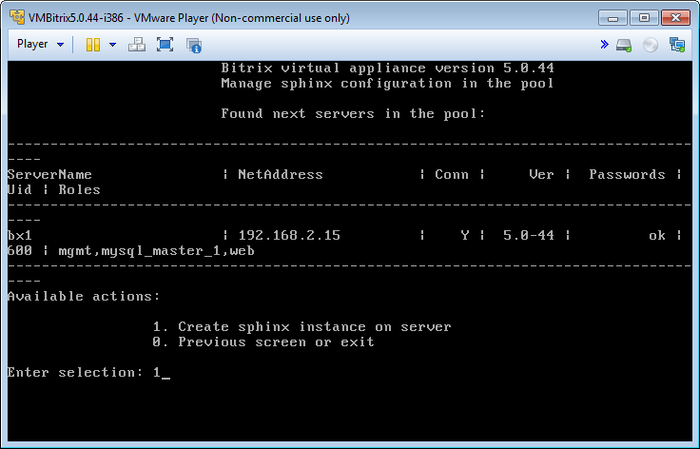
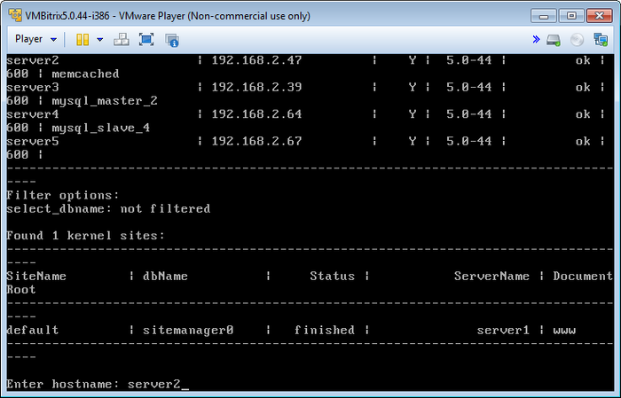
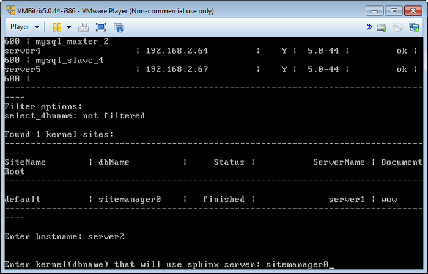
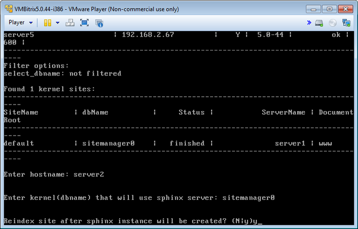
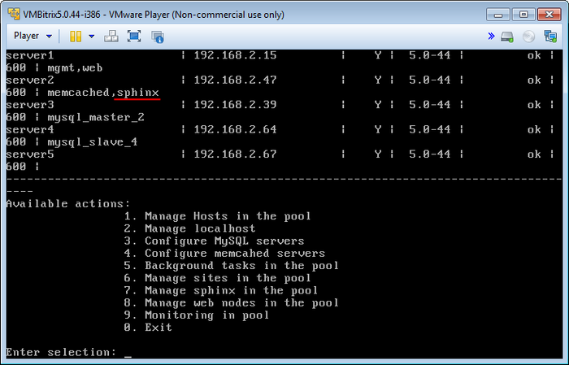

# Управление sphinx (Manage sphinx in the pool)

**Навигация**
- [← Оглавление курса](index.md)
- [← Предыдущий: 7773 — Сайты с ошибками (Show sites with errors)](lesson_7773.md)
- [Следующий: 6518 — Управление веб-серверами (Manage web nodes in the pool) →](lesson_6518.md)

Официальная страница урока: https://dev.1c-bitrix.ru/learning/course/index.php?COURSE_ID=37&LESSON_ID=6517

Использование **Sphinx** в качестве поискового механизма позволит значительно увеличить скорость поиска и снизит нагрузку на сервер.

Для его установки необходимо:

- Установить и обновить проект до последней актуальной версии;
- В меню виртуальной машины выбрать пункт 7. Manage sphinx in the pool &gt; 1. Create sphinx instance on server:
  
- Далее ввести имя хоста, где будет запущен сервер поиска **Sphinx** (в данном примере **server2**):
  
- Выбрать базу данных ядра системы сайта из списка:
  
- Дать согласие на запуск полной переиндексации после установки сервера **Sphinx**:
  
- Подождать, пока задача по установке **Sphinx** и переиндексации будет закончена:
  

**Внимание!** Задачи могут выполняться довольно длительное время (до 2-3 часов и более) в зависимости от сложности задачи, объема данных, используемых в этих задачах, мощности и загруженности сервера. Проверить текущие выполняемые задачи можно с помощью меню 5. Background tasks in the pool &gt; 1. View running tasks.

**Примечание:** Ручная настройка поискового механизма **Sphinx** описана в данном [уроке](/learning/course/index.php?COURSE_ID=35&LESSON_ID=5935).
