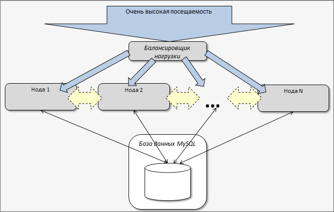
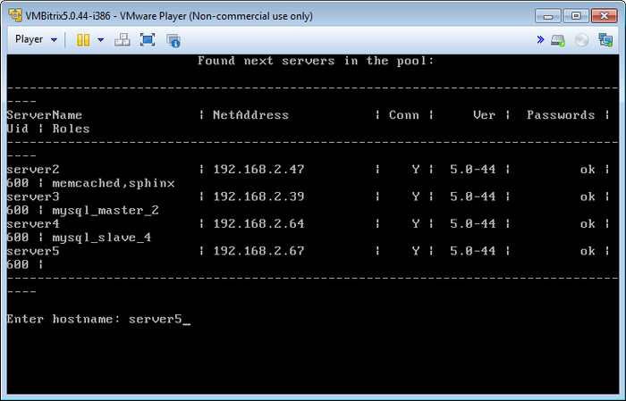
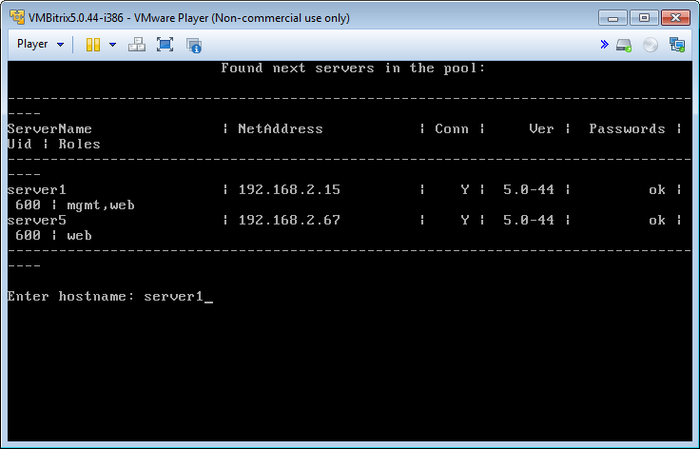
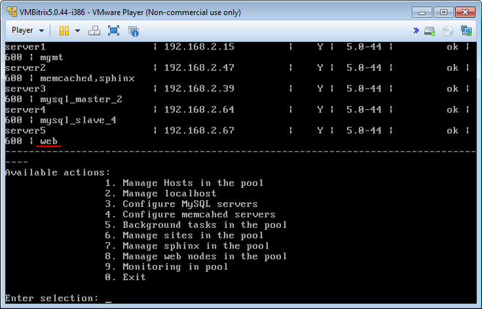

# Управление веб-серверами (Manage web nodes in the pool)

**Навигация**
- [← Оглавление курса](index.md)
- [← Предыдущий: 6517 — Управление sphinx (Manage sphinx in the pool)](lesson_6517.md)
- [Следующий: 6508 — Мониторинг (Monitoring in pool) →](lesson_6508.md)

Официальная страница урока: https://dev.1c-bitrix.ru/learning/course/index.php?COURSE_ID=37&LESSON_ID=6518

В *«1C-Битрикс: Виртуальная машина»* можно быстро развернуть кластеризацию веб-сервера в [«1С-Битрикс: Управление сайтом»](http://www.1c-bitrix.ru/products/cms/) и [«Битрикс24 в коробке»](http://www.1c-bitrix.ru/products/intranet/).

При разделении проекта на несколько веб-серверов необходимо решить две задачи:

- синхронизации данных (файлов) между серверами
- балансировки нагрузки между серверами

**Внимание!** Для кластеризации веб-сервера необходим модуль [Веб-кластер](http://www.1c-bitrix.ru/products/intranet/features/webcluster.php), который входит не во все редакции продуктов «1С-Битрикс».

  [Создание (Create web instance on server)](#add_node)
  [Удаление (Remove web instance on server)](#remove_node)

### Создание (Create web instance on server)

Для создания веб-сервера нужно:

- Выбрать пункт меню 8. Manage web nodes in the pool &gt; 1. Create web instance on server, :
  
- Ввести имя хоста в пуле, на котором будет создан веб-сервер (в данном примере – **server5**):
  
- Подождать, пока задача по созданию будет закончена.

### Удаление (Remove web instance on server)

Для удаления веб-сервера необходимо:

- Выбрать пункт меню 8. Manage web nodes in the pool &gt; 2. Remove web instance on server.
- Ввести имя хоста (например **server1**):
  
- Подождать, пока задача по удалению будет закончена.
- В итоге из двух веб-серверов останется один на машине **server5**:
  

Таким образом, мы перенесли веб-сервер с машины **server1** на **server5**, освободив ресурсы машины **server1** под другие роли.

**Внимание!** Задачи могут выполняться довольно длительное время (до 2-3 часов и более) в зависимости от сложности задачи, объема данных, используемых в этих задачах, мощности и загруженности сервера. Проверить текущие выполняемые задачи можно с помощью меню 5. Background tasks in the pool &gt; 1. View running tasks.
