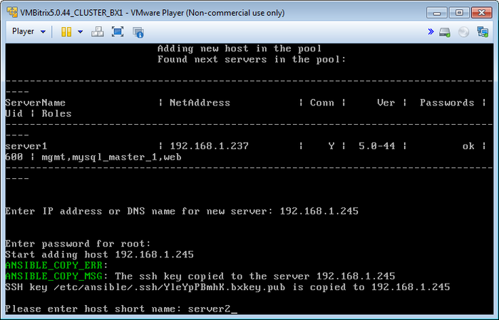
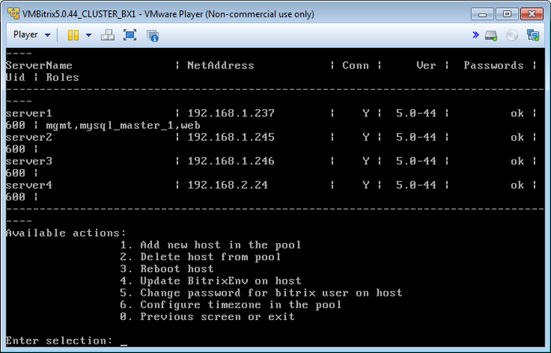
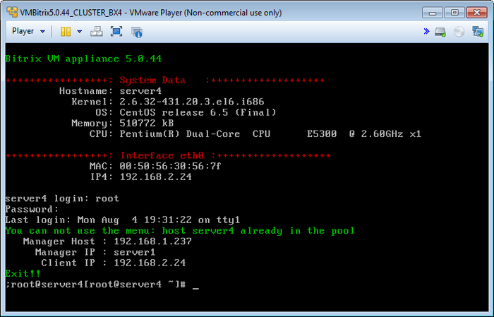

# Добавление нового хоста в пул (Add new host in the pool)

**Навигация**
- [← Оглавление курса](index.md)
- [← Предыдущий: 6550 — Перенос продукта «1C-Битрикс» на виртуальную среду BitrixVM/BitrixEnv](lesson_6550.md)
- [Следующий: 6520 — Удаление хоста из пула (Delete host from pool) →](lesson_6520.md)

Официальная страница урока: https://dev.1c-bitrix.ru/learning/course/index.php?COURSE_ID=37&LESSON_ID=6519

Добавление нового хоста в пул (кластер) осуществляется с помощью меню 1. Manage Hosts in the pool &gt; 1. Add new host in the pool.

Для этого необходимо задать ip-адрес или DNS-имя хоста и выбрать короткое имя для подключаемого сервера:

Таким образом, можно добавлять любое количество серверов в пул:

Теперь можно управлять любым сервером пула с одной машины.

**Примечание**: Если зайти на присоединенный к пулу сервер, то система оповестит о нахождении данного сервера в пуле и невозможности отображения управляемого меню:

