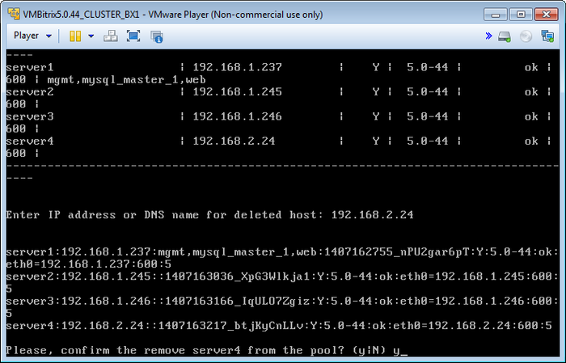
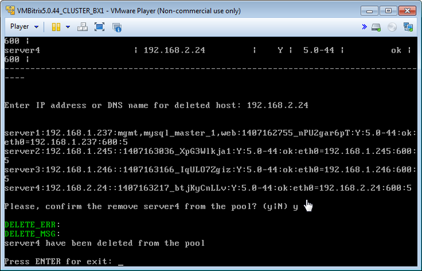

# Удаление хоста из пула (Delete host from pool)

**Навигация**
- [← Оглавление курса](index.md)
- [← Предыдущий: 6519 — Добавление нового хоста в пул (Add new host in the pool)](lesson_6519.md)
- [Следующий: 6521 — Перезапуск хоста (Reboot host) →](lesson_6521.md)

Официальная страница урока: https://dev.1c-bitrix.ru/learning/course/index.php?COURSE_ID=37&LESSON_ID=6520

Удаления хоста, находящегося в пуле, осуществляется с помощью меню 1. Manage Hosts in the pool &gt; 2. Delete host from pool .

Для этого необходимо задать ip-адрес или DNS-имя хоста удаляемого из пула сервера:

После подтверждения сервер будет удален из пула:

