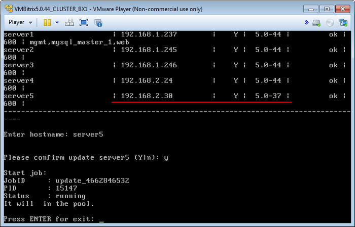
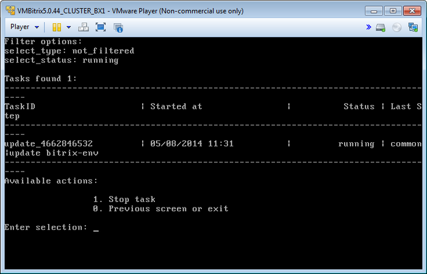
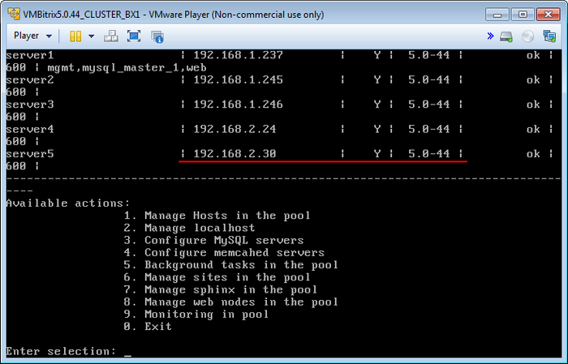

# Обновление BitrixEnv на хосте (Update BitrixEnv on host)

**Навигация**
- [← Оглавление курса](index.md)
- [← Предыдущий: 6521 — Перезапуск хоста (Reboot host)](lesson_6521.md)
- [Следующий: 6523 — Смена пароля пользователя bitrix (Change password for bitrix user on host) →](lesson_6523.md)

Официальная страница урока: https://dev.1c-bitrix.ru/learning/course/index.php?COURSE_ID=37&LESSON_ID=6522

С помощью менеджера пула можно удаленно обновлять Веб-окружение и компоненты системы на любом хосте, входящем в пул.

Например, в пул добавлена виртуальная машина версии 5.0.37, нам нужно обновить ее до 5.0.44.

- Выбираем пункт меню 1. Manage Hosts in the pool &gt; 4. Update BitrixEnv on host, система спросит **имя хоста** для обновления и подтверждение действия:
  
- Менеджер пула запустит задачу обновления Веб-окружения на удаленном хосте:
  
- Через некоторое время система на удаленном хосте обновится до последней версии (в данном примере - **5.0.44**)
  

Таким же образом можно обновлять включенные в пул виртуальные машины версии 4.3.
