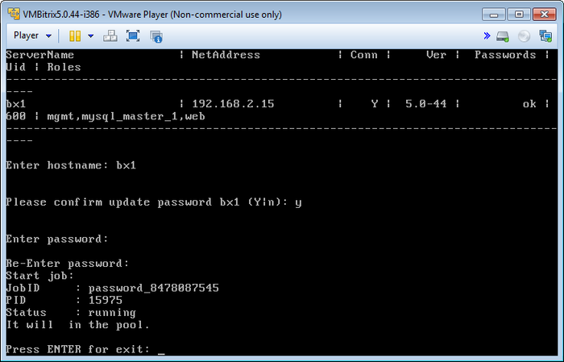

# Смена пароля пользователя bitrix (Change password for bitrix user on host)

**Навигация**
- [← Оглавление курса](index.md)
- [← Предыдущий: 6522 — Обновление BitrixEnv на хосте (Update BitrixEnv on host)](lesson_6522.md)
- [Следующий: 6524 — Настройка таймзоны в пуле (Configure timezone in the pool) →](lesson_6524.md)

Официальная страница урока: https://dev.1c-bitrix.ru/learning/course/index.php?COURSE_ID=37&LESSON_ID=6523

Смена пароля для пользователя **bitrix** осуществляется через пункт меню 1. Manage Hosts in the pool &gt; 5. Change password for bitrix user on host.

Будет выдан запрос имени хоста, на котором нужно сменить пароль пользователя **bitrix**, и согласие на это действие:

**Внимание!** Сменить пароль пользователя **root** через меню виртуальной машины нельзя. Для этого необходимо воспользоваться системными командами ОС. Например, для Centos 6.х консольная команда смены пароля пользователя **root**: `passwd`.
