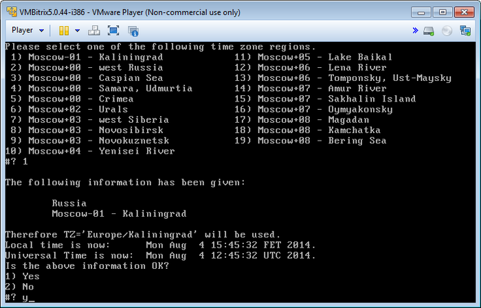
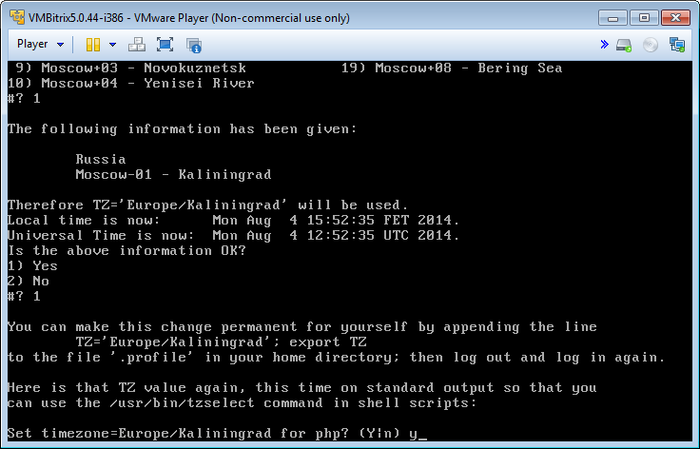
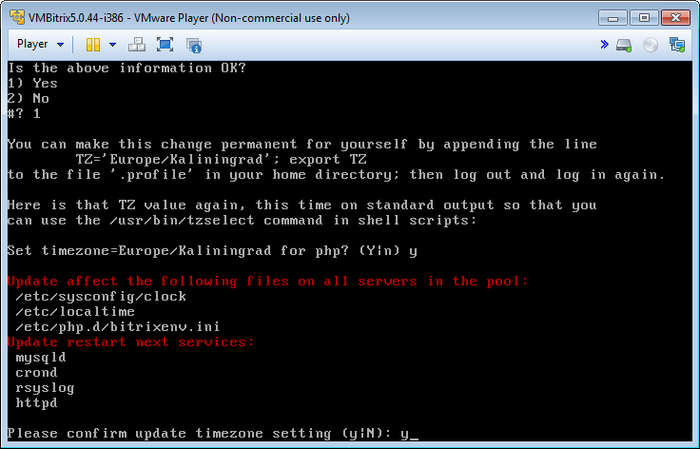

# Настройка таймзоны в пуле (Configure timezone in the pool)

**Навигация**
- [← Оглавление курса](index.md)
- [← Предыдущий: 6523 — Смена пароля пользователя bitrix (Change password for bitrix user on host)](lesson_6523.md)
- [Следующий: 7127 — Обновление PHP и MySQL (Upgrade php and mysql versions) →](lesson_7127.md)

Официальная страница урока: https://dev.1c-bitrix.ru/learning/course/index.php?COURSE_ID=37&LESSON_ID=6524

Настройка таймзоны – очень важный параметр, который обязательно нужно проверить и при необходимости настроить правильно. Параметр влияет на синхронизацию с 1С, календари, заказы и многое другое, где требуется дата и время.

Дата и время на сервере – это не одна конкретная дата и время, а фактически три различных времени:

- сервера
- PHP
- MySQL

Каждое из них – со своим часовым поясом.

Смена таймзоны происходит через пункт меню веб-окружения 1. Manage Hosts in the pool &gt; 6. Configure timezone in the pool, и меняет дату и время, в трёх местах сразу. Это очень важный момент, чтобы все три места работали с одинаковыми параметрами.

- После выбора континента, страны и города будет выведен запрос на согласие применения данной таймзоны:
  
- После этого будет предложено также изменить таймзону для PHP:
  
- И в заключение нужно подтвердить изменение таймзоны для всех серверов, входящих в пул:
  

**Примечание**: Корректность установки времени у PHP и MySQL можно проверить также через административный веб интерфейс продуктов «1C-битрикс»: Настройки &gt; Инструменты &gt; Проверка системы.
