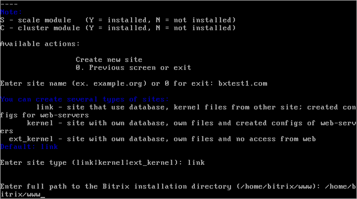
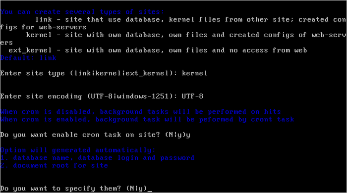
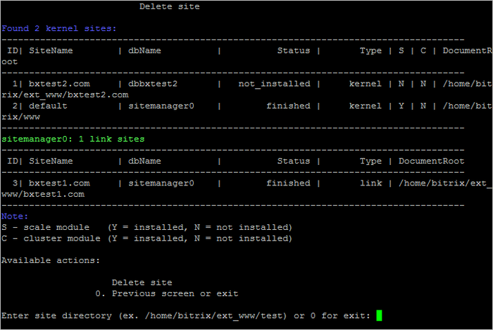

# Создание и удаление сайта (Create\Delete site)

**Навигация**
- [← Оглавление курса](index.md)
- [← Предыдущий: 6515 — Фоновые задачи (Background tasks in the pool)](lesson_6515.md)
- [Следующий: 6536 — Настройка задач cron (Change cron tasks on site) →](lesson_6536.md)

Официальная страница урока: https://dev.1c-bitrix.ru/learning/course/index.php?COURSE_ID=37&LESSON_ID=6535

Мастер создания дополнительных сайтов, позволяет развернуть на одной виртуальной машине несколько сайтов, как на независимых установках «1С-Битрикс», так и в рамках многосайтовости.

**Внимание!** В **BitrixVM\BitrixEnv** версии **5.1.х** перед добавлением сайта убедитесь, что у вас используется **пустой** root пароль к MySQL. При необходимости перед добавлением сайта можно сделать его пустым, а потом вернуть обратно.

В **BitrixVM\BitrixEnv** версии **7.х** root пароль к MySQL **не может быть пустым**, он устанавливается для BitrixEnv на этапе установки, а для BitrixVM автоматически при первом старте. Изменить его можно в меню 3. Configure MySQL server &gt; 2. Change password for mysql user root.

#### Добавление дополнительного сайта

Для добавления дополнительного сайта необходимо:

- Предварительно настроить DNS-сервер или в случае локальной установки указать доменное имя в `/etc/hosts` на виртуальной машине, а также на всех машинах, с которых будет осуществляться доступ к данному сайту.
- Далее из административного меню запустить мастер 6. Manage sites in the pool &gt; 1 Create site:
  
  
  и указать:

  1. **Enter site name** - доменное имя дополнительного сайта без www;
    **Внимание!** Если у вас домен в национальной кодировке (например, кириллический домен), то в данное поле нужно вводить имя домена в [Punycode-формате](https://ru.wikipedia.org/wiki/Punycode), воспользовавшись любым Unicode-Punycode конвертером.
  2. **Enter site type** - тип установки ядра «1С-Битрикс»:

    - **kernel** - в случае создания дополнительного сайта в рамках отдельной установки - отдельное ядро продукта «1С-Битрикс» в новой директории сайта.
    - **ext_kernel** - отдельное ядро продукта «1С-Битрикс» в новой директории сайта для создания линков на это ядро в рамках многосайтовости, ядро будет недоступно напрямую, а только через дополнительные сайты (работает в паре с сайтами типа **link**).
    - **link** - в случае создания дополнительного сайта в рамках многосайтовости - общее ядро и данные в общей базе с уже установленным продуктом «1С-Битрикс» (работает в паре с ядром **ext_kernel**).
  3. **Enter full path to the Bitrix installation directory** - указать путь до ядра продукта *«1С-Битрикс»*, на которые будут сделаны симлинки (для ядра типа **link**).
  4. **Enter site encoding** - указать кодировку будущего сайта: `UTF-8` или `windows 1251` (для ядра типа **kernel** и **ext_kernel**).
  5. **Do you want to enable cron task on site** - включить ли выполнение заданий на cron для будущего сайта (для ядра типа **kernel** и **ext_kernel**).
  6. **Do you want to specify them** - по умолчанию название, логин и пароль базы данных и root-директория сайта создаются автоматически (в файлах dbconn.php до версии 20.900.0 и только .settings.php с этой же версии), но с помощью данной опции можно указать свои, выбрав ответ `y` (для ядра типа **kernel** и **ext_kernel**).
- В процессе работы мастера будет создана директория на сервере: `/home/bitrix/ext_www/{название_хоста}`, в которой будут:

  - символические ссылки на директорию ядра, которую выбрали ранее (если был выбран вариант **link**).
  - директории и скрипт **BitrixSetup** для установки или восстановления продукта (если был выбран вариант **kernel**).
  - директории и скрипт **BitrixSetup** для восстановления продукта (если был выбран вариант **ext_kernel**).
- После завершения задачи по добавлению сайта он будет готов к использованию.
  **Примечание**: Количество дополнительных сайтов ограничивается лишь лицензией «1С-Битрикс» данной установки.

**Внимание!** Если был выбран вариант ядра **ext_kernel** и установлено ядро в `/home/bitrix/ext_www/{название_хоста}`, то в списке сайтов виртуальной машины данное ядро не появится до тех пор, пока не будет создан хотя бы один сайт (link) на это ядро.

#### Удаление дополнительного сайта

Для удаления записи о дополнительном сайте необходимо в административном меню *«1C-Битрикс: Виртуальная машина»* выбрать пункт 6. Manage sites in the pool &gt; 2. Delete site и выбрать директорию удаляемого сайта (**Enter site directory**):

**Внимание!** Мастер удаления дополнительного сайта удаляет папку и базу данных дополнительного сайта, поэтому необходимо предварительно сделать бекап важных данных.

**Внимание!** Задачи могут выполняться довольно длительное время (до 2-3 часов и более) в зависимости от сложности задачи, объема данных, используемых в этих задачах, мощности и загруженности сервера. Проверить текущие выполняемые задачи можно с помощью меню 5. Background tasks in the pool &gt; 1. View running tasks.

|  |
| --- |

|  | #### Материалы по теме: |
| --- | --- |

- [Виртуальная машина: многосайтовость для перехода на «1С-Битрикс24»](https://dev.1c-bitrix.ru/learning/course/index.php?COURSE_ID=42&LESSON_ID=12878)
