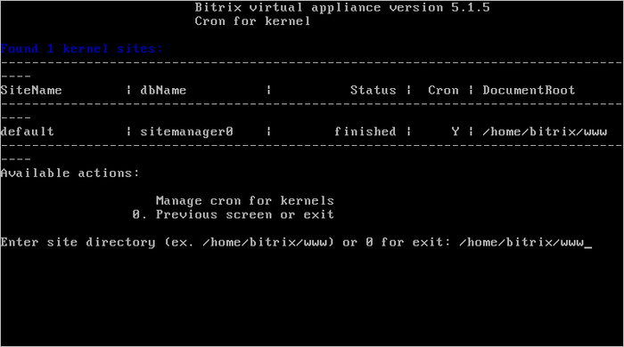
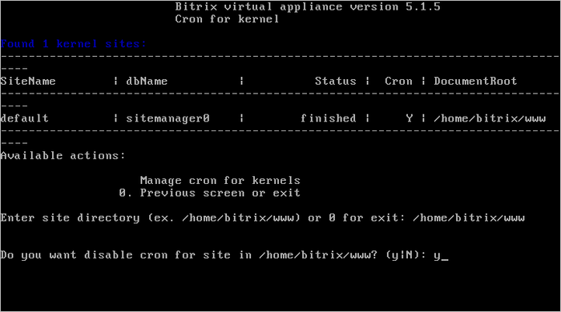
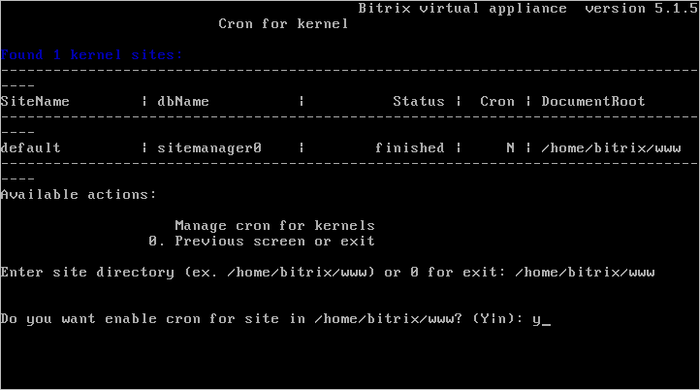

# Настройка задач cron (Change cron tasks on site)

**Навигация**
- [← Оглавление курса](index.md)
- [← Предыдущий: 6535 — Создание и удаление сайта (Create\Delete site)](lesson_6535.md)
- [Следующий: 6537 — Настройка почтового сервера (Change e-mail settings on site) →](lesson_6537.md)

Официальная страница урока: https://dev.1c-bitrix.ru/learning/course/index.php?COURSE_ID=37&LESSON_ID=6536

По умолчанию в виртуальной машине cron уже включен. Если по каким-либо причинам нужно отключить эту службу, то для этого необходимо:

- Перейти в главном меню в 6. Manage sites in the pool &gt; 3. Change cron tasks on site и ввести директорию сайта, для которого нужно отключить службу:
  
- Согласиться на отключение и дождаться пока задача будет закончена:
  

Аналогичным способом осуществляется и включение:

**Внимание!** Информацию о том, как настроить в продуктах *«1С-Битрикс»* обработку всех агентов на **cron**, можно прочитать [здесь](lesson_8897.md).
