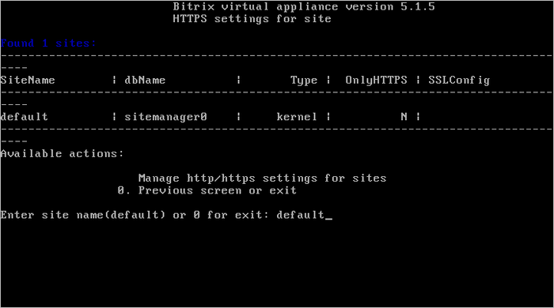
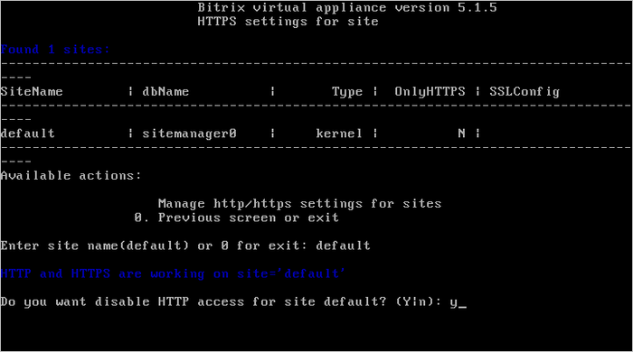
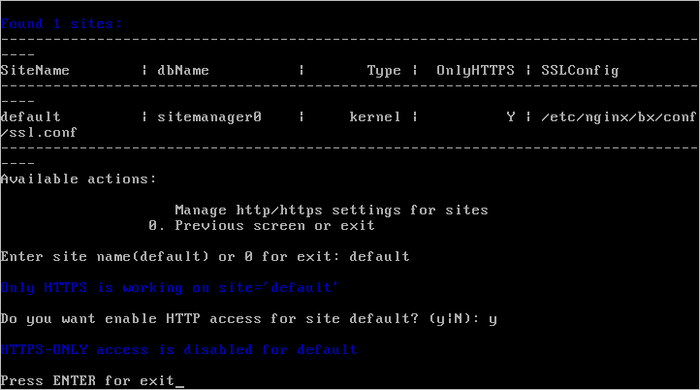

# Настройка https на сайте (Change https settings on site)

**Навигация**
- [← Оглавление курса](index.md)
- [← Предыдущий: 6537 — Настройка почтового сервера (Change e-mail settings on site)](lesson_6537.md)
- [Следующий: 6539 — Настройка резервного копирования сайта (Change backup settings on site) →](lesson_6539.md)

Официальная страница урока: https://dev.1c-bitrix.ru/learning/course/index.php?COURSE_ID=37&LESSON_ID=6538

По умолчанию в виртуальной машине включена поддержка доступа к сайтам через протоколы HTTP и HTTPS.

Если необходимо оставить доступ к сайту только по защищенному протоколу HTTPS, то для этого нужно:

- Перейти в главном меню в 6. Manage sites in the pool &gt; 5. Change https settings on site и ввести имя хоста, для которого нужно настроить протокол доступа:
  
- Согласиться на отключение HTTP доступа и дождаться пока задача будет закончена:
  
  **Внимание!** Для доступа к сайту только по протоколу HTTPS необходим [SSL-сертификат](https://ru.wikipedia.org/wiki/SSL) от доверенного центра сертификации, иначе браузеры будут выдавать ошибку, что сертификат безопасности сайта не является доверенным.

Аналогичным способом осуществляется возврат доступа к сайту по протоколу HTTP:

**Внимание!** Задачи могут выполняться довольно длительное время (до 2-3 часов и более) в зависимости от сложности задачи, объема данных, используемых в этих задачах, мощности и загруженности сервера. Проверить текущие выполняемые задачи можно с помощью меню 5. Background tasks in the pool &gt; 1. View running tasks.
