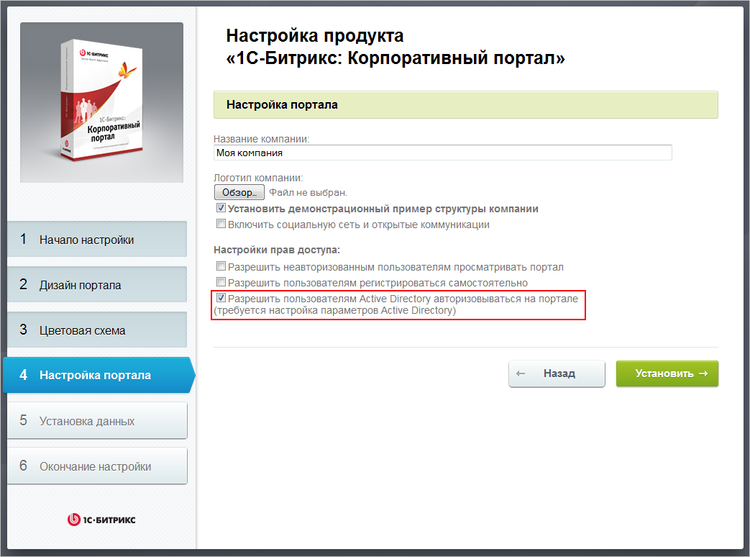
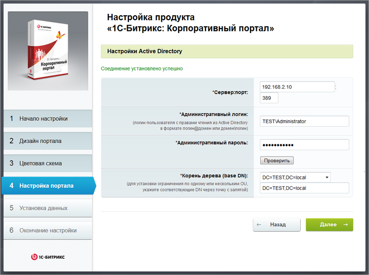
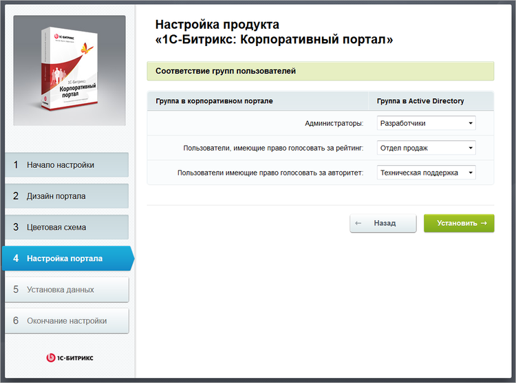
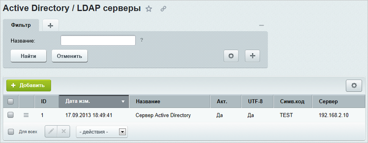
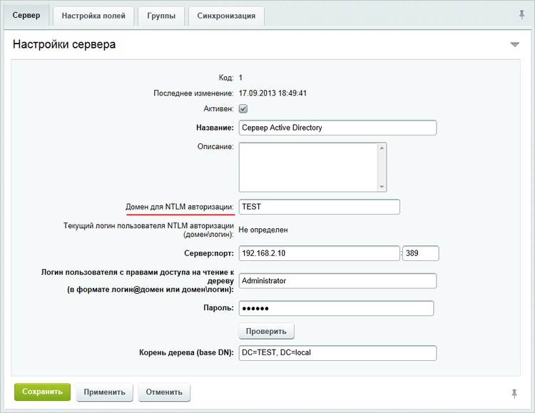
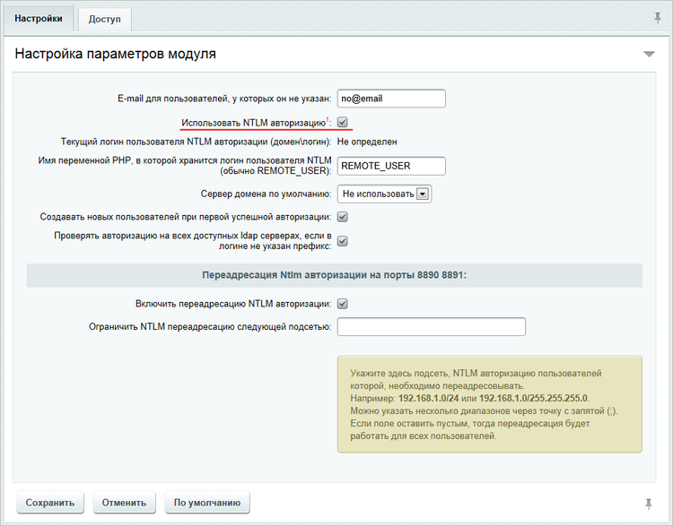
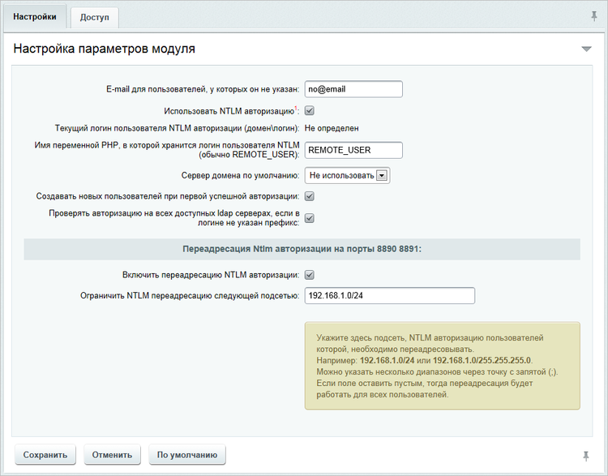
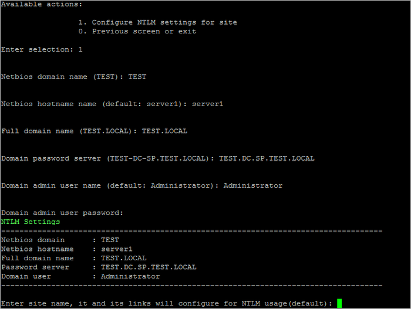
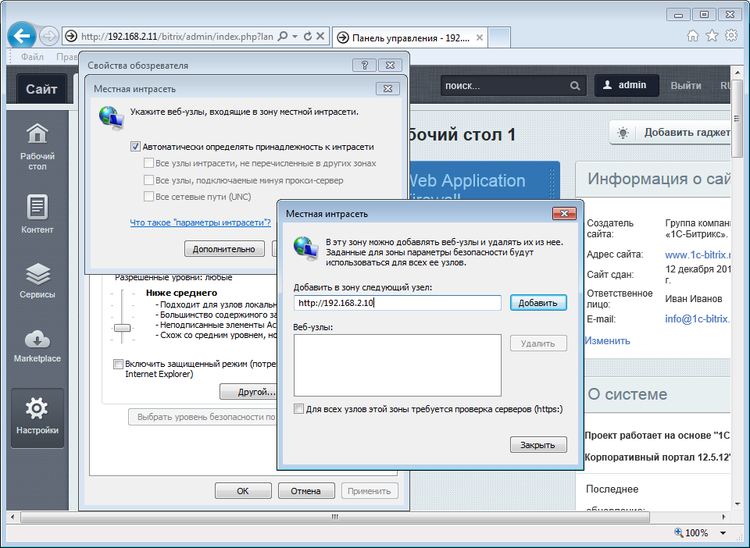
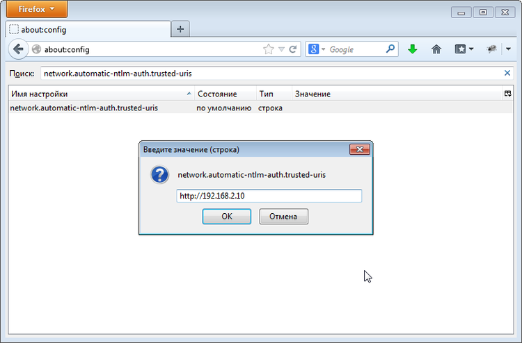

# Настройка NTLM-авторизации на всех сайтах (Configure NTLM auth for all sites)

**Навигация**
- [← Оглавление курса](index.md)
- [← Предыдущий: 6539 — Настройка резервного копирования сайта (Change backup settings on site)](lesson_6539.md)
- [Следующий: 7348 — Настройка xmppd|smtpd сервисов для сайта (Configure optional services (xmppd|smtpd) for site) →](lesson_7348.md)

Официальная страница урока: https://dev.1c-bitrix.ru/learning/course/index.php?COURSE_ID=37&LESSON_ID=6540

Для поддержки механизма NTLM-авторизации продуктами *«1С-Битрикс: Управление сайтом»* и *«Битрикс24 в коробке»* необходим модуль **AD/LDAP интеграция** версии 11.5.0 и выше.


После включения и настройки новый механизм NTLM-авторизации начинает работать следующим образом:


- неавторизованный посетитель приходит на проект, где обработчиком события он перенаправляется на открытый порт Apache (8890 для http или 8891 для https);
- Apache выполняет NTLM-авторизацию пользователя и пользователь перенаправляется назад на 80 или 443 порт (для http и https соответственно);
- следующие переходы по сайту пользователь выполняет в обычном режиме.


Рассмотрим настройку на примере «Битрикс24 в коробке».


#### Настройка NTLM-авторизации пользователей в «Битрикс24 в коробке»


- Во время установки, в мастере выбираем **Разрешить пользователям Active Directory авторизовываться на портале**:
  
- Далее вводим настройки подключения к **домену AD**, проверяем соединение:
  
- Указываем соответствия групп в AD группам корпоративного портала:
  
- После завершения установки в административном разделе портала открываем страницу **Active Directory / LDAP серверы** (Настройки &gt; AD/LDAP):
  
- редактируем параметры сервера Active Directory, указывая **домен для NTLM авторизации**:
  
- После этого заходим в настройки модуля AD/LDAP и устанавливаем **Использовать NTLM авторизацию**:
  


Продукт «1С-Битрикс» готов к использованию NTLM-авторизации, осталось настроить виртуальную машину.


**Внимание!** Если необходимо для локальной сети компании настроить NTLM-авторизацию, а для сотрудников, работающих с порталом, использовать стандартную авторизацию, то дополнительно в настройках модуля AD/LDAP нужно указать диапазон IP-адресов, для которых необходима NTLM-авторизация - **Ограничить NTLM переадресацию следующей подсетью** (например, 192.168.0.1/24):




#### Настройка NTLM-авторизации пользователей в «1С-Битрикс: Виртуальная машина»


Для настройки виртуальной машины необходимо подключитьcя к ней под пользователем **root**, выбрать пункт меню 6. Manage sites in the pool &gt; 7. Configure NTLM auth for all sites и ввести необходимые данные:





После подтверждения корректности введенных данных мастер настроит и запустит все необходимые службы, а также подключит виртуальную машину в домен.


**Примечание**: Проверить, что компьютер успешно введен в домен можно командой:


```
net ads testjoin
```


Настройка завершена, для успешной NTLM-авторизации осталось проверить настройки браузеров.


#### Настройка NTLM-авторизации в браузерах


- **Internet Explorer**
  Для успешной NTLM-авторизации нужно, чтобы веб-сервер находился в зоне **Local Intranet** (при необходимости нужно добавить):
  
- **Mozilla Firefox**:
  Добавить веб-сервер к списку доверенных URI для автоматической NTLM-авторизации (через параметр `network.automatic-ntlm-auth.trusted-uris` на странице Firefox: about:config)
  


**Примечание**: Действия по включению NTLM-авторизации на уже установленном продукте *«Битрикс24 в коробке»*, а также в *«1С-Битрикс: Управление сайтом»* аналогичны перечисленным выше, за исключением того, что сервер Active Directory добавляется вручную в административном разделе.
