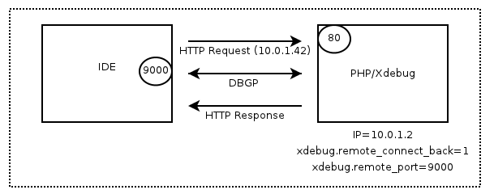

# Подключение IDE

**Навигация**
- [← Оглавление курса](index.md)
- [← Предыдущий: 6560 — Настройка NTLM-авторизации](lesson_6560.md)

Официальная страница урока: https://dev.1c-bitrix.ru/learning/course/index.php?COURSE_ID=37&LESSON_ID=6561

Для упрощения работы с **Bitrix Framework** в виртуальную машину включён **Xdebug**. Работает он по схеме:





Перед изменением настроек надо переименовать файл **xdebug.ini.disabled** в **xdebug.ini** и перезапустить **httpd**.


Для настройки машины воспользуйтесь следующим примером:


```
$ cat /etc/php.d/xdebug.ini
; Enable xdebug extension module
zend_extension=/usr/lib/php/modules/xdebug.so
xdebug.remote_enable=on
xdebug.remote_host=192.168.205.1
xdebug.remote_port=9000
```


**Примечание**: **Xdebug** требует использовать proxy при работе через **Network Address Translation**, необходимо открыть порт 9000.
