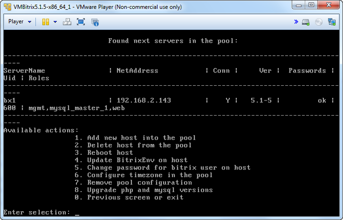

# Обновление PHP и MySQL (Upgrade php and mysql versions)

**Навигация**
- [← Оглавление курса](index.md)
- [← Предыдущий: 6524 — Настройка таймзоны в пуле (Configure timezone in the pool)](lesson_6524.md)
- [Следующий: 6502 — Изменение названия хоста →](lesson_6502.md)

Официальная страница урока: https://dev.1c-bitrix.ru/learning/course/index.php?COURSE_ID=37&LESSON_ID=7127

В процессе [обновления BitrixVM](lesson_6501.md) до версии 5.1.х и выше PHP и MySQL автоматически не обновляются. Обновить их можно в ручном режиме с помощью пункта меню виртуальной машины **1. Manage hosts in the pool - 8. Upgrade php and mysql versions**. Обратите внимание, что обновление запустится сразу, без предварительных предупреждений.

**Примечание:** Указанный пункт меню появится только при обновлении BitrixVM до версии 5.1.х и выше.

**Внимание!** Для того, чтобы воспользоваться обновлением PHP до версии 5.6, необходимо предварительно обновиться до 5.4 (и MySQL до 5.5) с помощью указанного выше пункта меню и далее, уже повторно, с помощью него же обновиться до версии 5.6.

Обновление до более высоких версий проводится аналогично.

В результате, после [выполнения фоновой задачи обновления](lesson_6515.md), будут обновлены PHP и MySQL до своих

			актуальных

                    С 1 августа 2020 года требуется PHP версии не ниже **7.2.0**. Рекомендуемая версия - 7.4.0 и выше.

[Подробнее](https://dev.1c-bitrix.ru/learning/course/index.php?COURSE_ID=135&LESSON_ID=2593)...

		 версий.

