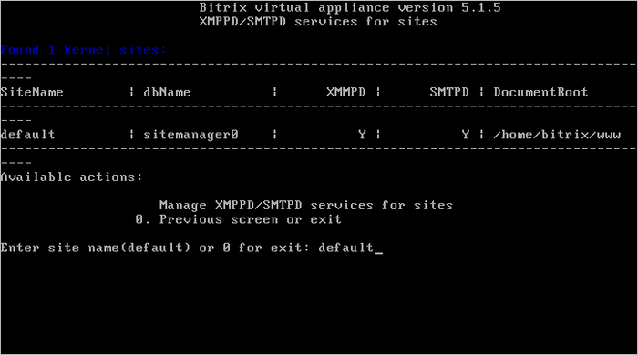
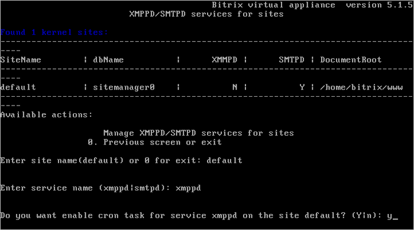

# Настройка xmppd|smtpd сервисов для сайта (Configure optional services (xmppd|smtpd) for site)

**Навигация**
- [← Оглавление курса](index.md)
- [← Предыдущий: 6540 — Настройка NTLM-авторизации на всех сайтах (Configure NTLM auth for all sites)](lesson_6540.md)
- [Следующий: 3085 — Условия работы композитного кеша →](lesson_3085.md)

Официальная страница урока: https://dev.1c-bitrix.ru/learning/course/index.php?COURSE_ID=37&LESSON_ID=7348

Мастер позволяет управлять работой сервисов **XMPP** и **SMTP** с помощью *Cron*. Это может понадобится, если необходимо рассылать jabber- и почтовые сообщения в случае, если на сайте нет активности, т.е если все события на сайте работают на хитах.

Для управления необходимо:

- Из административного меню запустить мастер 6. Manage sites in the pool &gt; 8 Configure optional services (xmppd|smtpd) for site:
  
- Далее указать:

  - **Enter site-name** - имя сайта;
  - **Enter service name** - имя сервиса **xmppd** или **smtpd**.
- И согласиться на активацию работы сервисов через *Cron*:
  
- После завершения данной задачи jabber-уведомления и почтовые сообщения будут отправляться по cron-расписанию, независимо от активности на сайте.

Аналогичным образом отключается данные опции:

**Внимание!** Задачи могут выполняться довольно длительное время (до 2-3 часов и более) в зависимости от сложности задачи, объема данных, используемых в этих задачах, мощности и загруженности сервера. Проверить текущие выполняемые задачи можно с помощью меню 5. Background tasks in the pool &gt; 1. View running tasks.
