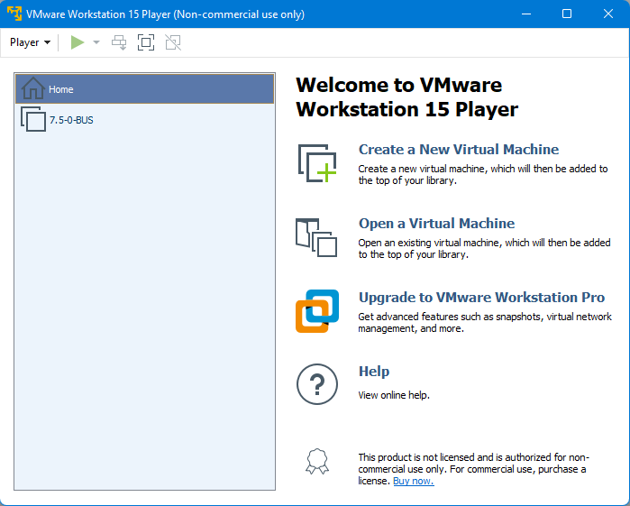
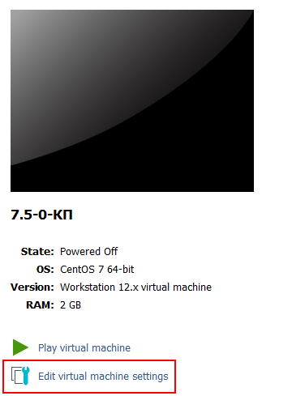
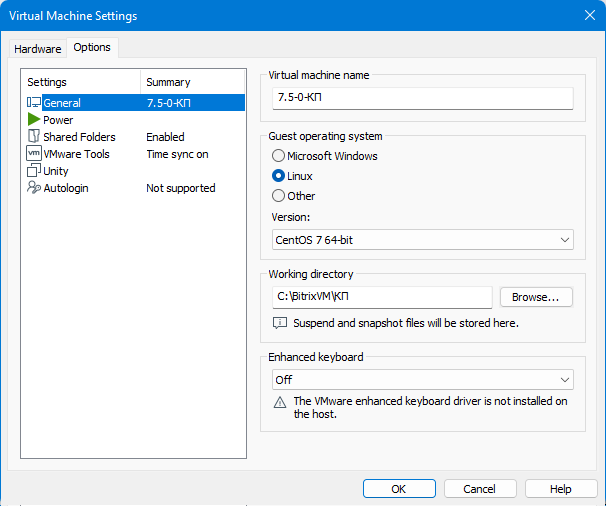
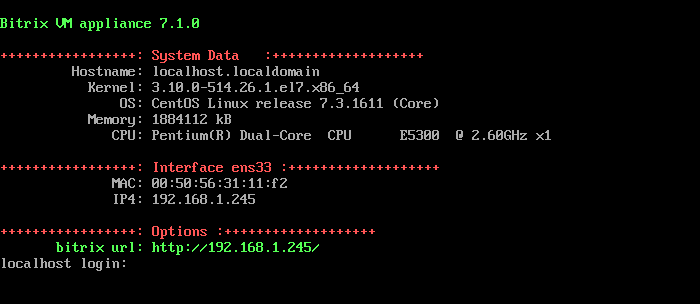
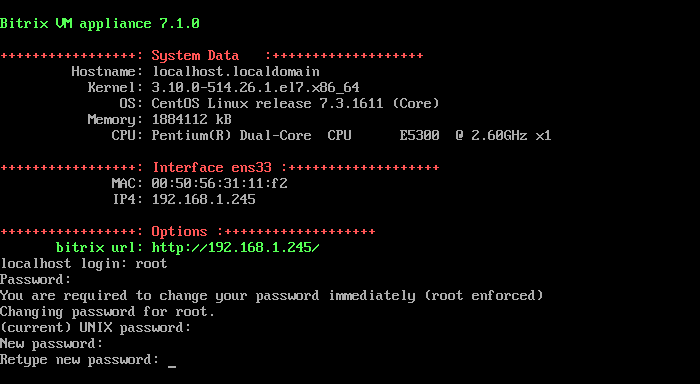
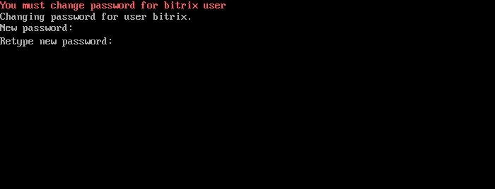
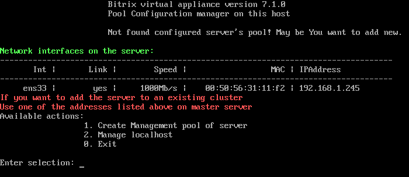
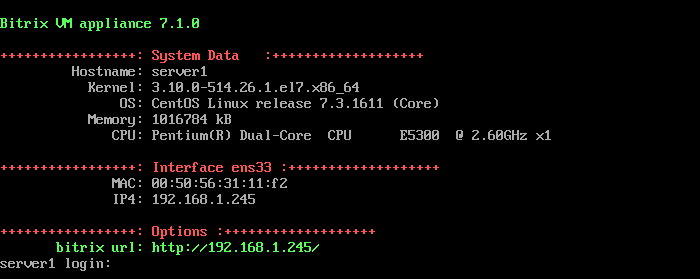

# Запуск виртуальной машины BitrixVM

**Навигация**
- [← Оглавление курса](index.md)
- [← Предыдущий: 5099 — Словарь](lesson_5099.md)
- [Следующий: 11681 — VMBitrix.CRM →](lesson_11681.md)

Официальная страница урока: https://dev.1c-bitrix.ru/learning/course/index.php?COURSE_ID=37&LESSON_ID=8813

### Запуск виртуальной машины BitrixVM

**Внимание!** Если у вас при старте образа виртуальной машины появляется черный экран и сразу пропадает, а BitrixVM не стартует, проверьте поддержку аппаратной виртуализации VT-x/VT-d вашим процессором. Включить виртуализацию VT-x/VT-d можно в BIOS вашего компьютера. Также проверьте битность вашей операционной системы, на которой запускается виртуальная машина, – она должна быть 64-битной.

1. Загрузите подходящий вам дистрибутив [настроенной виртуальной машины BitrixVM](http://www.1c-bitrix.ru/products/vmbitrix/).
2. Загруженный архив распакуйте в любую папку, например, `С:\BitrixVM\` и запустите виртуальную машину с помощью подходящего ПО:
  
  **Примечание:** Если при работе с **VMWare Player** виртуальная машина не запускается, откройте её настройки
  			(Edit virtual machine settings)
  
  		 и во вкладке
  			Options
  
  		 укажите гостевую операционную систему:
  - **Guest operating system**: `Linux`
  - **Version**: `CentOS 64-bit`
3. Начнется процесс загрузки операционной системы, установленной на виртуальной машине. В конце загрузки откроется окно:
  
4. При первом запуске виртуальной машины *BitrixVM* будет предложено сменить пароли суперпользователя **root** и пользователя **bitrix**:
  **Примечание:**Для суперпользователя **root** по умолчанию задан пароль **bitrix**.
  Если у вас версия *VMBitrix.CRM*, то пароль пользователя **root** будет указан на экране.
  
  Аналогично происходит смена пароля пользователя **bitrix**:
  
  **Примечание:** Сменить пароль пользователя **bitrix** можно позднее в панели управления виртуальным сервером с помощью пункта меню 1. Create Management pool of server - Change bitrix password.

  - В строке **localhost login** укажите логин: `root`, а в поле **Password** пароль: `bitrix`.
  - В строке **(current) UNIX password** укажите текущий пароль (`bitrix`) и нажмите **Enter**.
  - Введите новый пароль в строке **Enter new UNIX password** и нажмите **Enter**.
  - Повторите ввод нового пароля в строке **Retype new UNIX password** и нажмите **Enter**.
5. Далее нужно **обязательно** создать пул управления сервером с помощью меню [1. Create Management pool of server](https://dev.1c-bitrix.ru/learning/course/index.php?COURSE_ID=37&CHAPTER_ID=08817).
  
  **Внимание!** В *BitrixVM* **версии 7.x+** нужно обязательно создавать пул ([1. Create Management pool of server](/learning/course/index.php?COURSE_ID=37&CHAPTER_ID=08817)). Мастер создания пула откроет все необходимые порты в CentOS для корректной работы сервисов продуктов «1С-Битрикс».
  Если у вас в меню нет пунктов, кроме как **0. Exit** и в таблице сетевых интерфейсов  **IP4: Undefined** - это значит,  что у вас проблема с сетевым адаптером виртуальной машины или в локальной сети нет DHCP сервера. Проверьте настройки сетевого адаптера виртмашины или попробуйте задать ip-адрес [вручную](lesson_9315.md).
6. [Обновите версии PHP и MySQL](lesson_8831.md) до рекомендуемых [системных требований](https://dev.1c-bitrix.ru/learning/course/index.php?COURSE_ID=135&LESSON_ID=2593) продуктов *«1С-Битрикс»*.
7. Виртуальный сервер готов для дальнейшего использования.
8. После всех настроек виртуального сервера в целях безопасности не забудьте выйти из учетной записи **root**:
  

  - Выйти в консоль, выбрав в меню **0. Exit** (или нажать **Ctrl** + **C**)
  - И затем в консоли выполнить команду `exit`
9. Для запуска процесса установки продуктов компании 1С-Битрикс (или открытия уже установленного сайта), перейдите в браузере по пути, указанному в поле **bitrix url**.


**Примечание**: Пароли пользователей **root** и **bitrix** так же используются при подключении к сайту по SFTP.

Посмотреть краткий процесс установки BitrixVM для запуска сайта на «1С-Битрикс: Управление сайтом» можно в видеороликах на нашем Youtube канале:

- [Как установить BitrixVM в VMware Player](https://youtu.be/1AcNCihQr20);
- [Как установить BitrixVM в VirtualBox](https://youtu.be/WpkL0RE4enc).

### Как управлять BitrixVM

Для перехода к выполнению любого действия меню виртуальной машины введите число и нажмите **Enter**. Например, для настройки локального виртуального сервера в строке наберите **2** (**Manage localhost**) и нажмите **Enter**.

Чтобы вернуться в вашу ОС, нажмите **Ctrl**+**Alt** (VMWare Player).

Чтобы вернуться из командной строки (если нажали **0. Exit**) обратно в меню виртуальной машины, введите в консоли команду:

```

/root/menu.sh
```

Если вы запускаете несколько хостов в одной BitrixVM на локальном компьютере или в пределах вашей локальной сети, то можно указать для этих сайтов вместо IP свои выдуманные домены, предварительно прописав в файле [hosts](https://ru.wikipedia.org/wiki/Hosts) операционной системы или на сервере DHCP вашей сети. Тогда вы сможете обращаться к сайтам по доменным именам, но только в пределах вашего компьютера или вашей локальной сети.

Если при работе с BitrixVM возникли ошибки работы мастеров, то логи мастеров можно просмотреть в папке `/opt/webdir/temp/`.

**Примечание:**При возникновении проблем с сетевым адаптером **VMWare Player** или **VirtualBox** (например не открывается сайт по адресу виртуальной машины) необходимо перейти в настройки сетевого адаптера (Virtual Machine &gt; Removable Devices &gt; Network Adapter &gt; Settings...),

			поменять режим работы адаптера


		 с **NAT** на **Bridged** (или наоборот). И перезапустить виртуальный сервер, выбрав пункт меню 2. Manage localhost &gt; 4. Reboot server.
