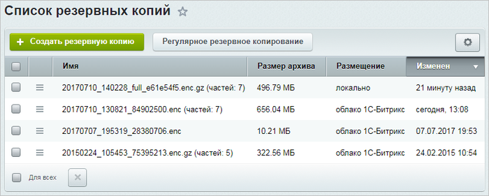
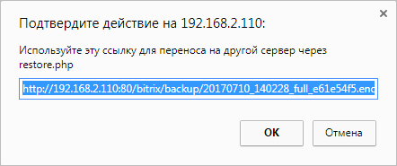

# Перенос продукта «1C-Битрикс» в виртуальную среду BitrixVM/BitrixEnv

**Навигация**
- [← Оглавление курса](index.md)
- [← Предыдущий: 9369 — Установка дистрибутива сайта в BitrixVM/BitrixEnv](lesson_9369.md)
- [Следующий: 26338 — Типовые ошибки при установке →](lesson_26338.md)

Официальная страница урока: https://dev.1c-bitrix.ru/learning/course/index.php?COURSE_ID=37&LESSON_ID=8815

### Подготовка

Что должно быть готово перед переносом?

Для переноса сайта с хостинга (облака) или локального сервера на виртуальную среду *BitrixVM* или *BitrixEnv* необходимы: **архив сайта** и настроенная виртуальная среда BitrixVM или BitrixEnv.

После успешного создания [архива сайта](/learning/course/index.php?COURSE_ID=35&CHAPTER_ID=01997) он будет доступен на странице

			Список резервных копий

                    

		 (Настройки &gt; Инструменты &gt; Список резервных копий) .

Также можно скачать архив сайта на локальный компьютер с помощью пункта меню  **Скачать**.

### Перенос сайта

Перенос сайта в виртуальную среду BitrixVM/BitrixEnv
