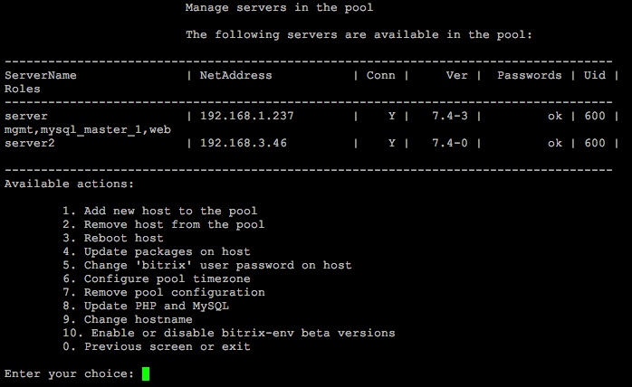
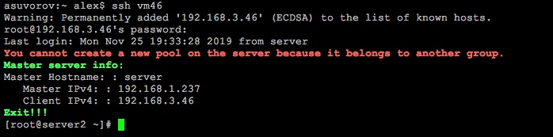

# 1. Добавление нового хоста в пул (1. Add new host to the pool)

**Навигация**
- [← Оглавление курса](index.md)
- [← Предыдущий: 26338 — Типовые ошибки при установке](lesson_26338.md)
- [Следующий: 8821 — 2. Удаление хоста из пула (2. Remove host from the pool) →](lesson_8821.md)

Официальная страница урока: https://dev.1c-bitrix.ru/learning/course/index.php?COURSE_ID=37&LESSON_ID=8819

**Внимание!** Добавление физических серверов в пул (кластер) нужно для масштабирования системы, для распределения нагрузки между несколькими серверами. Если у вас нет дополнительных физических серверов, то необходимости добавления их в пул нет.

На добавляемом сервере в пул (кластер) должно быть установлено [BitrixVM](lesson_8813.md) или [BitrixEnv](lesson_8811.md).

**Внимание!**  Сервер - не значит сайт! Если вам нужно создать или добавить веб-сайт в BitrixEnv, то делать это нужно в меню [Управление сайтами (Configure pool sites)](https://dev.1c-bitrix.ru/learning/course/index.php?COURSE_ID=37&CHAPTER_ID=08847).

Добавление нового сервера в пул (кластер) осуществляется с помощью меню 1. Manage servers in the pool &gt; 1. Add new host to the pool.

Для этого необходимо задать ip-адрес или DNS-имя сервера, выбрать короткое имя (в примере - **server2**) и ввести пароль root для подключаемого сервера:

**Примечание**: Имя сервера можно выбрать любое, можно указать, что хотите: bx1, server10, mysite.ru (можно и имя домена, если он один) и т.д.

Таким образом, можно добавлять любое количество серверов в пул:

Теперь можно управлять любым сервером пула с одной машины.

**Примечание**: Если зайти на присоединенный к пулу сервер, то система оповестит о нахождении данного сервера в пуле и невозможности отображения управляемого меню:

**Внимание!** Задачи могут выполняться довольно длительное время (до 2-3 часов и более) в зависимости от сложности задачи, объема данных, используемых в этих задачах, мощности и загруженности сервера. Проверить текущие выполняемые задачи можно с помощью меню [10. Background pool tasks &gt; 1. View running tasks](lesson_8845.md). Если по каким-либо причинам нужно посмотреть лог-файлы выполнения задач, то они находятся в директории `/opt/webdir/temp`.
