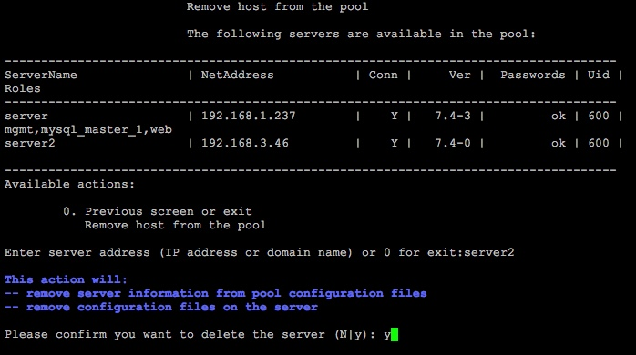
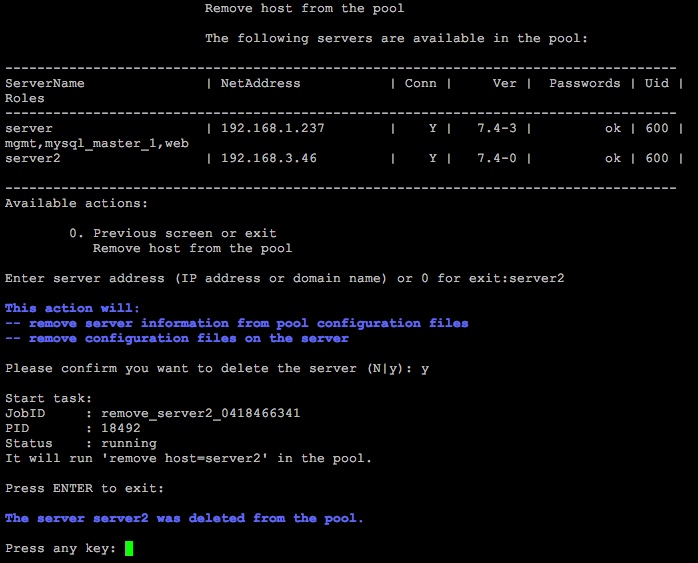

# 2. Удаление хоста из пула (2. Remove host from the pool)

**Навигация**
- [← Оглавление курса](index.md)
- [← Предыдущий: 8819 — 1. Добавление нового хоста в пул (1. Add new host to the pool)](lesson_8819.md)
- [Следующий: 8823 — 3. Перезапуск хоста (3. Reboot host) →](lesson_8823.md)

Официальная страница урока: https://dev.1c-bitrix.ru/learning/course/index.php?COURSE_ID=37&LESSON_ID=8821

Удаление хоста, находящегося в пуле, осуществляется с помощью меню 1. Manage servers in the pool &gt; 2. Remove host from the pool . Если на хосте есть хоть какие-то роли, то удаление хоста невозможно.

Для этого необходимо задать ip-адрес или DNS-имя хоста удаляемого из пула сервера:

После подтверждения сервер будет удален из пула:

**Внимание!** Задачи могут выполняться довольно длительное время (до 2-3 часов и более) в зависимости от сложности задачи, объема данных, используемых в этих задачах, мощности и загруженности сервера. Проверить текущие выполняемые задачи можно с помощью меню [10. Background pool tasks &gt; 1. View running tasks](lesson_8845.md). Если по каким-либо причинам нужно посмотреть лог-файлы выполнения задач, то они находятся в директории `/opt/webdir/temp`.
