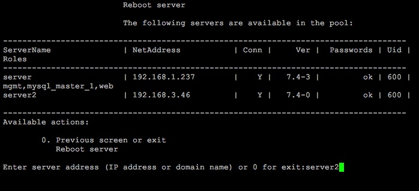

# 3. Перезапуск хоста (3. Reboot host)

**Навигация**
- [← Оглавление курса](index.md)
- [← Предыдущий: 8821 — 2. Удаление хоста из пула (2. Remove host from the pool)](lesson_8821.md)
- [Следующий: 8825 — 4. Обновление пакетов на хосте (4. Update packages on host) →](lesson_8825.md)

Официальная страница урока: https://dev.1c-bitrix.ru/learning/course/index.php?COURSE_ID=37&LESSON_ID=8823

Перезагрузка хоста, находящегося в пуле, осуществляется с помощью меню 1. Manage servers in the pool &gt; 3. Reboot host.

Для этого необходимо задать имя хоста (в данном примере - **server2**) и согласиться на перезапуск сервера:

