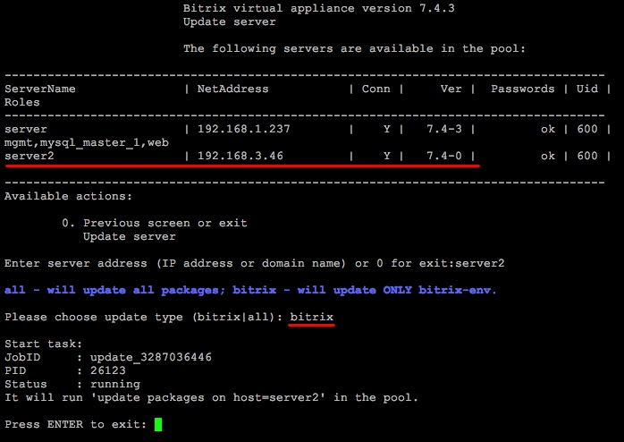
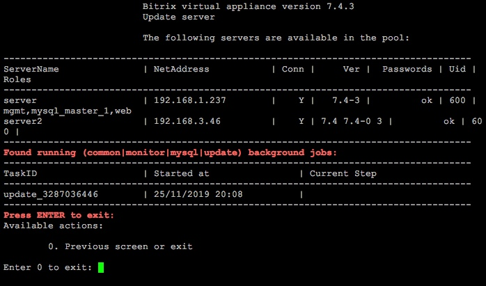
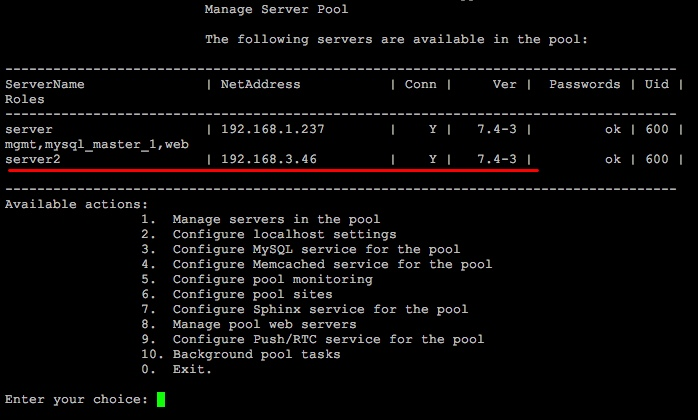

# 4. Обновление пакетов на хосте (4. Update packages on host)

**Навигация**
- [← Оглавление курса](index.md)
- [← Предыдущий: 8823 — 3. Перезапуск хоста (3. Reboot host)](lesson_8823.md)
- [Следующий: 8827 — 5. Смена пароля пользователя bitrix (5. Change 'bitrix' user password on host) →](lesson_8827.md)

Официальная страница урока: https://dev.1c-bitrix.ru/learning/course/index.php?COURSE_ID=37&LESSON_ID=8825

С помощью менеджера пула можно удаленно обновлять Веб-окружение и компоненты системы на любом хосте, входящем в пул.

Например, в пул добавлена виртуальная машина версии 7.4.0, нам нужно обновить ее до 7.4.х.

- Выбираем пункт меню 1. Manage servers in the pool &gt; 4. Update packages on host, система спросит **имя хоста** для обновления и выбор, что обновлять – только окружение (**bitrix**) или полностью систему и окружение (**all**):
  
- Менеджер пула запустит задачу обновления Веб-окружения на удаленном хосте:
  
  **Важно!** В процессе обновления BitrixVM версии PHP и MySQL автоматически не обновляются. Обновить их можно в ручном режиме с помощью пункта меню виртуальной машины [1. Manage hosts in the pool - 8. Update PHP and MySQL](lesson_8831.md).
- Через некоторое время система на удаленном хосте обновится до последней версии (в данном примере - **7.4.3**)
  

Таким же образом можно обновлять включенные в пул виртуальные машины ранних версий.

**Внимание!** Задачи могут выполняться довольно длительное время (до 2-3 часов и более) в зависимости от сложности задачи, объема данных, используемых в этих задачах, мощности и загруженности сервера. Проверить текущие выполняемые задачи можно с помощью меню [10. Background pool tasks &gt; 1. View running tasks](lesson_8845.md). Если по каким-либо причинам нужно посмотреть лог-файлы выполнения задач, то они находятся в директории `/opt/webdir/temp`.
