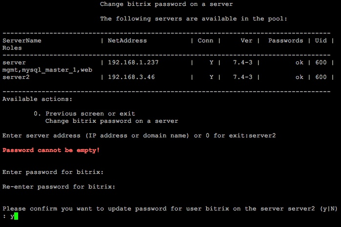

# 5. Смена пароля пользователя bitrix (5. Change 'bitrix' user password on host)

**Навигация**
- [← Оглавление курса](index.md)
- [← Предыдущий: 8825 — 4. Обновление пакетов на хосте (4. Update packages on host)](lesson_8825.md)
- [Следующий: 8829 — 6. Настройка таймзоны в пуле (6. Configure pool timezone) →](lesson_8829.md)

Официальная страница урока: https://dev.1c-bitrix.ru/learning/course/index.php?COURSE_ID=37&LESSON_ID=8827

Смена пароля для пользователя **bitrix** осуществляется через пункт меню 1. Manage servers in the pool &gt; 5. Change 'bitrix' user password on host.

Будет выдан запрос имени хоста, на котором нужно сменить старый пароль пользователя **bitrix**, указать новый и дать согласие на смену:

**Внимание!** Сменить пароль пользователя **root** через меню виртуальной машины нельзя. Для этого необходимо воспользоваться системными командами ОС. Например, для Centos 6/7 консольная команда смены пароля пользователя **root**: `passwd`.
