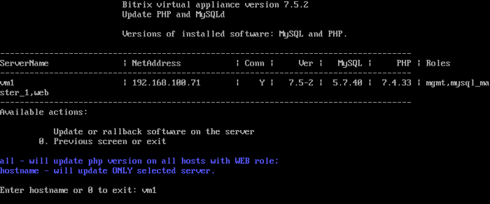
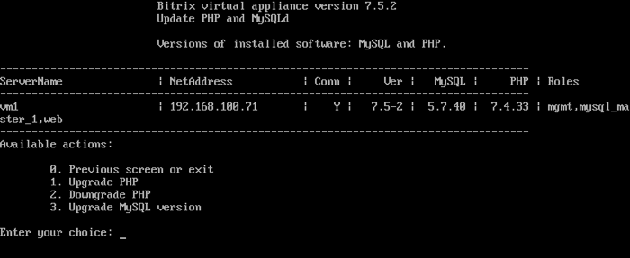
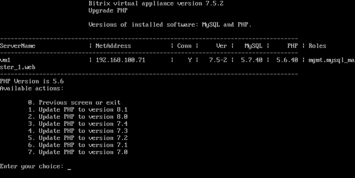
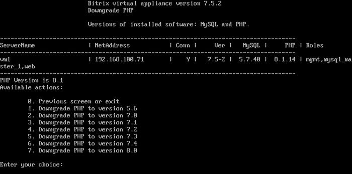
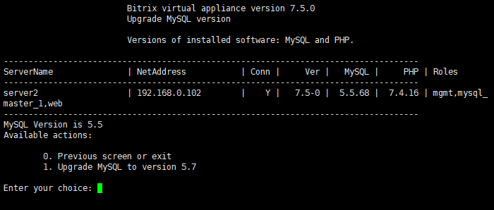
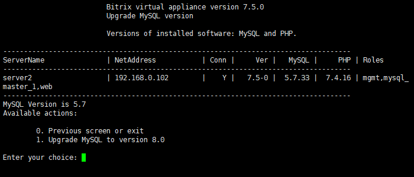

# 8. Обновление PHP и MySQL (8. Update PHP and MySQL)

**Навигация**
- [← Оглавление курса](index.md)
- [← Предыдущий: 8995 — 7. Удаление конфигурации пула (7. Remove pool configuration)](lesson_8995.md)
- [Следующий: 12860 — 9. Изменить имя хоста (9. Change hostname) →](lesson_12860.md)

Официальная страница урока: https://dev.1c-bitrix.ru/learning/course/index.php?COURSE_ID=37&LESSON_ID=8831

Обновлять версии PHP и MySQL необходимо, исходя из рекомендуемых системных требований продуктов «1С-Битрикс».

В процессе [обновления VMBitrix](lesson_8825.md) они автоматически не обновляются. Обновить их нужно в ручном режиме с помощью соответствующего пункта меню виртуальной машины 1. Manage servers in the pool - 8. Update PHP and MySQL.

**Примечание:** Указанный выше пункт меню присутствует в BitrixVM, начиная с версии 5.1.х и выше.

Укажите для обновления машину с конкретным именем хоста **hostname**:

**Примечание.** Можно указать **all** для обновления на всех машинах с ролью web, входящих в пул. Однако эта опция работает только при обновлении PHP. Для обновления MySQL выбирайте конкретные сервера по отдельности.

Далее можно выбрать варианты, что именно обновить:

#### 1. Upgrade PHP

Для обновления версии выберите подходящий пункт Update PHP to version х.х:

**Примечание**: На данный момент возможные версии: 5.6, 7.0, 7.1, 7.2, 7.3, 7.4, 8.0, 8.1.
C **1 февраля 2023 года** для всех продуктов компании «1С-Битрикс» минимальная версия PHP – 8.0, рекомендуемая – 8.1.

#### 2. Downgrade PHP

Аналогичным способом можно и понизить версию PHP, выбрав нужную с помощью пункта меню Downgrade PHP to version х.х. Для *VMbitrix.CRM* минимальная версия – 7.0.

#### 3. Upgrade MySQL version

Если вы обновили *VMBitrix* до версии 7.1 и выше, то у вас появится возможность обновить версию MySQL до 5.7 Percona DB. Сделать это можно, выбрав пункт Upgrade MySQL to 5.7 version:

После обновления MySQL до версии 5.7 появится возможность обновить MySQL до версии 8.0 – Upgrade MySQL to 8.0 version:

**Внимание!** После обновления MySQL до версии 8.0 обратно понизить версию  до 5.7 через меню *VMBitrix* нельзя.

**Внимание!** Задачи могут выполняться довольно длительное время (до 2-3 часов и более) в зависимости от сложности задачи, объема данных, используемых в этих задачах, мощности и загруженности сервера. Проверить текущие выполняемые задачи можно с помощью меню [10. Background pool tasks &gt; 1. View running tasks](lesson_8845.md). Если по каким-либо причинам нужно посмотреть лог-файлы выполнения задач, то они находятся в директории `/opt/webdir/temp`.

## Если обновления объёмные

Чтобы избежать проблем при обновлении нескольких версий самой Виртуальной машины (BitrixVM), а также PHP или SQL, сделайте это в пошаговом режиме. Примерно в таком порядке:

1. Сначала устраняете ошибки на портале, сайте.
2. Устанавливаете все доступные обновления.
3. Делаете бэкап.
4. Обновляете сначала BitrixVM.
5. Перезагружаете сервер
6. Проверяете работоспособность портала.
7. Делаете бэкап.
8. Обновляете PHP, на одну версию выше.
9. Повторяете шаг 5-8 до нужной версии PHP.
10. Если все отлично и ошибок нет, портал работает, обновляете SQL
11. Повторяете шаг 5-8 до нужной версии SQL.
12. Проверяете контроль на ошибки через полное тестирование, очистку кэша, сделайте переиндексацию, оптимизируйте БД
