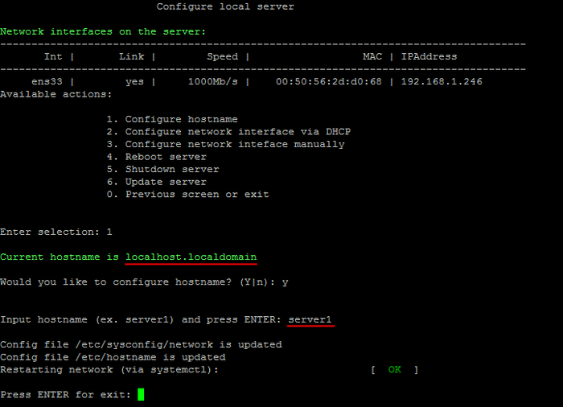
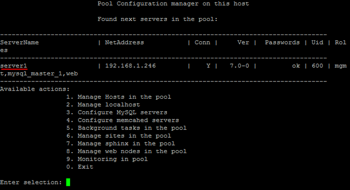

# 1. Изменение имени хоста (1. Configure hostname)

**Навигация**
- [← Оглавление курса](index.md)
- [← Предыдущий: 12862 — 10. Использование бета-версии BitrixEnv (10. Enable or disable bitrix-env beta versions)](lesson_12862.md)
- [Следующий: 8837 — 2. Настройка IP-адреса сервера через DHCP (2. Configure network interface via DHCP) →](lesson_8837.md)

Официальная страница урока: https://dev.1c-bitrix.ru/learning/course/index.php?COURSE_ID=37&LESSON_ID=8835

Чтобы задать имя хоста локального сервера, нужно перейти в главном меню 2. Manage localhost - 1. Configure hostname.

Далее согласиться на изменение и ввести название **Input hostname**, например, **server1** (по умолчанию это **localhost.localdomain**):

После чего системе будет присвоено новое имя:

**Примечание**: Название для хоста можно выбрать любое, какое хотите: bx1, server10, mysite.ru (можно и имя домена, если он один) и т.д.
