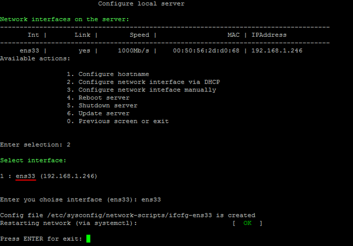

# 2. Настройка IP-адреса сервера через DHCP (2. Configure network interface via DHCP)

**Навигация**
- [← Оглавление курса](index.md)
- [← Предыдущий: 8835 — 1. Изменение имени хоста (1. Configure hostname)](lesson_8835.md)
- [Следующий: 9315 — 3. Настройка IP-адреса сервера вручную (3. Configure network inteface manually) →](lesson_9315.md)

Официальная страница урока: https://dev.1c-bitrix.ru/learning/course/index.php?COURSE_ID=37&LESSON_ID=8837

При первом старте BitrixVM получение IP-адреса сервером происходит автоматически, если в сети есть настроенный DHCP-сервер.

Чтобы с помощью него сменить или обновить IP-адрес локального сервера, нужно:

- Перейти в главном меню 2. Manage localhost - 2. Configure network interface via DHCP.
- Выбрать сетевой интерфейс (в данном примере **ens33**) и автоматически будет получен IP-адрес от DHCP-сервера:
  
