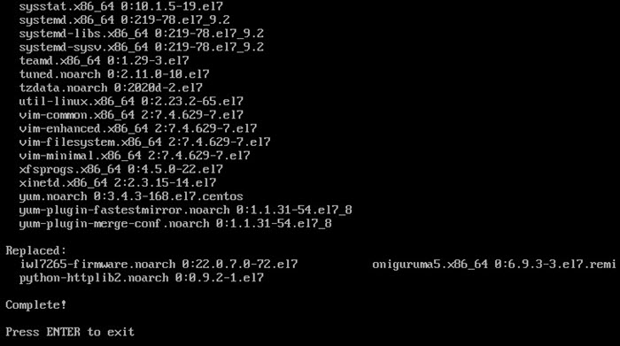

# 6. Обновление локального сервера (6. Update server)

**Навигация**
- [← Оглавление курса](index.md)
- [← Предыдущий: 12127 — 5. Выключение сервера (5. Shutdown server)](lesson_12127.md)
- [Следующий: 20722 — 7. Использование бета-версии BitrixEnv (7. Enable or disable bitrix-env beta versions) →](lesson_20722.md)

Официальная страница урока: https://dev.1c-bitrix.ru/learning/course/index.php?COURSE_ID=37&LESSON_ID=8839

### Обновление


**Внимание!** Обновление продукта *«1C-Битрикс: Виртуальная машина»* - сложная операция, в процессе которой происходит обновление системных файлов операционной системы виртуальной машины, и для этого необходимы соответствующие знания администрирования *nix-систем. Перед запуском обновления рекомендуется сделать полный бекап «Виртуальной машины».


Для обновления локальной виртуальной машины необходимо выбрать в административном меню пункт 2. Manage localhost - 6. Update server и согласиться на обновление.





Скрипт автоматически проверит обновления компонентов и произведет их установку.


**Внимание!** Этот пункт меню запускает обновление компонентов BitrixVM/BitrixEnv и CentOS. Если у вас несколько серверов в пуле (кластер), или вы хотите обновить только пакеты BitrixVM/BitrixEnv, то целесообразно производить [обновление виртуальных машин пула](lesson_8825.md).


### Ошибки и их решение


1. Если в процессе обновления *BitrixVM* случится ошибка примерно такого вида:
  ```
  Failing package is: Percona-Server-Client-57-5.7.25-28.1.el7.x86_64
  GPG Keys are configured as: file:///etc/pki/rpm-gpg/RPM-GPG-KEY-Percona
  ```
  То нужно выполнить команду обновления пакета Percona:
  ```
  yum install https://repo.percona.com/yum/percona-release-latest.noarch.rpm
  ```
  И далее запустить обновление заново через меню.
2. Если после обновления, что-то перестанет работать, то можно вернуть полностью или частично старые файлы настроек соответствующей службы, т.к. конфигурационные файлы при обновлении не перезаписываются, а сохраняются в файлах ***.ori.(метка времени)**.
3. Также в процессе обновления могут отключиться некоторые модули php. Для их включения необходимо выполнить следующие команды:
  ```
  mv -f /etc/php.d/(имя модуля).ini.disabled /etc/php.d/(имя модуля).ini
  service httpd restart
  ```
4. Если в процессе обновления появится ошибка, что недостаточно места в загрузочном разделе /boot:
  ```
  At least 26MB more space needed on the /boot filesystem.
  ```
  То нужно в **/etc/yum.conf** установить `installonly_limit=2`.
  Затем очистить старые ядра командой:
  ```
  package-cleanup --oldkernels --count=2
  ```


**Внимание!** Задачи могут выполняться довольно длительное время (до 2-3 часов и более) в зависимости от сложности задачи, объема данных, используемых в этих задачах, мощности и загруженности сервера. Проверить текущие выполняемые задачи можно с помощью меню 5. Background tasks in the pool &gt; 1. View running tasks. Если по каким-либо причинам нужно посмотреть лог-файлы выполнения задач, то они находятся в директории `/opt/webdir/temp`.
