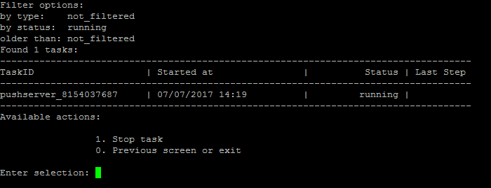
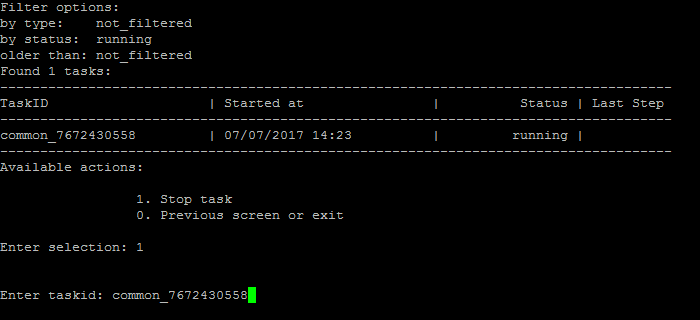
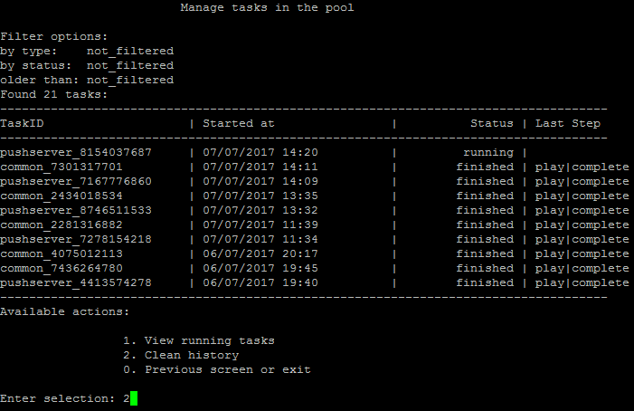
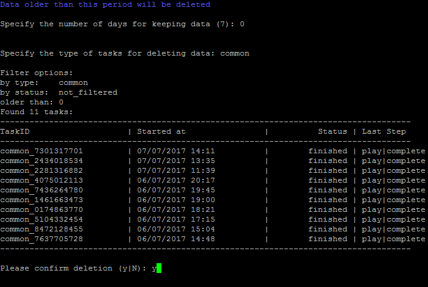

# 10. Фоновые задачи (10. Background pool tasks)

**Навигация**
- [← Оглавление курса](index.md)
- [← Предыдущий: 9381 — 2. Удалить NodeJS RTC инстанс (2. Uninstall NodeJS RTC instance)](lesson_9381.md)
- [Следующий: 21872 — 1. Настроить сервис «Конвертер файлов» (1. Configure Transformer service) →](lesson_21872.md)

Официальная страница урока: https://dev.1c-bitrix.ru/learning/course/index.php?COURSE_ID=37&LESSON_ID=8845

### Посмотреть историю

Все изменения в виртуальной машине – настройки, запуск каких-либо служб, синхронизация и др. осуществляются с помощью скриптов – задач.

Просмотреть историю, а также выполняемые в данный момент задачи, можно с помощью пункта меню 10. Background pool tasks:

Просмотреть запущенную в данный момент задачу можно с помощью пункта меню 10. Background pool tasks &gt; 1. View running tasks:

Для её остановки нужно перейти в пункт меню 10. Background pool tasks &gt; 1. View running tasks &gt; 1. Stop task и ввести идентификатор задачи:

**Внимание!** Задачи могут выполняться довольно длительное время (до 2-3 часов и более) в зависимости от сложности, объема данных, используемых в них, мощности и загруженности сервера.

### Очистить историю

Чтобы очистить историю нужно выбрать пункт меню 10. Background pool tasks &gt; 2. Delete history:

Далее выбрать количество дней, за которое нужно оставить историю, и фильтр, по которому выбирать задачи (к примеру, выберем **все задачи** с TaskID **common**):

После этого будут выведены все задачи, удовлетворяющие заданному интервалу и фильтру, и далее запрос на очистку истории:

**Внимание!** Если по каким-либо причинам нужно посмотреть лог-файлы выполнения, то они находятся в директории `/opt/webdir/temp`.
